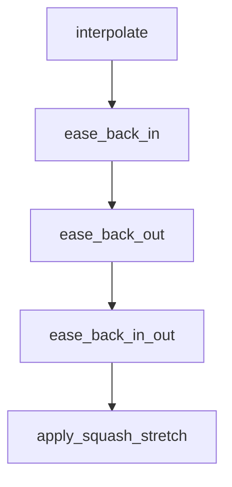

# Chapter 7: Risk Management and Skill Selection Rubric

Welcome to **Chapter 7: Risk Management and Skill Selection Rubric**. In this part of **Awesome Claude Skills Tutorial: High-Signal Skill Discovery and Reuse for Claude Workflows**, you will build an intuitive mental model first, then move into concrete implementation details and practical production tradeoffs.


This chapter provides a risk-aware framework for adopting third-party skills.

## Learning Goals

- score skills by trust, clarity, and operational impact
- identify high-risk automation behaviors early
- stage rollout to limit blast radius
- document keep/drop decisions objectively

## Selection Rubric

| Dimension | Strong Signal | Risk Signal |
|:----------|:--------------|:------------|
| documentation | clear setup, examples, constraints | vague or promotional guidance |
| maintenance | active updates and issue response | stale or unresolved breakage |
| security posture | explicit permissions and limits | unclear access boundaries |
| reversibility | easy rollback/disable path | hard-to-undo destructive actions |

## Source References

- [Contributing: Skill Requirements](https://github.com/ComposioHQ/awesome-claude-skills/blob/master/CONTRIBUTING.md#skill-requirements)
- [README: Resources](https://github.com/ComposioHQ/awesome-claude-skills/blob/master/README.md#resources)

## Summary

You now have a defensible framework for safer skill adoption.

Next: [Chapter 8: Team Adoption and Ongoing Maintenance](08-team-adoption-and-ongoing-maintenance.md)

## Source Code Walkthrough

### `slack-gif-creator/core/easing.py`

The `interpolate` function in [`slack-gif-creator/core/easing.py`](https://github.com/ComposioHQ/awesome-claude-skills/blob/HEAD/slack-gif-creator/core/easing.py) handles a key part of this chapter's functionality:

```py


def interpolate(start: float, end: float, t: float, easing: str = 'linear') -> float:
    """
    Interpolate between two values with easing.

    Args:
        start: Start value
        end: End value
        t: Progress from 0.0 to 1.0
        easing: Name of easing function

    Returns:
        Interpolated value
    """
    ease_func = get_easing(easing)
    eased_t = ease_func(t)
    return start + (end - start) * eased_t


def ease_back_in(t: float) -> float:
    """Back ease-in (slight overshoot backward before forward motion)."""
    c1 = 1.70158
    c3 = c1 + 1
    return c3 * t * t * t - c1 * t * t


def ease_back_out(t: float) -> float:
    """Back ease-out (overshoot forward then settle back)."""
    c1 = 1.70158
    c3 = c1 + 1
    return 1 + c3 * pow(t - 1, 3) + c1 * pow(t - 1, 2)
```

This function is important because it defines how Awesome Claude Skills Tutorial: High-Signal Skill Discovery and Reuse for Claude Workflows implements the patterns covered in this chapter.

### `slack-gif-creator/core/easing.py`

The `ease_back_in` function in [`slack-gif-creator/core/easing.py`](https://github.com/ComposioHQ/awesome-claude-skills/blob/HEAD/slack-gif-creator/core/easing.py) handles a key part of this chapter's functionality:

```py


def ease_back_in(t: float) -> float:
    """Back ease-in (slight overshoot backward before forward motion)."""
    c1 = 1.70158
    c3 = c1 + 1
    return c3 * t * t * t - c1 * t * t


def ease_back_out(t: float) -> float:
    """Back ease-out (overshoot forward then settle back)."""
    c1 = 1.70158
    c3 = c1 + 1
    return 1 + c3 * pow(t - 1, 3) + c1 * pow(t - 1, 2)


def ease_back_in_out(t: float) -> float:
    """Back ease-in-out (overshoot at both ends)."""
    c1 = 1.70158
    c2 = c1 * 1.525
    if t < 0.5:
        return (pow(2 * t, 2) * ((c2 + 1) * 2 * t - c2)) / 2
    return (pow(2 * t - 2, 2) * ((c2 + 1) * (t * 2 - 2) + c2) + 2) / 2


def apply_squash_stretch(base_scale: tuple[float, float], intensity: float,
                         direction: str = 'vertical') -> tuple[float, float]:
    """
    Calculate squash and stretch scales for more dynamic animation.

    Args:
        base_scale: (width_scale, height_scale) base scales
```

This function is important because it defines how Awesome Claude Skills Tutorial: High-Signal Skill Discovery and Reuse for Claude Workflows implements the patterns covered in this chapter.

### `slack-gif-creator/core/easing.py`

The `ease_back_out` function in [`slack-gif-creator/core/easing.py`](https://github.com/ComposioHQ/awesome-claude-skills/blob/HEAD/slack-gif-creator/core/easing.py) handles a key part of this chapter's functionality:

```py


def ease_back_out(t: float) -> float:
    """Back ease-out (overshoot forward then settle back)."""
    c1 = 1.70158
    c3 = c1 + 1
    return 1 + c3 * pow(t - 1, 3) + c1 * pow(t - 1, 2)


def ease_back_in_out(t: float) -> float:
    """Back ease-in-out (overshoot at both ends)."""
    c1 = 1.70158
    c2 = c1 * 1.525
    if t < 0.5:
        return (pow(2 * t, 2) * ((c2 + 1) * 2 * t - c2)) / 2
    return (pow(2 * t - 2, 2) * ((c2 + 1) * (t * 2 - 2) + c2) + 2) / 2


def apply_squash_stretch(base_scale: tuple[float, float], intensity: float,
                         direction: str = 'vertical') -> tuple[float, float]:
    """
    Calculate squash and stretch scales for more dynamic animation.

    Args:
        base_scale: (width_scale, height_scale) base scales
        intensity: Squash/stretch intensity (0.0-1.0)
        direction: 'vertical', 'horizontal', or 'both'

    Returns:
        (width_scale, height_scale) with squash/stretch applied
    """
    width_scale, height_scale = base_scale
```

This function is important because it defines how Awesome Claude Skills Tutorial: High-Signal Skill Discovery and Reuse for Claude Workflows implements the patterns covered in this chapter.

### `slack-gif-creator/core/easing.py`

The `ease_back_in_out` function in [`slack-gif-creator/core/easing.py`](https://github.com/ComposioHQ/awesome-claude-skills/blob/HEAD/slack-gif-creator/core/easing.py) handles a key part of this chapter's functionality:

```py


def ease_back_in_out(t: float) -> float:
    """Back ease-in-out (overshoot at both ends)."""
    c1 = 1.70158
    c2 = c1 * 1.525
    if t < 0.5:
        return (pow(2 * t, 2) * ((c2 + 1) * 2 * t - c2)) / 2
    return (pow(2 * t - 2, 2) * ((c2 + 1) * (t * 2 - 2) + c2) + 2) / 2


def apply_squash_stretch(base_scale: tuple[float, float], intensity: float,
                         direction: str = 'vertical') -> tuple[float, float]:
    """
    Calculate squash and stretch scales for more dynamic animation.

    Args:
        base_scale: (width_scale, height_scale) base scales
        intensity: Squash/stretch intensity (0.0-1.0)
        direction: 'vertical', 'horizontal', or 'both'

    Returns:
        (width_scale, height_scale) with squash/stretch applied
    """
    width_scale, height_scale = base_scale

    if direction == 'vertical':
        # Compress vertically, expand horizontally (preserve volume)
        height_scale *= (1 - intensity * 0.5)
        width_scale *= (1 + intensity * 0.5)
    elif direction == 'horizontal':
        # Compress horizontally, expand vertically
```

This function is important because it defines how Awesome Claude Skills Tutorial: High-Signal Skill Discovery and Reuse for Claude Workflows implements the patterns covered in this chapter.


## How These Components Connect


