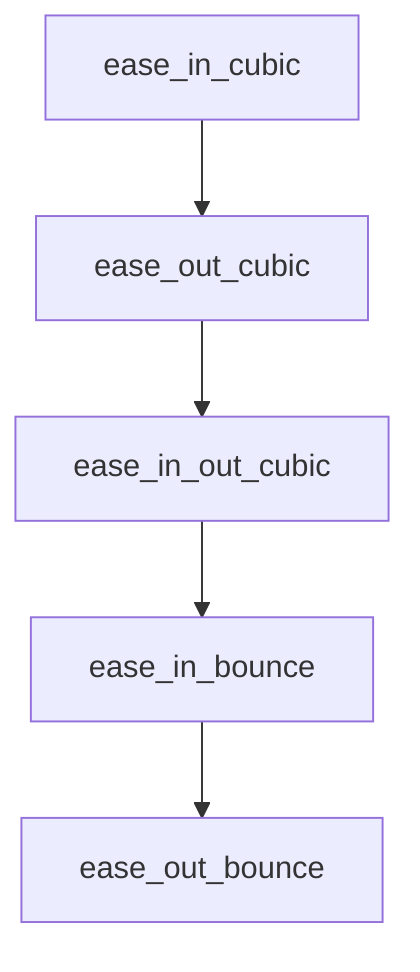

# Chapter 7: Risk Management and Skill Selection Rubric

Welcome to **Chapter 7: Risk Management and Skill Selection Rubric**. In this part of **Awesome Claude Skills Tutorial: High-Signal Skill Discovery and Reuse for Claude Workflows**, you will build an intuitive mental model first, then move into concrete implementation details and practical production tradeoffs.


This chapter provides a risk-aware framework for adopting third-party skills.

## Learning Goals

- score skills by trust, clarity, and operational impact
- identify high-risk automation behaviors early
- stage rollout to limit blast radius
- document keep/drop decisions objectively

## Selection Rubric

| Dimension | Strong Signal | Risk Signal |
|:----------|:--------------|:------------|
| documentation | clear setup, examples, constraints | vague or promotional guidance |
| maintenance | active updates and issue response | stale or unresolved breakage |
| security posture | explicit permissions and limits | unclear access boundaries |
| reversibility | easy rollback/disable path | hard-to-undo destructive actions |

## Source References

- [Contributing: Skill Requirements](https://github.com/ComposioHQ/awesome-claude-skills/blob/master/CONTRIBUTING.md#skill-requirements)
- [README: Resources](https://github.com/ComposioHQ/awesome-claude-skills/blob/master/README.md#resources)

## Summary

You now have a defensible framework for safer skill adoption.

Next: [Chapter 8: Team Adoption and Ongoing Maintenance](08-team-adoption-and-ongoing-maintenance.md)

## Depth Expansion Playbook

## Source Code Walkthrough

### `slack-gif-creator/core/easing.py`

The `ease_in_cubic` function in [`slack-gif-creator/core/easing.py`](https://github.com/ComposioHQ/awesome-claude-skills/blob/HEAD/slack-gif-creator/core/easing.py) handles a key part of this chapter's functionality:

```py


def ease_in_cubic(t: float) -> float:
    """Cubic ease-in (slow start)."""
    return t * t * t


def ease_out_cubic(t: float) -> float:
    """Cubic ease-out (fast start)."""
    return (t - 1) * (t - 1) * (t - 1) + 1


def ease_in_out_cubic(t: float) -> float:
    """Cubic ease-in-out."""
    if t < 0.5:
        return 4 * t * t * t
    return (t - 1) * (2 * t - 2) * (2 * t - 2) + 1


def ease_in_bounce(t: float) -> float:
    """Bounce ease-in (bouncy start)."""
    return 1 - ease_out_bounce(1 - t)


def ease_out_bounce(t: float) -> float:
    """Bounce ease-out (bouncy end)."""
    if t < 1 / 2.75:
        return 7.5625 * t * t
    elif t < 2 / 2.75:
        t -= 1.5 / 2.75
        return 7.5625 * t * t + 0.75
    elif t < 2.5 / 2.75:
```

This function is important because it defines how Awesome Claude Skills Tutorial: High-Signal Skill Discovery and Reuse for Claude Workflows implements the patterns covered in this chapter.

### `slack-gif-creator/core/easing.py`

The `ease_out_cubic` function in [`slack-gif-creator/core/easing.py`](https://github.com/ComposioHQ/awesome-claude-skills/blob/HEAD/slack-gif-creator/core/easing.py) handles a key part of this chapter's functionality:

```py


def ease_out_cubic(t: float) -> float:
    """Cubic ease-out (fast start)."""
    return (t - 1) * (t - 1) * (t - 1) + 1


def ease_in_out_cubic(t: float) -> float:
    """Cubic ease-in-out."""
    if t < 0.5:
        return 4 * t * t * t
    return (t - 1) * (2 * t - 2) * (2 * t - 2) + 1


def ease_in_bounce(t: float) -> float:
    """Bounce ease-in (bouncy start)."""
    return 1 - ease_out_bounce(1 - t)


def ease_out_bounce(t: float) -> float:
    """Bounce ease-out (bouncy end)."""
    if t < 1 / 2.75:
        return 7.5625 * t * t
    elif t < 2 / 2.75:
        t -= 1.5 / 2.75
        return 7.5625 * t * t + 0.75
    elif t < 2.5 / 2.75:
        t -= 2.25 / 2.75
        return 7.5625 * t * t + 0.9375
    else:
        t -= 2.625 / 2.75
        return 7.5625 * t * t + 0.984375
```

This function is important because it defines how Awesome Claude Skills Tutorial: High-Signal Skill Discovery and Reuse for Claude Workflows implements the patterns covered in this chapter.

### `slack-gif-creator/core/easing.py`

The `ease_in_out_cubic` function in [`slack-gif-creator/core/easing.py`](https://github.com/ComposioHQ/awesome-claude-skills/blob/HEAD/slack-gif-creator/core/easing.py) handles a key part of this chapter's functionality:

```py


def ease_in_out_cubic(t: float) -> float:
    """Cubic ease-in-out."""
    if t < 0.5:
        return 4 * t * t * t
    return (t - 1) * (2 * t - 2) * (2 * t - 2) + 1


def ease_in_bounce(t: float) -> float:
    """Bounce ease-in (bouncy start)."""
    return 1 - ease_out_bounce(1 - t)


def ease_out_bounce(t: float) -> float:
    """Bounce ease-out (bouncy end)."""
    if t < 1 / 2.75:
        return 7.5625 * t * t
    elif t < 2 / 2.75:
        t -= 1.5 / 2.75
        return 7.5625 * t * t + 0.75
    elif t < 2.5 / 2.75:
        t -= 2.25 / 2.75
        return 7.5625 * t * t + 0.9375
    else:
        t -= 2.625 / 2.75
        return 7.5625 * t * t + 0.984375


def ease_in_out_bounce(t: float) -> float:
    """Bounce ease-in-out."""
    if t < 0.5:
```

This function is important because it defines how Awesome Claude Skills Tutorial: High-Signal Skill Discovery and Reuse for Claude Workflows implements the patterns covered in this chapter.

### `slack-gif-creator/core/easing.py`

The `ease_in_bounce` function in [`slack-gif-creator/core/easing.py`](https://github.com/ComposioHQ/awesome-claude-skills/blob/HEAD/slack-gif-creator/core/easing.py) handles a key part of this chapter's functionality:

```py


def ease_in_bounce(t: float) -> float:
    """Bounce ease-in (bouncy start)."""
    return 1 - ease_out_bounce(1 - t)


def ease_out_bounce(t: float) -> float:
    """Bounce ease-out (bouncy end)."""
    if t < 1 / 2.75:
        return 7.5625 * t * t
    elif t < 2 / 2.75:
        t -= 1.5 / 2.75
        return 7.5625 * t * t + 0.75
    elif t < 2.5 / 2.75:
        t -= 2.25 / 2.75
        return 7.5625 * t * t + 0.9375
    else:
        t -= 2.625 / 2.75
        return 7.5625 * t * t + 0.984375


def ease_in_out_bounce(t: float) -> float:
    """Bounce ease-in-out."""
    if t < 0.5:
        return ease_in_bounce(t * 2) * 0.5
    return ease_out_bounce(t * 2 - 1) * 0.5 + 0.5


def ease_in_elastic(t: float) -> float:
    """Elastic ease-in (spring effect)."""
    if t == 0 or t == 1:
```

This function is important because it defines how Awesome Claude Skills Tutorial: High-Signal Skill Discovery and Reuse for Claude Workflows implements the patterns covered in this chapter.


## How These Components Connect


