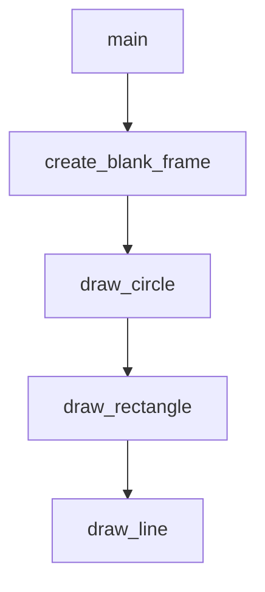

# Chapter 8: Team Adoption and Ongoing Maintenance

Welcome to **Chapter 8: Team Adoption and Ongoing Maintenance**. In this part of **Awesome Claude Skills Tutorial: High-Signal Skill Discovery and Reuse for Claude Workflows**, you will build an intuitive mental model first, then move into concrete implementation details and practical production tradeoffs.


This chapter covers long-term operationalization of shared skill stacks.

## Learning Goals

- standardize team-level skill baselines
- define review cadence for drift and deprecations
- keep internal docs synchronized with real usage
- measure impact of adopted skill sets over time

## Team Operations Checklist

- define approved baseline skill set
- maintain owner and review cadence per high-impact skill
- retire low-value or risky skills quickly
- track concrete outcomes (speed, quality, incidents)

## Source References

- [README](https://github.com/ComposioHQ/awesome-claude-skills/blob/master/README.md)
- [Contributing Guide](https://github.com/ComposioHQ/awesome-claude-skills/blob/master/CONTRIBUTING.md)

## Summary

You now have an end-to-end model for discovering, adopting, and governing Claude skills at scale.

Next steps:

- define a small approved skill bundle for your team
- run one measured pilot across a single workflow category
- establish a monthly skill review and cleanup process

## Source Code Walkthrough

### `skill-creator/scripts/init_skill.py`

The `main` function in [`skill-creator/scripts/init_skill.py`](https://github.com/ComposioHQ/awesome-claude-skills/blob/HEAD/skill-creator/scripts/init_skill.py) handles a key part of this chapter's functionality:

```py
Delete this entire "Structuring This Skill" section when done - it's just guidance.]

## [TODO: Replace with the first main section based on chosen structure]

[TODO: Add content here. See examples in existing skills:
- Code samples for technical skills
- Decision trees for complex workflows
- Concrete examples with realistic user requests
- References to scripts/templates/references as needed]

## Resources

This skill includes example resource directories that demonstrate how to organize different types of bundled resources:

### scripts/
Executable code (Python/Bash/etc.) that can be run directly to perform specific operations.

**Examples from other skills:**
- PDF skill: `fill_fillable_fields.py`, `extract_form_field_info.py` - utilities for PDF manipulation
- DOCX skill: `document.py`, `utilities.py` - Python modules for document processing

**Appropriate for:** Python scripts, shell scripts, or any executable code that performs automation, data processing, or specific operations.

**Note:** Scripts may be executed without loading into context, but can still be read by Claude for patching or environment adjustments.

### references/
Documentation and reference material intended to be loaded into context to inform Claude's process and thinking.

**Examples from other skills:**
- Product management: `communication.md`, `context_building.md` - detailed workflow guides
- BigQuery: API reference documentation and query examples
- Finance: Schema documentation, company policies
```

This function is important because it defines how Awesome Claude Skills Tutorial: High-Signal Skill Discovery and Reuse for Claude Workflows implements the patterns covered in this chapter.

### `slack-gif-creator/core/frame_composer.py`

The `create_blank_frame` function in [`slack-gif-creator/core/frame_composer.py`](https://github.com/ComposioHQ/awesome-claude-skills/blob/HEAD/slack-gif-creator/core/frame_composer.py) handles a key part of this chapter's functionality:

```py


def create_blank_frame(width: int, height: int, color: tuple[int, int, int] = (255, 255, 255)) -> Image.Image:
    """
    Create a blank frame with solid color background.

    Args:
        width: Frame width
        height: Frame height
        color: RGB color tuple (default: white)

    Returns:
        PIL Image
    """
    return Image.new('RGB', (width, height), color)


def draw_circle(frame: Image.Image, center: tuple[int, int], radius: int,
                fill_color: Optional[tuple[int, int, int]] = None,
                outline_color: Optional[tuple[int, int, int]] = None,
                outline_width: int = 1) -> Image.Image:
    """
    Draw a circle on a frame.

    Args:
        frame: PIL Image to draw on
        center: (x, y) center position
        radius: Circle radius
        fill_color: RGB fill color (None for no fill)
        outline_color: RGB outline color (None for no outline)
        outline_width: Outline width in pixels

```

This function is important because it defines how Awesome Claude Skills Tutorial: High-Signal Skill Discovery and Reuse for Claude Workflows implements the patterns covered in this chapter.

### `slack-gif-creator/core/frame_composer.py`

The `draw_circle` function in [`slack-gif-creator/core/frame_composer.py`](https://github.com/ComposioHQ/awesome-claude-skills/blob/HEAD/slack-gif-creator/core/frame_composer.py) handles a key part of this chapter's functionality:

```py


def draw_circle(frame: Image.Image, center: tuple[int, int], radius: int,
                fill_color: Optional[tuple[int, int, int]] = None,
                outline_color: Optional[tuple[int, int, int]] = None,
                outline_width: int = 1) -> Image.Image:
    """
    Draw a circle on a frame.

    Args:
        frame: PIL Image to draw on
        center: (x, y) center position
        radius: Circle radius
        fill_color: RGB fill color (None for no fill)
        outline_color: RGB outline color (None for no outline)
        outline_width: Outline width in pixels

    Returns:
        Modified frame
    """
    draw = ImageDraw.Draw(frame)
    x, y = center
    bbox = [x - radius, y - radius, x + radius, y + radius]
    draw.ellipse(bbox, fill=fill_color, outline=outline_color, width=outline_width)
    return frame


def draw_rectangle(frame: Image.Image, top_left: tuple[int, int], bottom_right: tuple[int, int],
                   fill_color: Optional[tuple[int, int, int]] = None,
                   outline_color: Optional[tuple[int, int, int]] = None,
                   outline_width: int = 1) -> Image.Image:
    """
```

This function is important because it defines how Awesome Claude Skills Tutorial: High-Signal Skill Discovery and Reuse for Claude Workflows implements the patterns covered in this chapter.

### `slack-gif-creator/core/frame_composer.py`

The `draw_rectangle` function in [`slack-gif-creator/core/frame_composer.py`](https://github.com/ComposioHQ/awesome-claude-skills/blob/HEAD/slack-gif-creator/core/frame_composer.py) handles a key part of this chapter's functionality:

```py


def draw_rectangle(frame: Image.Image, top_left: tuple[int, int], bottom_right: tuple[int, int],
                   fill_color: Optional[tuple[int, int, int]] = None,
                   outline_color: Optional[tuple[int, int, int]] = None,
                   outline_width: int = 1) -> Image.Image:
    """
    Draw a rectangle on a frame.

    Args:
        frame: PIL Image to draw on
        top_left: (x, y) top-left corner
        bottom_right: (x, y) bottom-right corner
        fill_color: RGB fill color (None for no fill)
        outline_color: RGB outline color (None for no outline)
        outline_width: Outline width in pixels

    Returns:
        Modified frame
    """
    draw = ImageDraw.Draw(frame)
    draw.rectangle([top_left, bottom_right], fill=fill_color, outline=outline_color, width=outline_width)
    return frame


def draw_line(frame: Image.Image, start: tuple[int, int], end: tuple[int, int],
              color: tuple[int, int, int] = (0, 0, 0), width: int = 2) -> Image.Image:
    """
    Draw a line on a frame.

    Args:
        frame: PIL Image to draw on
```

This function is important because it defines how Awesome Claude Skills Tutorial: High-Signal Skill Discovery and Reuse for Claude Workflows implements the patterns covered in this chapter.


## How These Components Connect


