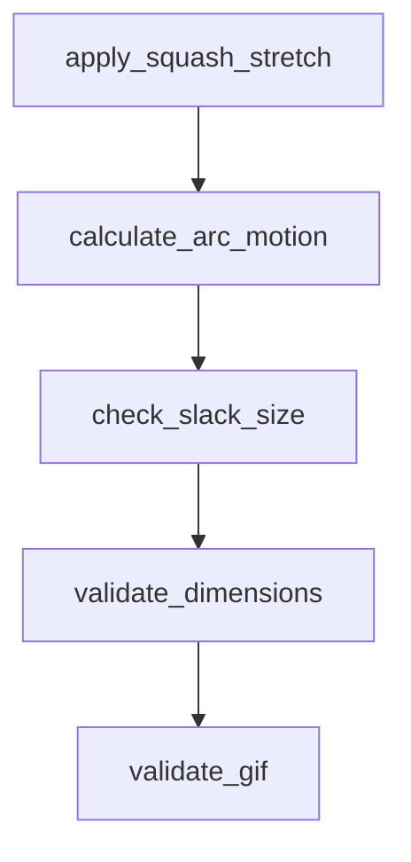

# Chapter 8: Team Adoption and Ongoing Maintenance

Welcome to **Chapter 8: Team Adoption and Ongoing Maintenance**. In this part of **Awesome Claude Skills Tutorial: High-Signal Skill Discovery and Reuse for Claude Workflows**, you will build an intuitive mental model first, then move into concrete implementation details and practical production tradeoffs.


This chapter covers long-term operationalization of shared skill stacks.

## Learning Goals

- standardize team-level skill baselines
- define review cadence for drift and deprecations
- keep internal docs synchronized with real usage
- measure impact of adopted skill sets over time

## Team Operations Checklist

- define approved baseline skill set
- maintain owner and review cadence per high-impact skill
- retire low-value or risky skills quickly
- track concrete outcomes (speed, quality, incidents)

## Source References

- [README](https://github.com/ComposioHQ/awesome-claude-skills/blob/master/README.md)
- [Contributing Guide](https://github.com/ComposioHQ/awesome-claude-skills/blob/master/CONTRIBUTING.md)

## Summary

You now have an end-to-end model for discovering, adopting, and governing Claude skills at scale.

Next steps:

- define a small approved skill bundle for your team
- run one measured pilot across a single workflow category
- establish a monthly skill review and cleanup process

## Depth Expansion Playbook

## Source Code Walkthrough

### `slack-gif-creator/core/easing.py`

The `apply_squash_stretch` function in [`slack-gif-creator/core/easing.py`](https://github.com/ComposioHQ/awesome-claude-skills/blob/HEAD/slack-gif-creator/core/easing.py) handles a key part of this chapter's functionality:

```py


def apply_squash_stretch(base_scale: tuple[float, float], intensity: float,
                         direction: str = 'vertical') -> tuple[float, float]:
    """
    Calculate squash and stretch scales for more dynamic animation.

    Args:
        base_scale: (width_scale, height_scale) base scales
        intensity: Squash/stretch intensity (0.0-1.0)
        direction: 'vertical', 'horizontal', or 'both'

    Returns:
        (width_scale, height_scale) with squash/stretch applied
    """
    width_scale, height_scale = base_scale

    if direction == 'vertical':
        # Compress vertically, expand horizontally (preserve volume)
        height_scale *= (1 - intensity * 0.5)
        width_scale *= (1 + intensity * 0.5)
    elif direction == 'horizontal':
        # Compress horizontally, expand vertically
        width_scale *= (1 - intensity * 0.5)
        height_scale *= (1 + intensity * 0.5)
    elif direction == 'both':
        # General squash (both dimensions)
        width_scale *= (1 - intensity * 0.3)
        height_scale *= (1 - intensity * 0.3)

    return (width_scale, height_scale)

```

This function is important because it defines how Awesome Claude Skills Tutorial: High-Signal Skill Discovery and Reuse for Claude Workflows implements the patterns covered in this chapter.

### `slack-gif-creator/core/easing.py`

The `calculate_arc_motion` function in [`slack-gif-creator/core/easing.py`](https://github.com/ComposioHQ/awesome-claude-skills/blob/HEAD/slack-gif-creator/core/easing.py) handles a key part of this chapter's functionality:

```py


def calculate_arc_motion(start: tuple[float, float], end: tuple[float, float],
                        height: float, t: float) -> tuple[float, float]:
    """
    Calculate position along a parabolic arc (natural motion path).

    Args:
        start: (x, y) starting position
        end: (x, y) ending position
        height: Arc height at midpoint (positive = upward)
        t: Progress (0.0-1.0)

    Returns:
        (x, y) position along arc
    """
    x1, y1 = start
    x2, y2 = end

    # Linear interpolation for x
    x = x1 + (x2 - x1) * t

    # Parabolic interpolation for y
    # y = start + progress * (end - start) + arc_offset
    # Arc offset peaks at t=0.5
    arc_offset = 4 * height * t * (1 - t)
    y = y1 + (y2 - y1) * t - arc_offset

    return (x, y)


# Add new easing functions to the convenience mapping
```

This function is important because it defines how Awesome Claude Skills Tutorial: High-Signal Skill Discovery and Reuse for Claude Workflows implements the patterns covered in this chapter.

### `slack-gif-creator/core/validators.py`

The `check_slack_size` function in [`slack-gif-creator/core/validators.py`](https://github.com/ComposioHQ/awesome-claude-skills/blob/HEAD/slack-gif-creator/core/validators.py) handles a key part of this chapter's functionality:

```py


def check_slack_size(gif_path: str | Path, is_emoji: bool = True) -> tuple[bool, dict]:
    """
    Check if GIF meets Slack size limits.

    Args:
        gif_path: Path to GIF file
        is_emoji: True for emoji GIF (64KB limit), False for message GIF (2MB limit)

    Returns:
        Tuple of (passes: bool, info: dict with details)
    """
    gif_path = Path(gif_path)

    if not gif_path.exists():
        return False, {'error': f'File not found: {gif_path}'}

    size_bytes = gif_path.stat().st_size
    size_kb = size_bytes / 1024
    size_mb = size_kb / 1024

    limit_kb = 64 if is_emoji else 2048
    limit_mb = limit_kb / 1024

    passes = size_kb <= limit_kb

    info = {
        'size_bytes': size_bytes,
        'size_kb': size_kb,
        'size_mb': size_mb,
        'limit_kb': limit_kb,
```

This function is important because it defines how Awesome Claude Skills Tutorial: High-Signal Skill Discovery and Reuse for Claude Workflows implements the patterns covered in this chapter.

### `slack-gif-creator/core/validators.py`

The `validate_dimensions` function in [`slack-gif-creator/core/validators.py`](https://github.com/ComposioHQ/awesome-claude-skills/blob/HEAD/slack-gif-creator/core/validators.py) handles a key part of this chapter's functionality:

```py


def validate_dimensions(width: int, height: int, is_emoji: bool = True) -> tuple[bool, dict]:
    """
    Check if dimensions are suitable for Slack.

    Args:
        width: Frame width in pixels
        height: Frame height in pixels
        is_emoji: True for emoji GIF, False for message GIF

    Returns:
        Tuple of (passes: bool, info: dict with details)
    """
    info = {
        'width': width,
        'height': height,
        'is_square': width == height,
        'type': 'emoji' if is_emoji else 'message'
    }

    if is_emoji:
        # Emoji GIFs should be 128x128
        optimal = width == height == 128
        acceptable = width == height and 64 <= width <= 128

        info['optimal'] = optimal
        info['acceptable'] = acceptable

        if optimal:
            print(f"✓ {width}x{height} - optimal for emoji")
            passes = True
```

This function is important because it defines how Awesome Claude Skills Tutorial: High-Signal Skill Discovery and Reuse for Claude Workflows implements the patterns covered in this chapter.


## How These Components Connect


