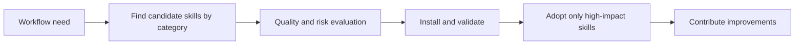

# Awesome Claude Skills Tutorial: Curated Skill Discovery and Practical Adoption for Claude Workflows

> Learn how to use `ComposioHQ/awesome-claude-skills` to find, evaluate, install, and maintain high-impact skills across coding, productivity, and app automation workflows.

## Why This Track Matters

`awesome-claude-skills` is one of the largest active skill collections for Claude and includes both prompt-native skills and app-connected automation packs.

This track focuses on:

- navigating the catalog efficiently by use case
- installing skills safely in Claude.ai and Claude Code contexts
- applying quality filters before adopting third-party skills
- contributing reusable skills with clear structure and documentation

## Current Snapshot (Verified February 12, 2026)

- repository: [`ComposioHQ/awesome-claude-skills`](https://github.com/ComposioHQ/awesome-claude-skills)
- stars: about **34.2k**
- latest release: no tagged GitHub release published yet
- recent activity: updates on **February 11, 2026**
- project positioning: high-volume curated Claude skill ecosystem with app automation coverage

## Mental Model

## Chapter Guide

| Chapter | Key Question | Outcome |
|:--------|:-------------|:--------|
| [01 - Getting Started](01-getting-started.md) | How do I use this catalog quickly without overload? | Fast onboarding baseline |
| [02 - Catalog Taxonomy and Navigation](02-catalog-taxonomy-and-navigation.md) | How should I browse categories and skill families? | Better discovery efficiency |
| [03 - Installation Paths: Claude.ai, Claude Code, API](03-installation-paths-claude-ai-claude-code-api.md) | How do install workflows differ by runtime? | Safer and faster setup |
| [04 - Skill Authoring Template and Quality Standards](04-skill-authoring-template-and-quality-standards.md) | What makes a skill reusable and reviewable? | Higher-quality skill design |
| [05 - App Automation via Composio Skill Packs](05-app-automation-via-composio-skill-packs.md) | How should tool-connected skills be adopted? | Automation readiness |
| [06 - Contribution Workflow and Governance](06-contribution-workflow-and-governance.md) | How do I contribute without adding noise? | Contributor readiness |
| [07 - Risk Management and Selection Rubric](07-risk-management-and-selection-rubric.md) | How do I minimize security and maintenance risk? | Safer adoption decisions |
| [08 - Team Adoption and Ongoing Maintenance](08-team-adoption-and-ongoing-maintenance.md) | How do teams standardize and evolve skill usage? | Operational playbook |

## What You Will Learn

- how to shortlist and validate skills for real workflow bottlenecks
- how to install and test skills across Claude runtime contexts
- how to apply a practical quality rubric for ongoing skill governance
- how to contribute skills with stronger interoperability and clarity

## Source References

- [Awesome Claude Skills Repository](https://github.com/ComposioHQ/awesome-claude-skills)
- [README](https://github.com/ComposioHQ/awesome-claude-skills/blob/master/README.md)
- [Contributing Guide](https://github.com/ComposioHQ/awesome-claude-skills/blob/master/CONTRIBUTING.md)
- [Connect Apps Plugin](https://github.com/ComposioHQ/awesome-claude-skills/tree/master/connect-apps-plugin)
- [Composio SDK Folder](https://github.com/ComposioHQ/awesome-claude-skills/tree/master/composio-sdk)

## Related Tutorials

- [Anthropic Skills Tutorial](../anthropic-skills-tutorial/)
- [Claude Code Tutorial](../claude-code-tutorial/)
- [MCP Servers Tutorial](../mcp-servers-tutorial/)
- [OpenHands Tutorial](../openhands-tutorial/)

---

Start with [Chapter 1: Getting Started](01-getting-started.md).
