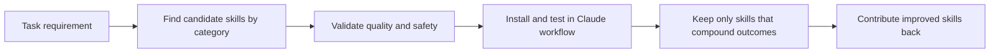

# Awesome Claude Skills Tutorial: High-Signal Skill Discovery and Reuse for Claude Workflows

> Learn how to use `ComposioHQ/awesome-claude-skills` to discover, evaluate, install, and contribute Claude skills for coding, automation, writing, and cross-app workflows.

## Why This Track Matters

`awesome-claude-skills` is one of the largest curated collections of Claude skills and practical workflow assets, with especially strong coverage across automation and real-tool integrations.

This track focuses on:

- finding relevant skills quickly across a large catalog
- installing and validating skills in Claude Code and Claude.ai contexts
- applying contribution quality standards for reusable skills
- using Composio-powered app automation skill packs safely

## Current Snapshot (Verified February 12, 2026)

- repository: [`ComposioHQ/awesome-claude-skills`](https://github.com/ComposioHQ/awesome-claude-skills)
- stars: about **34.2k**
- latest release: no tagged GitHub release published yet
- recent activity: updates on **February 11, 2026**
- project positioning: high-volume curated skills ecosystem for Claude workflows and app automation

## Mental Model

## Chapter Guide

| Chapter | Key Question | Outcome |
|:--------|:-------------|:--------|
| [01 - Getting Started](01-getting-started.md) | How do I extract value fast from a huge skills list? | Fast onboarding baseline |
| [02 - Catalog Taxonomy and Navigation](02-catalog-taxonomy-and-navigation.md) | How should I navigate categories and skill families? | Better discovery flow |
| [03 - Installation Paths: Claude.ai, Claude Code, API](03-installation-paths-claude-ai-claude-code-api.md) | How do skill install patterns differ by runtime? | Practical integration fluency |
| [04 - Skill Authoring Template and Quality Standards](04-skill-authoring-template-and-quality-standards.md) | What makes a skill reusable and trustworthy? | Higher-quality skill design |
| [05 - App Automation via Composio Skill Packs](05-app-automation-via-composio-skill-packs.md) | How do app automation skills differ from prompt-only skills? | Automation readiness |
| [06 - Contribution Workflow and Repository Governance](06-contribution-workflow-and-repository-governance.md) | How do I contribute without adding noise? | Contributor readiness |
| [07 - Risk Management and Skill Selection Rubric](07-risk-management-and-skill-selection-rubric.md) | How do I minimize security and reliability risks? | Safer adoption framework |
| [08 - Team Adoption and Ongoing Maintenance](08-team-adoption-and-ongoing-maintenance.md) | How do teams standardize and evolve skill usage? | Operational playbook |

## What You Will Learn

- how to identify high-signal skills for real workflow bottlenecks
- how to install and test skills across multiple Claude runtimes
- how to build and contribute skills that are clear, modular, and reusable
- how to govern skill usage with less risk and better team consistency

## Source References

- [Awesome Claude Skills Repository](https://github.com/ComposioHQ/awesome-claude-skills)
- [README](https://github.com/ComposioHQ/awesome-claude-skills/blob/master/README.md)
- [Contributing Guide](https://github.com/ComposioHQ/awesome-claude-skills/blob/master/CONTRIBUTING.md)
- [Connect Apps Plugin](https://github.com/ComposioHQ/awesome-claude-skills/tree/master/connect-apps-plugin)
- [Composio Skill SDK](https://github.com/ComposioHQ/awesome-claude-skills/tree/master/composio-sdk)

## Related Tutorials

- [Claude Code Tutorial](../claude-code-tutorial/)
- [Anthropic Skills Tutorial](../anthropic-skills-tutorial/)
- [Everything Claude Code Tutorial](../everything-claude-code-tutorial/)
- [OpenSkills Tutorial](../openskills-tutorial/)

---

Start with [Chapter 1: Getting Started](01-getting-started.md).
