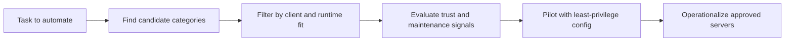

# Awesome MCP Servers Tutorial: Curating and Operating High-Signal MCP Integrations

> Learn how to use `punkpeye/awesome-mcp-servers` as a practical control surface for discovering, vetting, and operating Model Context Protocol servers across coding, data, browser automation, and enterprise workflows.

## Why This Track Matters

`awesome-mcp-servers` is one of the largest and most actively maintained MCP discovery surfaces. It is a practical bridge between protocol-level MCP understanding and real server adoption decisions.

This track focuses on:

- navigating a very large server catalog without analysis paralysis
- evaluating server quality, security posture, and maintenance signals
- choosing installation and runtime patterns for local and cloud usage
- contributing high-quality list updates that keep signal high

## Current Snapshot (auto-updated)

- repository: [`punkpeye/awesome-mcp-servers`](https://github.com/punkpeye/awesome-mcp-servers)
- stars: about **80.7k**
- latest release: no tagged GitHub release published
- recent activity: updates on **February 11, 2026**
- project positioning: primary high-volume discovery hub for MCP server implementations

## Mental Model

## Chapter Guide

| Chapter | Key Question | Outcome |
|:--------|:-------------|:--------|
| [01 - Getting Started](01-getting-started.md) | How do I get value quickly from a huge list? | Fast onboarding baseline |
| [02 - List Taxonomy and Legend](02-list-taxonomy-and-legend.md) | How should I navigate categories and symbols? | Better discovery precision |
| [03 - Clients and Runtime Compatibility](03-clients-and-runtime-compatibility.md) | Which servers fit my host/client constraints? | Fewer integration mismatches |
| [04 - Server Selection and Quality Rubric](04-server-selection-and-quality-rubric.md) | How do I choose reliable servers? | Repeatable evaluation method |
| [05 - Installation and Configuration Patterns](05-installation-and-configuration-patterns.md) | What setup patterns reduce onboarding risk? | Cleaner server rollout |
| [06 - Contribution Workflow and List Hygiene](06-contribution-workflow-and-list-hygiene.md) | How do I contribute without reducing signal quality? | Contributor readiness |
| [07 - Operations, Security, and Risk Controls](07-operations-security-and-risk-controls.md) | How do I run MCP servers safely in production contexts? | Safer operational posture |
| [08 - Team Adoption and Maintenance](08-team-adoption-and-maintenance.md) | How do teams keep MCP server stacks current over time? | Sustainable operations model |

## What You Will Learn

- how to translate business or engineering tasks into specific MCP server selection criteria
- how to screen servers by maintenance, trust, and operational fit
- how to operationalize curated MCP stacks with lower security and reliability risk
- how to contribute durable updates to an ecosystem-scale awesome list

## Source References

- [Awesome MCP Servers Repository](https://github.com/punkpeye/awesome-mcp-servers)
- [README](https://github.com/punkpeye/awesome-mcp-servers/blob/main/README.md)
- [Contributing Guide](https://github.com/punkpeye/awesome-mcp-servers/blob/main/CONTRIBUTING.md)
- [Awesome MCP Clients](https://github.com/punkpeye/awesome-mcp-clients)
- [Model Context Protocol](https://modelcontextprotocol.io/)

## Related Tutorials

- [MCP Servers Tutorial](../mcp-servers-tutorial/)
- [MCP Python SDK Tutorial](../mcp-python-sdk-tutorial/)
- [GitHub MCP Server Tutorial](../github-mcp-server-tutorial/)
- [Playwright MCP Tutorial](../playwright-mcp-tutorial/)

---

Start with [Chapter 1: Getting Started](01-getting-started.md).

## Navigation & Backlinks

- [Start Here: Chapter 1: Getting Started](01-getting-started.md)
- [Back to Main Catalog](../../README.md#-tutorial-catalog)
- [Browse A-Z Tutorial Directory](../../discoverability/tutorial-directory.md)
- [Search by Intent](../../discoverability/query-hub.md)
- [Explore Category Hubs](../../README.md#category-hubs)

## Full Chapter Map

1. [Chapter 1: Getting Started](01-getting-started.md)
2. [Chapter 2: List Taxonomy and Legend](02-list-taxonomy-and-legend.md)
3. [Chapter 3: Clients and Runtime Compatibility](03-clients-and-runtime-compatibility.md)
4. [Chapter 4: Server Selection and Quality Rubric](04-server-selection-and-quality-rubric.md)
5. [Chapter 5: Installation and Configuration Patterns](05-installation-and-configuration-patterns.md)
6. [Chapter 6: Contribution Workflow and List Hygiene](06-contribution-workflow-and-list-hygiene.md)
7. [Chapter 7: Operations, Security, and Risk Controls](07-operations-security-and-risk-controls.md)
8. [Chapter 8: Team Adoption and Maintenance](08-team-adoption-and-maintenance.md)

*Generated by [AI Codebase Knowledge Builder](https://github.com/The-Pocket/Tutorial-Codebase-Knowledge)*
