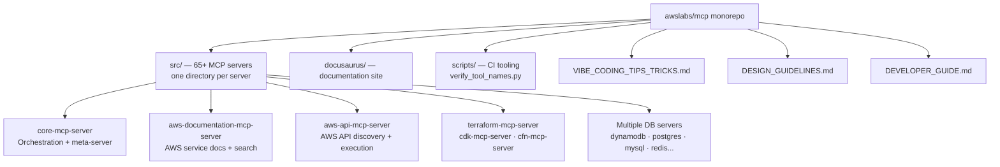
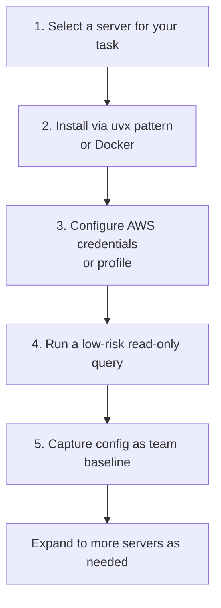

# Chapter 1: Getting Started

The `awslabs/mcp` repository is a monorepo containing 65+ production-grade MCP servers for AWS services, maintained by AWS Labs. Each server wraps one or more AWS service APIs as MCP tools, allowing LLM agents in Claude Desktop, Cursor, Amazon Q Developer, and other MCP clients to perform AWS operations through natural language.

## Learning Goals

- Identify one or two servers that match your immediate needs
- Configure installation for your primary MCP host client
- Validate first tool calls with minimal environment risk
- Establish baseline profiles and runtime settings

## Repository Overview



## Server Categories at a Glance

| Category | Example Servers |
|:---------|:---------------|
| Documentation & discovery | `aws-documentation-mcp-server`, `aws-api-mcp-server`, `aws-knowledge-mcp-server` |
| Infrastructure as Code | `terraform-mcp-server`, `cdk-mcp-server`, `cfn-mcp-server`, `aws-iac-mcp-server` |
| Compute | `eks-mcp-server`, `ecs-mcp-server`, `lambda-tool-mcp-server` |
| Data stores | `dynamodb-mcp-server`, `postgres-mcp-server`, `mysql-mcp-server`, `aurora-dsql-mcp-server` |
| AI/ML | `bedrock-kb-retrieval-mcp-server`, `amazon-bedrock-agentcore-mcp-server`, `sagemaker-ai-mcp-server` |
| Observability | `cloudwatch-mcp-server`, `cloudtrail-mcp-server`, `prometheus-mcp-server` |
| Cost & billing | `cost-explorer-mcp-server`, `billing-cost-management-mcp-server`, `aws-pricing-mcp-server` |
| Security | `iam-mcp-server`, `well-architected-security-mcp-server` |

## Fast Start Loop



### Step 1: Select Your First Server

For most AWS users, start with:
- **`aws-documentation-mcp-server`**: Search AWS service documentation — safe, read-only, no AWS credentials needed for basic usage
- **`aws-api-mcp-server`**: Discover and call AWS APIs directly — requires AWS credentials
- **`core-mcp-server`**: Meta-server for orchestrating other servers

### Step 2: Install

All servers follow the same `uvx` pattern:

```bash
# Run directly (no install step)
uvx awslabs.aws-documentation-mcp-server

# Or install into a project
uv add awslabs.aws-documentation-mcp-server
```

### Step 3: Configure Claude Desktop

```json
{
  "mcpServers": {
    "awslabs-docs": {
      "command": "uvx",
      "args": ["awslabs.aws-documentation-mcp-server"],
      "env": {
        "AWS_PROFILE": "your-profile",
        "AWS_REGION": "us-east-1",
        "MCP_LOG_LEVEL": "WARNING"
      }
    }
  }
}
```

### Step 4: Validate with a Read-Only Query

```
User: "Search AWS documentation for Lambda function timeout limits"
→ aws-documentation-mcp-server uses search tools to find relevant docs
→ Returns documentation content as markdown

User: "What AWS APIs are available for ECS task management?"
→ aws-api-mcp-server discovers relevant API operations
→ Returns API names, parameters, and documentation
```

## Fully Qualified Tool Names

The repository enforces a naming convention for all tool names. The `scripts/verify_tool_names.py` CI tool validates this:

```
Format: awslabs<server_name_underscored>___<tool_name>
Example: awslabsaws_documentation_mcp_server___search_documentation
```

This prevents tool name collisions when multiple AWS MCP servers are loaded simultaneously in the same MCP client.

## Source References

- [Repository README](https://github.com/awslabs/mcp/blob/main/README.md)
- [AWS Documentation MCP Server README](https://github.com/awslabs/mcp/blob/main/src/aws-documentation-mcp-server/README.md)
- [AWS API MCP Server README](https://github.com/awslabs/mcp/blob/main/src/aws-api-mcp-server/README.md)
- [Core MCP Server README](https://github.com/awslabs/mcp/blob/main/src/core-mcp-server/README.md)

## Summary

The `awslabs/mcp` repo provides a catalog of 65+ AWS-focused MCP servers, each installable via `uvx`. Start with the documentation or API discovery servers for read-only exploration. Use the fully qualified tool name convention (`awslabs<server>___<tool>`) to understand how tools are namespaced when multiple servers are active simultaneously.

Next: [Chapter 2: Server Catalog and Role Composition](02-server-catalog-and-role-composition.md)
