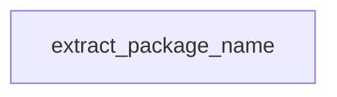

# Chapter 1: Getting Started

Welcome to **Chapter 1: Getting Started**. In this part of **awslabs/mcp Tutorial: Operating a Large-Scale MCP Server Ecosystem for AWS Workloads**, you will build an intuitive mental model first, then move into concrete implementation details and practical production tradeoffs.


This chapter gives a practical first-run path through the AWS MCP ecosystem.

## Learning Goals

- identify one or two servers that match immediate needs
- configure installation for your primary MCP host client
- validate first tool calls with minimal environment risk
- establish baseline profiles and runtime settings

## Fast Start Loop

1. select an initial server (for example documentation, API, or IaC)
2. install via your MCP host pattern (`uvx`-based paths are common)
3. set minimal environment variables (region/profile/log level)
4. run a low-risk read-only query end to end
5. capture this configuration as your baseline template

## Source References

- [Repository README](https://github.com/awslabs/mcp/blob/main/README.md)
- [AWS Documentation MCP Server README](https://github.com/awslabs/mcp/blob/main/src/aws-documentation-mcp-server/README.md)
- [AWS API MCP Server README](https://github.com/awslabs/mcp/blob/main/src/aws-api-mcp-server/README.md)

## Summary

You now have a stable onboarding path for first AWS MCP server usage.

Next: [Chapter 2: Server Catalog and Role Composition](02-server-catalog-and-role-composition.md)

## Source Code Walkthrough

### `scripts/verify_tool_names.py`

The `extract_package_name` function in [`scripts/verify_tool_names.py`](https://github.com/awslabs/mcp/blob/HEAD/scripts/verify_tool_names.py) handles a key part of this chapter's functionality:

```py


def extract_package_name(pyproject_path: Path) -> str:
    """Extract the package name from pyproject.toml file."""
    try:
        with open(pyproject_path, 'rb') as f:
            data = tomllib.load(f)
        return data['project']['name']
    except (FileNotFoundError, KeyError) as e:
        raise ValueError(f'Failed to extract package name from {pyproject_path}: {e}')
    except Exception as e:
        if 'TOML' in str(type(e).__name__):
            raise ValueError(f'Failed to parse TOML file {pyproject_path}: {e}')
        else:
            raise ValueError(f'Failed to extract package name from {pyproject_path}: {e}')


def convert_package_name_to_server_format(package_name: str) -> str:
    """Convert package name to the format used in fully qualified tool names.

    Examples:
        awslabs.git-repo-research-mcp-server -> git_repo_research_mcp_server
        awslabs.nova-canvas-mcp-server -> nova_canvas_mcp_server
    """
    # Remove 'awslabs.' prefix if present
    if package_name.startswith('awslabs.'):
        package_name = package_name[8:]

    # Replace hyphens with underscores
    return package_name.replace('-', '_')


```

This function is important because it defines how awslabs/mcp Tutorial: Operating a Large-Scale MCP Server Ecosystem for AWS Workloads implements the patterns covered in this chapter.


## How These Components Connect


