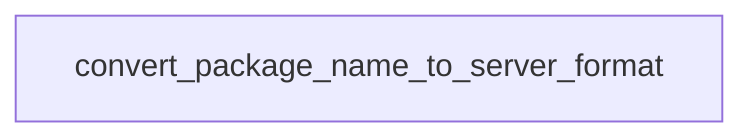

# Chapter 2: Server Catalog and Role Composition

Welcome to **Chapter 2: Server Catalog and Role Composition**. In this part of **awslabs/mcp Tutorial: Operating a Large-Scale MCP Server Ecosystem for AWS Workloads**, you will build an intuitive mental model first, then move into concrete implementation details and practical production tradeoffs.


This chapter explains how to navigate and compose capabilities from a large server catalog.

## Learning Goals

- map server choices to concrete job-to-be-done categories
- avoid loading unnecessary servers and tools for each workflow
- use role-based composition patterns where available
- keep context and tool surface area intentionally constrained

## Selection Heuristic

Start with the smallest server set that satisfies your workflow. Expand only when a measurable capability gap appears. More servers is not automatically better.

## Source References

- [Repository README Catalog](https://github.com/awslabs/mcp/blob/main/README.md)
- [Core MCP Server README](https://github.com/awslabs/mcp/blob/main/src/core-mcp-server/README.md)
- [Samples Overview](https://github.com/awslabs/mcp/blob/main/samples/README.md)

## Summary

You now have a strategy for selecting servers without overwhelming client context.

Next: [Chapter 3: Transport and Client Integration Patterns](03-transport-and-client-integration-patterns.md)

## Source Code Walkthrough

### `scripts/verify_tool_names.py`

The `convert_package_name_to_server_format` function in [`scripts/verify_tool_names.py`](https://github.com/awslabs/mcp/blob/HEAD/scripts/verify_tool_names.py) handles a key part of this chapter's functionality:

```py


def convert_package_name_to_server_format(package_name: str) -> str:
    """Convert package name to the format used in fully qualified tool names.

    Examples:
        awslabs.git-repo-research-mcp-server -> git_repo_research_mcp_server
        awslabs.nova-canvas-mcp-server -> nova_canvas_mcp_server
    """
    # Remove 'awslabs.' prefix if present
    if package_name.startswith('awslabs.'):
        package_name = package_name[8:]

    # Replace hyphens with underscores
    return package_name.replace('-', '_')


def calculate_fully_qualified_name(server_name: str, tool_name: str) -> str:
    """Calculate the fully qualified tool name as used by MCP clients.

    Format: awslabs<server_name>___<tool_name>

    Examples:
        awslabs + git_repo_research_mcp_server + ___ + search_repos_on_github
        = awslabsgit_repo_research_mcp_server___search_repos_on_github
    """
    return f'awslabs{server_name}___{tool_name}'


def find_tool_decorators(file_path: Path) -> List[Tuple[str, int]]:
    """Find all tool definitions in a Python file and extract tool names.

```

This function is important because it defines how awslabs/mcp Tutorial: Operating a Large-Scale MCP Server Ecosystem for AWS Workloads implements the patterns covered in this chapter.


## How These Components Connect


