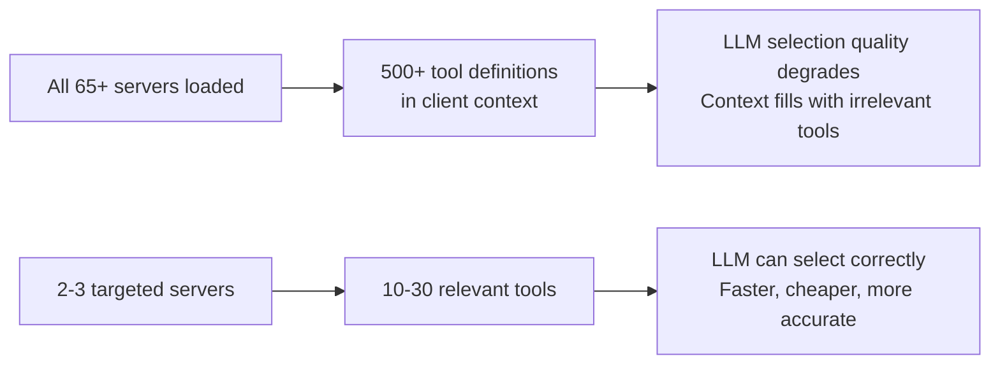
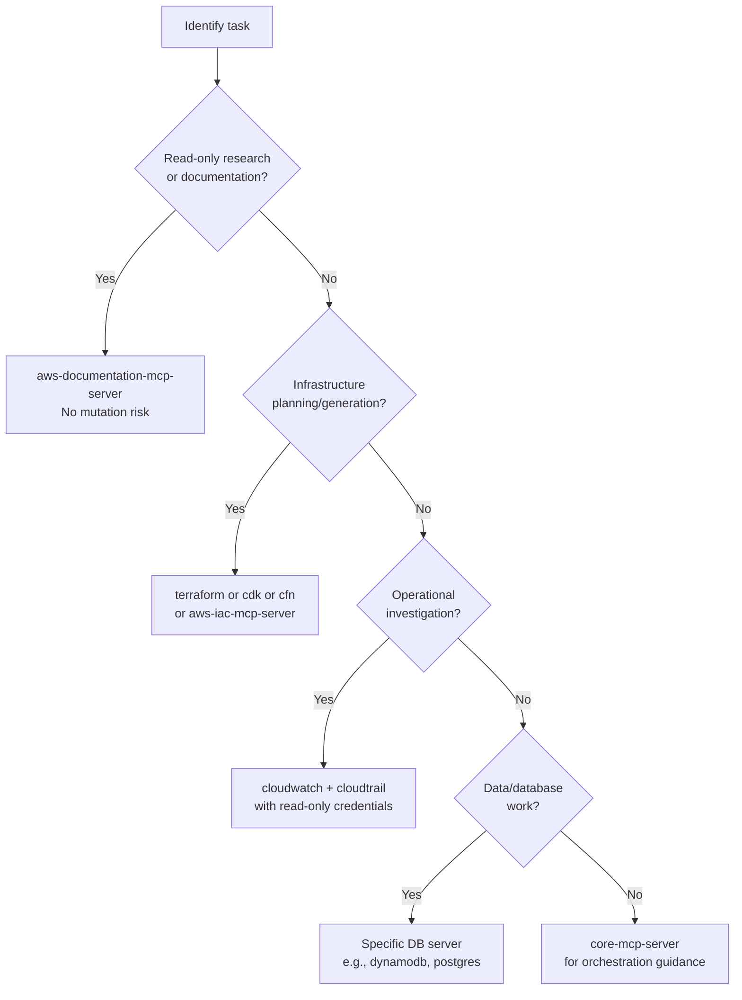

# Chapter 2: Server Catalog and Role Composition

The `awslabs/mcp` catalog contains 65+ servers. Loading all of them simultaneously would overwhelm any MCP client's context window with tool definitions. This chapter explains how to select servers by workflow role and compose them deliberately.

## Learning Goals

- Map server choices to concrete job categories
- Avoid loading unnecessary servers and their tool surface areas
- Use role-based composition patterns for complex workflows
- Keep context and tool surface area intentionally constrained

## The Context Window Problem



Each tool definition consumes tokens in the LLM context. Loading servers you don't need for a task directly degrades tool selection quality.

## Role-Based Server Composition

### Role: AWS Research / Documentation

Use when you need to understand AWS services, find documentation, or explore API options.

```json
{
  "mcpServers": {
    "aws-docs": {
      "command": "uvx",
      "args": ["awslabs.aws-documentation-mcp-server"]
    },
    "aws-api-discovery": {
      "command": "uvx",
      "args": ["awslabs.aws-api-mcp-server"],
      "env": { "AWS_PROFILE": "readonly" }
    }
  }
}
```

### Role: Infrastructure as Code Developer

Use when generating or reviewing Terraform, CDK, or CloudFormation.

```json
{
  "mcpServers": {
    "terraform": {
      "command": "uvx",
      "args": ["awslabs.terraform-mcp-server"]
    },
    "cdk": {
      "command": "uvx",
      "args": ["awslabs.cdk-mcp-server"]
    },
    "aws-docs": {
      "command": "uvx",
      "args": ["awslabs.aws-documentation-mcp-server"]
    }
  }
}
```

### Role: Data / Database Operations

Use when working with AWS managed databases.

```json
{
  "mcpServers": {
    "dynamodb": {
      "command": "uvx",
      "args": ["awslabs.dynamodb-mcp-server"],
      "env": { "AWS_PROFILE": "dev", "AWS_REGION": "us-east-1" }
    },
    "aurora-dsql": {
      "command": "uvx",
      "args": ["awslabs.aurora-dsql-mcp-server"],
      "env": { "AWS_PROFILE": "dev" }
    }
  }
}
```

### Role: Observability / Incident Response

Use during incident investigation or operational troubleshooting.

```json
{
  "mcpServers": {
    "cloudwatch": {
      "command": "uvx",
      "args": ["awslabs.cloudwatch-mcp-server"],
      "env": { "AWS_PROFILE": "readonly", "AWS_REGION": "us-east-1" }
    },
    "cloudtrail": {
      "command": "uvx",
      "args": ["awslabs.cloudtrail-mcp-server"],
      "env": { "AWS_PROFILE": "readonly" }
    }
  }
}
```

## Server Catalog by Category

```mermaid
graph TD
    CATALOG[awslabs/mcp Server Catalog]

    CATALOG --> DISCOVERY[Documentation & Discovery]
    DISCOVERY --> D1[aws-documentation-mcp-server]
    DISCOVERY --> D2[aws-api-mcp-server]
    DISCOVERY --> D3[aws-knowledge-mcp-server]
    DISCOVERY --> D4[openapi-mcp-server]

    CATALOG --> IAC[Infrastructure as Code]
    IAC --> I1[terraform-mcp-server]
    IAC --> I2[cdk-mcp-server]
    IAC --> I3[cfn-mcp-server]
    IAC --> I4[aws-iac-mcp-server]

    CATALOG --> COMPUTE[Compute & Containers]
    COMPUTE --> C1[eks-mcp-server]
    COMPUTE --> C2[ecs-mcp-server]
    COMPUTE --> C3[lambda-tool-mcp-server]
    COMPUTE --> C4[aws-serverless-mcp-server]

    CATALOG --> AIML[AI & ML]
    AIML --> A1[bedrock-kb-retrieval-mcp-server]
    AIML --> A2[amazon-bedrock-agentcore-mcp-server]
    AIML --> A3[sagemaker-ai-mcp-server]
    AIML --> A4[nova-canvas-mcp-server]

    CATALOG --> OBS[Observability]
    OBS --> O1[cloudwatch-mcp-server]
    OBS --> O2[cloudtrail-mcp-server]
    OBS --> O3[cloudwatch-applicationsignals-mcp-server]
    OBS --> O4[prometheus-mcp-server]
```



## Key Individual Servers

### `core-mcp-server`

The orchestration meta-server. It has awareness of the other servers in the ecosystem and can guide which server to activate for a given task. Load it alongside domain-specific servers for complex workflows.

### `aws-documentation-mcp-server`

Searches and retrieves AWS official documentation. No AWS credentials required for basic operation. Always safe to include — adds documentation context without risk of mutating resources.

### `aws-api-mcp-server`

Discovers and can invoke AWS APIs directly through the AWS SDK. Requires AWS credentials. Can perform write operations — use with a read-only IAM profile when exploring.

### `aws-iac-mcp-server`

A unified IaC server that wraps Terraform, CDK, and CloudFormation patterns. Use instead of loading all three IaC servers separately when you need multi-tool IaC support.

### `cloudwatch-mcp-server`

Retrieves CloudWatch metrics, logs, alarms, and dashboards. Requires CloudWatch read permissions. One of the most valuable servers for operational troubleshooting.

## Selection Heuristic



## Source References

- [Repository README Catalog](https://github.com/awslabs/mcp/blob/main/README.md)
- [Core MCP Server README](https://github.com/awslabs/mcp/blob/main/src/core-mcp-server/README.md)
- [Design Guidelines](https://github.com/awslabs/mcp/blob/main/DESIGN_GUIDELINES.md)

## Summary

Load the minimal server set for each workflow role. Documentation and discovery servers are always safe to include (read-only, no AWS credential risk). IaC servers are design-time tools; use them with explicit human approval gates for any `apply` or `deploy` operations. Observability servers should use read-only IAM profiles. Never load all 65+ servers simultaneously — context quality degrades rapidly with tool proliferation.

Next: [Chapter 3: Transport and Client Integration Patterns](03-transport-and-client-integration-patterns.md)
