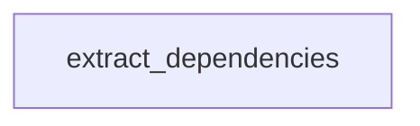

# Chapter 2: Server Catalog and Role Composition

Welcome to **Chapter 2: Server Catalog and Role Composition**. In this part of **awslabs/mcp Tutorial: Operating a Large-Scale MCP Server Ecosystem for AWS Workloads**, you will build an intuitive mental model first, then move into concrete implementation details and practical production tradeoffs.


This chapter explains how to navigate and compose capabilities from a large server catalog.

## Learning Goals

- map server choices to concrete job-to-be-done categories
- avoid loading unnecessary servers and tools for each workflow
- use role-based composition patterns where available
- keep context and tool surface area intentionally constrained

## Selection Heuristic

Start with the smallest server set that satisfies your workflow. Expand only when a measurable capability gap appears. More servers is not automatically better.

## Source References

- [Repository README Catalog](https://github.com/awslabs/mcp/blob/main/README.md)
- [Core MCP Server README](https://github.com/awslabs/mcp/blob/main/src/core-mcp-server/README.md)
- [Samples Overview](https://github.com/awslabs/mcp/blob/main/samples/README.md)

## Summary

You now have a strategy for selecting servers without overwhelming client context.

Next: [Chapter 3: Transport and Client Integration Patterns](03-transport-and-client-integration-patterns.md)

## Depth Expansion Playbook

## Source Code Walkthrough

### `scripts/verify_package_name.py`

The `extract_dependencies` function in [`scripts/verify_package_name.py`](https://github.com/awslabs/mcp/blob/HEAD/scripts/verify_package_name.py) handles a key part of this chapter's functionality:

```py


def extract_dependencies(pyproject_path: Path) -> List[str]:
    """Extract dependency names from pyproject.toml file."""
    try:
        with open(pyproject_path, 'rb') as f:
            data = tomllib.load(f)
        dependencies = data.get('project', {}).get('dependencies', [])
        # Extract just the package names (remove version constraints)
        dep_names = []
        for dep in dependencies:
            # Remove version constraints (>=, ==, etc.) and extract just the package name
            dep_name = re.split(r'[>=<!=]', dep)[0].strip()
            dep_names.append(dep_name)
        return dep_names
    except (FileNotFoundError, KeyError):
        # If we can't extract dependencies, return empty list
        return []
    except Exception:
        # If we can't parse dependencies, return empty list
        return []


def extract_package_from_base64_config(config_b64: str) -> List[str]:
    """Extract package names from Base64 encoded or URL-encoded JSON config."""
    try:
        # First, try to URL decode in case it's URL-encoded
        try:
            config_b64 = urllib.parse.unquote(config_b64)
        except (ValueError, UnicodeDecodeError):
            pass  # If URL decoding fails, use original string

```

This function is important because it defines how awslabs/mcp Tutorial: Operating a Large-Scale MCP Server Ecosystem for AWS Workloads implements the patterns covered in this chapter.


## How These Components Connect


