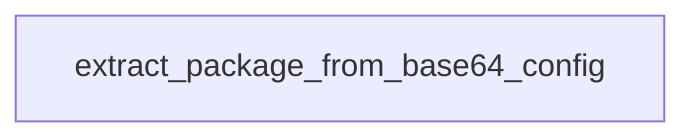

# Chapter 3: Transport and Client Integration Patterns

Welcome to **Chapter 3: Transport and Client Integration Patterns**. In this part of **awslabs/mcp Tutorial: Operating a Large-Scale MCP Server Ecosystem for AWS Workloads**, you will build an intuitive mental model first, then move into concrete implementation details and practical production tradeoffs.


This chapter covers integration patterns across IDE and chat MCP clients.

## Learning Goals

- understand default transport assumptions in the ecosystem
- map client configuration differences across hosts
- evaluate when HTTP modes are available for specific servers
- avoid brittle configuration drift across teams

## Integration Rule

Standardize one primary transport/client path per environment first, then add alternative modes only when you have a concrete operational requirement.

## Source References

- [Repository README Transport Section](https://github.com/awslabs/mcp/blob/main/README.md)
- [AWS API MCP Server README](https://github.com/awslabs/mcp/blob/main/src/aws-api-mcp-server/README.md)
- [AWS Documentation MCP Server README](https://github.com/awslabs/mcp/blob/main/src/aws-documentation-mcp-server/README.md)

## Summary

You now have a repeatable integration pattern for client configuration and transport selection.

Next: [Chapter 4: Infrastructure and IaC Workflows](04-infrastructure-and-iac-workflows.md)

## Depth Expansion Playbook

## Source Code Walkthrough

### `scripts/verify_package_name.py`

The `extract_package_from_base64_config` function in [`scripts/verify_package_name.py`](https://github.com/awslabs/mcp/blob/HEAD/scripts/verify_package_name.py) handles a key part of this chapter's functionality:

```py


def extract_package_from_base64_config(config_b64: str) -> List[str]:
    """Extract package names from Base64 encoded or URL-encoded JSON config."""
    try:
        # First, try to URL decode in case it's URL-encoded
        try:
            config_b64 = urllib.parse.unquote(config_b64)
        except (ValueError, UnicodeDecodeError):
            pass  # If URL decoding fails, use original string

        # Try to parse as JSON directly first (for URL-encoded JSON)
        try:
            config = json.loads(config_b64)
        except json.JSONDecodeError:
            # If not JSON, try Base64 decoding
            config_json = base64.b64decode(config_b64).decode('utf-8')
            config = json.loads(config_json)

        # Look for package names in the config
        package_names = []

        # Check command field - handle both formats:
        # Format 1: {"command": "uvx", "args": ["package@version"]}
        # Format 2: {"command": "uvx package@version"}
        if 'command' in config:
            command = config['command']
            if command in ['uvx', 'uv']:
                # Format 1: check args array
                if 'args' in config and config['args']:
                    for arg in config['args']:
                        # Only consider it a package if it has @ and doesn't look like a URL or connection string
```

This function is important because it defines how awslabs/mcp Tutorial: Operating a Large-Scale MCP Server Ecosystem for AWS Workloads implements the patterns covered in this chapter.


## How These Components Connect


