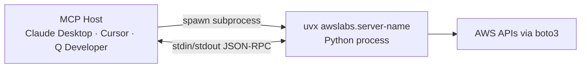
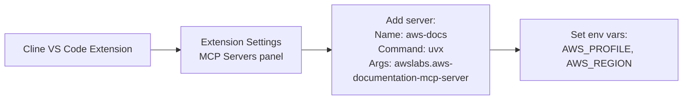
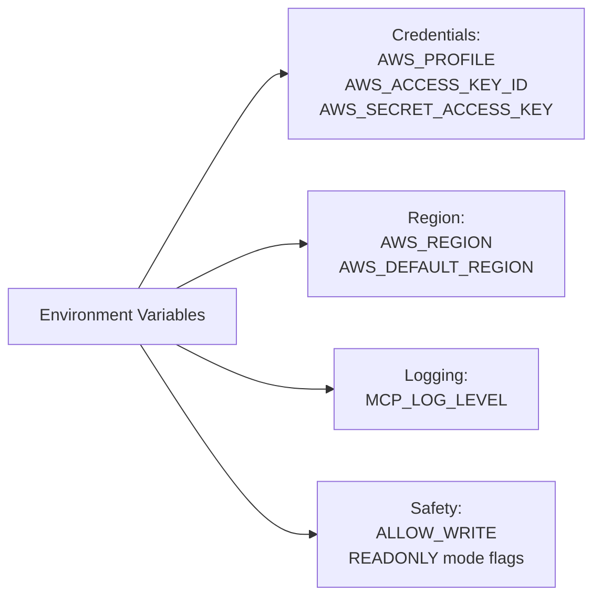

# Chapter 3: Transport and Client Integration Patterns

All `awslabs/mcp` servers support stdio transport by default, which is the right choice for local desktop clients. Some servers also support Docker-based deployment and HTTP transports. This chapter covers configuration patterns for each major MCP host client.

## Learning Goals

- Understand default transport assumptions across the ecosystem
- Map configuration differences across MCP host clients (Claude Desktop, Cursor, Amazon Q Developer, Cline)
- Evaluate when Docker or HTTP modes are appropriate for specific servers
- Avoid brittle configuration drift across teams

## Default Transport: Stdio via uvx

All servers use stdio transport by default. The MCP host spawns the server as a subprocess via `uvx`:



The `uvx` command downloads and runs the server in an isolated virtualenv without a permanent install step. This makes version control easy — pin the version in the `args`:

```json
{
  "command": "uvx",
  "args": ["awslabs.aws-documentation-mcp-server@1.3.0"]
}
```

## Claude Desktop Configuration

Config file: `~/Library/Application Support/Claude/claude_desktop_config.json` (macOS)

```json
{
  "mcpServers": {
    "aws-docs": {
      "command": "uvx",
      "args": ["awslabs.aws-documentation-mcp-server"],
      "env": {
        "AWS_PROFILE": "your-profile",
        "AWS_REGION": "us-east-1",
        "MCP_LOG_LEVEL": "WARNING"
      }
    },
    "terraform": {
      "command": "uvx",
      "args": ["awslabs.terraform-mcp-server"],
      "env": {
        "AWS_PROFILE": "infra-dev",
        "ALLOW_WRITE": "true"
      }
    }
  }
}
```

## Cursor IDE Configuration

Cursor supports global (`~/.cursor/mcp.json`) and project-level (`.cursor/mcp.json`) MCP configs:

```json
{
  "mcpServers": {
    "aws-cdk": {
      "command": "uvx",
      "args": ["awslabs.cdk-mcp-server"],
      "env": {
        "AWS_PROFILE": "dev",
        "AWS_REGION": "us-east-1"
      }
    }
  }
}
```

Project-level configs are useful for different AWS profiles per project.

## Amazon Q Developer

Amazon Q Developer has native MCP support. Configure via the Q Developer IDE extension settings or the `~/.aws/amazonq/mcp.json` configuration file:

```json
{
  "mcpServers": {
    "aws-docs": {
      "command": "uvx",
      "args": ["awslabs.aws-documentation-mcp-server"]
    },
    "cloudwatch": {
      "command": "uvx",
      "args": ["awslabs.cloudwatch-mcp-server"],
      "env": {
        "AWS_PROFILE": "readonly",
        "AWS_REGION": "us-east-1"
      }
    }
  }
}
```

## Cline (VS Code Extension)

Cline supports MCP servers configured through its settings panel. The `docs/images/root-readme/` directory in the repo contains screenshots showing the Cline configuration workflow:



## Docker Transport (Alternative)

Some servers provide Dockerfiles for containerized deployment. This is useful when:
- You cannot install Python/uv on the host machine
- You need a pinned, reproducible server environment
- You want to share a server instance across team members

```json
{
  "mcpServers": {
    "aws-docs-docker": {
      "command": "docker",
      "args": [
        "run", "--rm", "-i",
        "-e", "AWS_PROFILE=default",
        "-v", "/root/.aws:/root/.aws:ro",
        "awslabs/aws-documentation-mcp-server:latest"
      ]
    }
  }
}
```

Note: AWS credentials must be mounted or injected via environment when using Docker. The `-v /root/.aws:/root/.aws:ro` approach mounts credentials read-only into the container.

## Environment Variable Standardization

All `awslabs/mcp` servers follow consistent environment variable conventions:

| Variable | Purpose | Default |
|:---------|:--------|:--------|
| `AWS_PROFILE` | AWS credentials profile | `default` |
| `AWS_REGION` | AWS region | `us-east-1` |
| `MCP_LOG_LEVEL` | Server log verbosity | `WARNING` |
| `ALLOW_WRITE` | Enable mutating operations | `false` (server-dependent) |



## Team Configuration Standardization

To prevent drift across team environments, use a shared configuration template:

```bash
# Team shared config template in git repo
cat .mcp/config-template.json
{
  "mcpServers": {
    "aws-docs": {
      "command": "uvx",
      "args": ["awslabs.aws-documentation-mcp-server@${MCP_DOCS_VERSION}"],
      "env": {
        "AWS_PROFILE": "${AWS_PROFILE}",
        "AWS_REGION": "${AWS_REGION:-us-east-1}"
      }
    }
  }
}

# Developer runs a setup script that substitutes variables and
# copies to the correct client config location
```

## Source References

- [Repository README Transport Section](https://github.com/awslabs/mcp/blob/main/README.md)
- [AWS API MCP Server README](https://github.com/awslabs/mcp/blob/main/src/aws-api-mcp-server/README.md)
- [AWS Documentation MCP Server README](https://github.com/awslabs/mcp/blob/main/src/aws-documentation-mcp-server/README.md)
- [Cline integration screenshots](https://github.com/awslabs/mcp/tree/main/docs/images/root-readme)

## Summary

All `awslabs/mcp` servers run via `uvx` on stdio transport — the standard pattern for desktop MCP clients. Configurations differ only in the JSON config file location per client (Claude Desktop, Cursor, Amazon Q Developer, Cline). Docker transport is available for teams without Python/uv or for reproducible shared deployments. Standardize environment variables (`AWS_PROFILE`, `AWS_REGION`, `MCP_LOG_LEVEL`) across all server configs to prevent drift.

Next: [Chapter 4: Infrastructure and IaC Workflows](04-infrastructure-and-iac-workflows.md)
