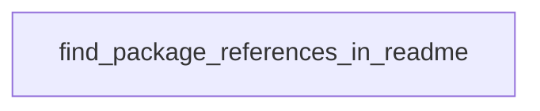

# Chapter 4: Infrastructure and IaC Workflows

Welcome to **Chapter 4: Infrastructure and IaC Workflows**. In this part of **awslabs/mcp Tutorial: Operating a Large-Scale MCP Server Ecosystem for AWS Workloads**, you will build an intuitive mental model first, then move into concrete implementation details and practical production tradeoffs.


This chapter focuses on infrastructure automation servers (Terraform, CloudFormation, CDK, and related flows).

## Learning Goals

- align IaC server choice to your existing delivery stack
- integrate security scanning into generated infrastructure workflows
- distinguish deprecated versus preferred server paths
- keep deployment ownership and approval boundaries explicit

## IaC Strategy

Use server outputs to accelerate drafting and validation, but keep infrastructure approvals, production applies, and policy exceptions under explicit human governance.

## Source References

- [AWS Terraform MCP Server README](https://github.com/awslabs/mcp/blob/main/src/terraform-mcp-server/README.md)
- [Repository README Infrastructure Sections](https://github.com/awslabs/mcp/blob/main/README.md)
- [Design Guidelines](https://github.com/awslabs/mcp/blob/main/DESIGN_GUIDELINES.md)

## Summary

You now understand how to use IaC-focused MCP servers without weakening deployment controls.

Next: [Chapter 5: Data, Knowledge, and Agent Workflows](05-data-knowledge-and-agent-workflows.md)

## Depth Expansion Playbook

## Source Code Walkthrough

### `scripts/verify_package_name.py`

The `find_package_references_in_readme` function in [`scripts/verify_package_name.py`](https://github.com/awslabs/mcp/blob/HEAD/scripts/verify_package_name.py) handles a key part of this chapter's functionality:

```py


def find_package_references_in_readme(
    readme_path: Path, dependencies: List[str] = None, verbose: bool = False
) -> List[Tuple[str, int]]:
    """Find all package name references in the README file with line numbers."""
    try:
        with open(readme_path, 'r', encoding='utf-8') as f:
            lines = f.readlines()
            content = ''.join(lines)
    except FileNotFoundError:
        return []

    # More specific patterns for package references in installation instructions
    patterns = [
        # uvx/uv tool run patterns with @version
        r'uvx\s+([a-zA-Z0-9._-]+@[a-zA-Z0-9._-]+)',
        r'uv\s+tool\s+run\s+--from\s+([a-zA-Z0-9._-]+@[a-zA-Z0-9._-]+)',
        # pip install patterns
        r'pip\s+install\s+([a-zA-Z0-9._-]+)',
        # JSON configuration patterns with @version
        r'"([a-zA-Z0-9._-]+@[a-zA-Z0-9._-]+)"',
        # Package names in JSON config (without version)
        r'"([a-zA-Z0-9._-]+)"\s*:\s*{[^}]*"command"\s*:\s*"uvx"',
        # Docker image patterns (only match actual image names, not command args)
        r'docker\s+run[^"]*"([a-zA-Z0-9._/-]+)"\s*:',
        # Cursor installation links - handled via Base64 config extraction
        # r'cursor\.com/en/install-mcp\?name=([a-zA-Z0-9._-]+)',  # Removed: name often contains display names
        # VS Code installation links (name parameter in URL) - only match package-like names
        r'vscode\.dev/redirect/mcp/install\?name=([a-zA-Z0-9._-]+)',
    ]

```

This function is important because it defines how awslabs/mcp Tutorial: Operating a Large-Scale MCP Server Ecosystem for AWS Workloads implements the patterns covered in this chapter.


## How These Components Connect


