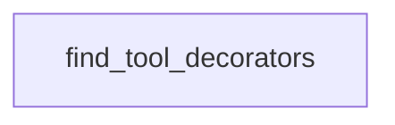

# Chapter 4: Infrastructure and IaC Workflows

Welcome to **Chapter 4: Infrastructure and IaC Workflows**. In this part of **awslabs/mcp Tutorial: Operating a Large-Scale MCP Server Ecosystem for AWS Workloads**, you will build an intuitive mental model first, then move into concrete implementation details and practical production tradeoffs.


This chapter focuses on infrastructure automation servers (Terraform, CloudFormation, CDK, and related flows).

## Learning Goals

- align IaC server choice to your existing delivery stack
- integrate security scanning into generated infrastructure workflows
- distinguish deprecated versus preferred server paths
- keep deployment ownership and approval boundaries explicit

## IaC Strategy

Use server outputs to accelerate drafting and validation, but keep infrastructure approvals, production applies, and policy exceptions under explicit human governance.

## Source References

- [AWS Terraform MCP Server README](https://github.com/awslabs/mcp/blob/main/src/terraform-mcp-server/README.md)
- [Repository README Infrastructure Sections](https://github.com/awslabs/mcp/blob/main/README.md)
- [Design Guidelines](https://github.com/awslabs/mcp/blob/main/DESIGN_GUIDELINES.md)

## Summary

You now understand how to use IaC-focused MCP servers without weakening deployment controls.

Next: [Chapter 5: Data, Knowledge, and Agent Workflows](05-data-knowledge-and-agent-workflows.md)

## Source Code Walkthrough

### `scripts/verify_tool_names.py`

The `find_tool_decorators` function in [`scripts/verify_tool_names.py`](https://github.com/awslabs/mcp/blob/HEAD/scripts/verify_tool_names.py) handles a key part of this chapter's functionality:

```py


def find_tool_decorators(file_path: Path) -> List[Tuple[str, int]]:
    """Find all tool definitions in a Python file and extract tool names.

    Supports all tool registration patterns:
    - Pattern 1: @mcp.tool(name='tool_name')
    - Pattern 2: @mcp.tool() (uses function name)
    - Pattern 3: app.tool('tool_name')(function)
    - Pattern 4: mcp.tool()(function) (uses function name)
    - Pattern 5: self.mcp.tool(name='tool_name')(function)
    - Pattern 6: @<var>.tool(name='tool_name')

    Returns:
        List of tuples: (tool_name, line_number)
    """
    try:
        with open(file_path, 'r', encoding='utf-8') as f:
            content = f.read()
    except (FileNotFoundError, UnicodeDecodeError):
        return []

    tools = []

    try:
        tree = ast.parse(content, filename=str(file_path))
    except SyntaxError:
        # If we can't parse the file, skip it
        return []

    for node in ast.walk(tree):
        # PATTERN 1 & 2 & 6: Decorator patterns
```

This function is important because it defines how awslabs/mcp Tutorial: Operating a Large-Scale MCP Server Ecosystem for AWS Workloads implements the patterns covered in this chapter.


## How These Components Connect


