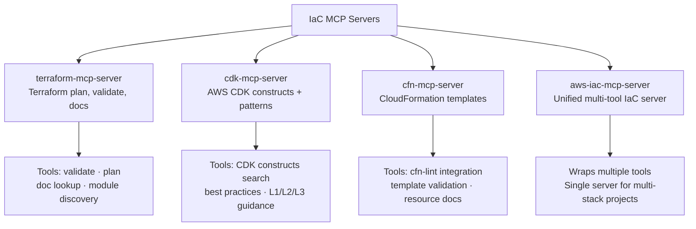
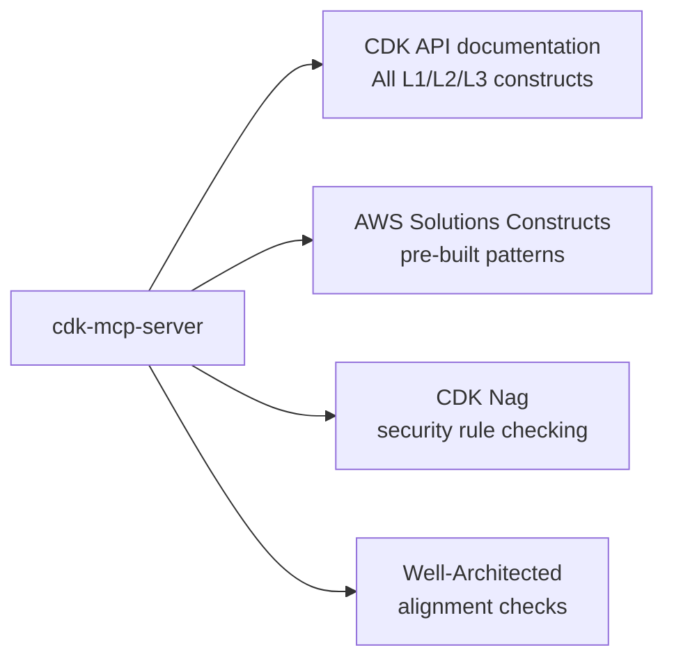
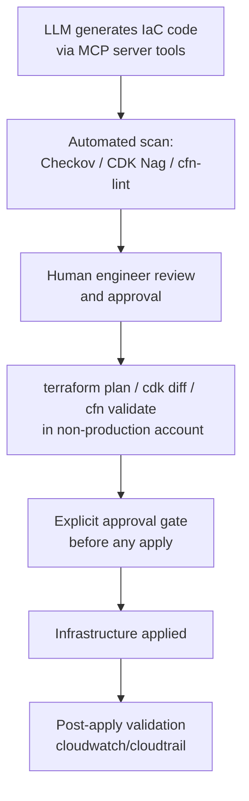

# Chapter 4: Infrastructure and IaC Workflows

The `awslabs/mcp` repo includes dedicated servers for each major AWS IaC tool: Terraform, AWS CDK, CloudFormation, and a unified `aws-iac-mcp-server`. This chapter maps each server to its use case, explains what operations it enables, and establishes governance boundaries for production infrastructure.

## Learning Goals

- Align IaC server choice to your existing delivery stack
- Integrate security scanning into generated infrastructure workflows
- Distinguish deprecated versus preferred server paths
- Keep deployment ownership and approval boundaries explicit

## IaC Server Options



## `terraform-mcp-server`

The Terraform MCP server enables AI-assisted Terraform workflows. Key tools:

- `search_terraform_registry`: Search for providers, modules, and resources in the Terraform Registry
- `resolve_terraform_registry_module`: Get module documentation and usage examples
- `run_checkov_scan`: Run Checkov security scanning on Terraform code
- `get_aws_provider_resources`: Discover available AWS Terraform resources

Typical workflow:
```
1. LLM: "Create a Terraform module for an EKS cluster with managed node groups"
2. terraform-mcp-server: search_terraform_registry for aws_eks_cluster
3. LLM: generates Terraform code using search results
4. terraform-mcp-server: run_checkov_scan on generated code
5. LLM: reviews security findings, suggests fixes
6. Human: reviews final plan before terraform apply
```

## `cdk-mcp-server`

The CDK MCP server provides AWS CDK context to AI coding assistants. Key capabilities:

- CDK construct documentation retrieval (L1, L2, L3)
- AWS Solutions Constructs pattern guidance
- CDK Nag security check integration
- Well-Architected Framework alignment for CDK patterns



## `cfn-mcp-server`

CloudFormation-specific server for teams using CFN templates. Integrates with `cfn-lint` for template validation.

## `aws-iac-mcp-server`

The unified IaC server for teams that use multiple IaC tools. Useful when:
- Your project mixes Terraform and CDK
- You want a single server entry instead of managing three separately
- You need a coordinated view across IaC tools

## IaC Governance Model



**Key rule**: MCP servers assist with code generation and validation. They do not perform `terraform apply`, `cdk deploy`, or CloudFormation stack creation without explicit human instruction. The design guidelines in the repo specify that servers should have clear `ALLOW_WRITE` controls for any mutating operations.

## Security Scanning Integration

Both `terraform-mcp-server` and `cdk-mcp-server` integrate security scanning tools. This is built into the IaC workflow, not an afterthought:

| Server | Scanning Tool | What It Checks |
|:-------|:-------------|:---------------|
| `terraform-mcp-server` | Checkov | AWS resource misconfigurations, IAM policies, encryption |
| `cdk-mcp-server` | CDK Nag | CDK construct-level security rules |
| `cfn-mcp-server` | cfn-lint | CloudFormation template validity and best practices |

## Common IaC Workflows

### Generate EKS Cluster (CDK)

```
1. Load: cdk-mcp-server + aws-documentation-mcp-server
2. "Create a production EKS cluster in CDK with managed node groups, encryption, and logging"
3. cdk-mcp-server provides CDK construct docs + AWS Solutions Constructs patterns
4. aws-documentation-mcp-server provides EKS configuration best practices
5. LLM generates CDK TypeScript code
6. cdk-mcp-server runs CDK Nag checks
7. Human reviews, runs cdk diff, approves deployment
```

### Scan Existing Terraform

```
1. Load: terraform-mcp-server
2. "Scan my Terraform code in ./infra/ for security issues"
3. terraform-mcp-server: run_checkov_scan on ./infra/
4. LLM reviews findings and suggests fixes
5. Developer applies fixes, re-scans
```

## Source References

- [Terraform MCP Server README](https://github.com/awslabs/mcp/blob/main/src/terraform-mcp-server/README.md)
- [CDK MCP Server README](https://github.com/awslabs/mcp/blob/main/src/cdk-mcp-server/README.md)
- [CFN MCP Server README](https://github.com/awslabs/mcp/blob/main/src/cfn-mcp-server/README.md)
- [Design Guidelines](https://github.com/awslabs/mcp/blob/main/DESIGN_GUIDELINES.md)

## Summary

The IaC servers accelerate code generation and validation but do not replace human governance of production changes. The standard workflow is: generate → scan → human review → dry-run → explicit approval → apply. Use `terraform-mcp-server` for Terraform workflows with Checkov integration, `cdk-mcp-server` for CDK with CDK Nag, and `aws-iac-mcp-server` for unified multi-tool projects. Never configure the servers to `apply` or `deploy` in production without an explicit human approval step.

Next: [Chapter 5: Data, Knowledge, and Agent Workflows](05-data-knowledge-and-agent-workflows.md)
