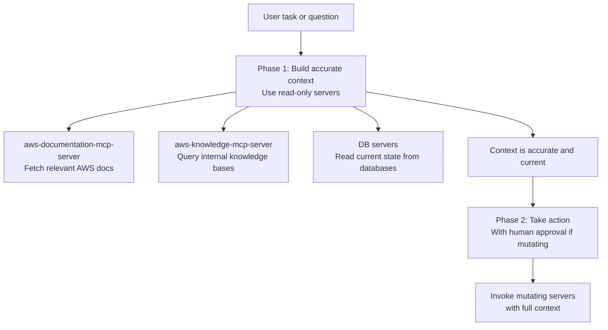
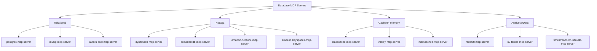

# Chapter 5: Data, Knowledge, and Agent Workflows

This chapter covers documentation/knowledge servers that reduce LLM staleness, data-oriented servers for AWS managed databases, and the pattern for chaining read-oriented context-building before invoking mutating operations.

## Learning Goals

- Use documentation and knowledge servers to reduce stale-model assumptions about AWS services
- Combine data-oriented servers for richer troubleshooting and planning workflows
- Structure workflows that separate retrieval from action execution
- Choose server combinations by task complexity and risk level

## Context-First Workflow Pattern



The pattern: always retrieve relevant documentation and data state first, then invoke operational or mutating tools. This prevents LLM hallucinations about service behavior and reduces errors from stale training data.

## Documentation & Knowledge Servers

### `aws-documentation-mcp-server`

The primary documentation retrieval server. Searches and fetches content from official AWS documentation at docs.aws.amazon.com.

Key tools:
- `search_documentation`: Full-text search across AWS documentation
- `get_documentation`: Fetch a specific documentation page
- `recommend_resources`: Get recommended documentation for a service or topic

Use cases:
- "What are the default timeout limits for Lambda functions?"
- "What IAM permissions are needed to create an RDS cluster?"
- "What are the differences between provisioned and on-demand capacity for DynamoDB?"

### `aws-knowledge-mcp-server`

Connects to Amazon Bedrock Knowledge Bases to query internal team knowledge, runbooks, or custom documentation indexed in your Bedrock Knowledge Base.

```json
{
  "mcpServers": {
    "team-knowledge": {
      "command": "uvx",
      "args": ["awslabs.aws-knowledge-mcp-server"],
      "env": {
        "AWS_PROFILE": "prod-readonly",
        "KNOWLEDGE_BASE_ID": "your-knowledge-base-id",
        "AWS_REGION": "us-east-1"
      }
    }
  }
}
```

### `bedrock-kb-retrieval-mcp-server`

Similar to `aws-knowledge-mcp-server` but specialized for Bedrock Knowledge Base retrieval with advanced filtering and ranking options.

## Database Servers



### Database Workflow Pattern

```
1. Load the relevant DB server for your database type
2. "Show me the schema for the orders table in production"
3. DB server: reads schema metadata (DDL or describe)
4. "Write a query to find orders older than 30 days with pending status"
5. LLM generates SQL using schema context
6. Human reviews query before execution
7. "Run the query in read-only mode to verify results"
```

Key rule: database servers can read data and should be able to execute queries, but any data-modifying operations (DELETE, UPDATE, INSERT at scale) should require explicit confirmation.

## Agent Workflow Composition

For complex multi-step AWS workflows, combine multiple servers:

### Example: Database Incident Investigation

```json
{
  "mcpServers": {
    "cloudwatch": { "command": "uvx", "args": ["awslabs.cloudwatch-mcp-server"], "env": { "AWS_PROFILE": "readonly" } },
    "dynamodb": { "command": "uvx", "args": ["awslabs.dynamodb-mcp-server"], "env": { "AWS_PROFILE": "readonly" } },
    "aws-docs": { "command": "uvx", "args": ["awslabs.aws-documentation-mcp-server"] }
  }
}
```

Investigation sequence:
```
1. cloudwatch-mcp-server: query CloudWatch metrics for DynamoDB table
2. cloudwatch-mcp-server: retrieve error logs from CloudWatch Logs
3. dynamodb-mcp-server: describe the table capacity and index configuration
4. aws-documentation-mcp-server: look up DynamoDB throttling documentation
5. LLM synthesizes findings and recommends capacity adjustments
```

### Example: Data Pipeline Planning

```json
{
  "mcpServers": {
    "aws-dataprocessing": { "command": "uvx", "args": ["awslabs.aws-dataprocessing-mcp-server"], "env": { "AWS_PROFILE": "dev" } },
    "aws-docs": { "command": "uvx", "args": ["awslabs.aws-documentation-mcp-server"] },
    "stepfunctions": { "command": "uvx", "args": ["awslabs.stepfunctions-tool-mcp-server"], "env": { "AWS_PROFILE": "dev" } }
  }
}
```

## AI/ML Workflow Servers

### `amazon-bedrock-agentcore-mcp-server`

Connects to Amazon Bedrock AgentCore for managed agent execution. Provides tools for browser interaction, code execution, memory management, and gateway operations.

### `sagemaker-ai-mcp-server`

Access SageMaker for model training, deployment, and inference operations.

### `nova-canvas-mcp-server`

Generate and edit images using Amazon Nova Canvas via Bedrock.

## Source References

- [AWS Documentation MCP Server README](https://github.com/awslabs/mcp/blob/main/src/aws-documentation-mcp-server/README.md)
- [AWS Knowledge MCP Server README](https://github.com/awslabs/mcp/blob/main/src/aws-knowledge-mcp-server/README.md)
- [DynamoDB MCP Server README](https://github.com/awslabs/mcp/blob/main/src/dynamodb-mcp-server/README.md)
- [Bedrock KB Retrieval README](https://github.com/awslabs/mcp/blob/main/src/bedrock-kb-retrieval-mcp-server/README.md)
- [Samples README](https://github.com/awslabs/mcp/blob/main/samples/README.md)

## Summary

Build workflows with documentation and data retrieval first, action execution second. The `aws-documentation-mcp-server` is the safest and most broadly useful server — include it in any task requiring AWS service knowledge. Database servers enable powerful schema-aware query generation; always read before write and require human review before bulk mutations. Combine observability servers (cloudwatch, cloudtrail) with data servers for incident investigation workflows.

Next: [Chapter 6: Security, Credentials, and Risk Controls](06-security-credentials-and-risk-controls.md)
