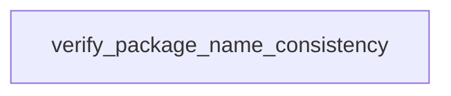

# Chapter 5: Data, Knowledge, and Agent Workflows

Welcome to **Chapter 5: Data, Knowledge, and Agent Workflows**. In this part of **awslabs/mcp Tutorial: Operating a Large-Scale MCP Server Ecosystem for AWS Workloads**, you will build an intuitive mental model first, then move into concrete implementation details and practical production tradeoffs.


This chapter explains how documentation and data-oriented servers improve context quality for coding and operations agents.

## Learning Goals

- use documentation/knowledge servers to reduce stale-model assumptions
- combine data-oriented servers for richer troubleshooting and planning
- structure workflows that separate retrieval from action execution
- choose server combinations by task complexity and risk

## Workflow Pattern

Use knowledge and documentation servers first to build accurate context, then invoke mutating or operational servers only after intent and constraints are clear.

## Source References

- [AWS Documentation MCP Server README](https://github.com/awslabs/mcp/blob/main/src/aws-documentation-mcp-server/README.md)
- [Repository README Knowledge/Data Sections](https://github.com/awslabs/mcp/blob/main/README.md)
- [Samples README](https://github.com/awslabs/mcp/blob/main/samples/README.md)

## Summary

You now have a context-first approach for data and knowledge enriched MCP workflows.

Next: [Chapter 6: Security, Credentials, and Risk Controls](06-security-credentials-and-risk-controls.md)

## Depth Expansion Playbook

## Source Code Walkthrough

### `scripts/verify_package_name.py`

The `verify_package_name_consistency` function in [`scripts/verify_package_name.py`](https://github.com/awslabs/mcp/blob/HEAD/scripts/verify_package_name.py) handles a key part of this chapter's functionality:

```py


def verify_package_name_consistency(
    package_name: str, references: List[Tuple[str, int]]
) -> Tuple[bool, List[str]]:
    """Verify that package references match the actual package name."""
    # Extract just the package name part (without version)
    base_package_name = package_name.split('@')[0] if '@' in package_name else package_name

    issues = []

    for ref, line_num in references:
        # Extract package name from reference (remove version if present)
        ref_package = ref.split('@')[0] if '@' in ref else ref

        if ref_package != base_package_name:
            issues.append(
                f"Package name mismatch: found '{ref_package}' but expected '{base_package_name}' (line {line_num})"
            )

    return len(issues) == 0, issues


def main():
    """Main function to verify package name consistency."""
    parser = argparse.ArgumentParser(
        description='Verify that README files correctly reference package names from pyproject.toml'
    )
    parser.add_argument(
        'package_dir', help='Path to the package directory (e.g., src/amazon-neptune-mcp-server)'
    )
    parser.add_argument('--verbose', '-v', action='store_true', help='Enable verbose output')
```

This function is important because it defines how awslabs/mcp Tutorial: Operating a Large-Scale MCP Server Ecosystem for AWS Workloads implements the patterns covered in this chapter.


## How These Components Connect


