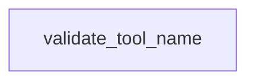

# Chapter 6: Security, Credentials, and Risk Controls

Welcome to **Chapter 6: Security, Credentials, and Risk Controls**. In this part of **awslabs/mcp Tutorial: Operating a Large-Scale MCP Server Ecosystem for AWS Workloads**, you will build an intuitive mental model first, then move into concrete implementation details and practical production tradeoffs.


This chapter covers credential boundaries, mutating-operation risk, and environment controls.

## Learning Goals

- map IAM role scope to operational blast radius
- apply read-only and mutation-consent style safeguards where supported
- enforce single-tenant assumptions for server instances
- reduce file-system and command execution risk through explicit policy

## Security Baseline

Treat IAM as the primary control plane, then layer server-side safety flags and client approval flows on top. Do not run single-user servers as shared multi-tenant services.

## Source References

- [AWS API MCP Server Security Sections](https://github.com/awslabs/mcp/blob/main/src/aws-api-mcp-server/README.md)
- [Repository README Security Notes](https://github.com/awslabs/mcp/blob/main/README.md)
- [Vibe Coding Tips](https://github.com/awslabs/mcp/blob/main/VIBE_CODING_TIPS_TRICKS.md)

## Summary

You now have a practical risk-control framework for production MCP usage on AWS.

Next: [Chapter 7: Development, Testing, and Contribution Workflow](07-development-testing-and-contribution-workflow.md)

## Source Code Walkthrough

### `scripts/verify_tool_names.py`

The `validate_tool_name` function in [`scripts/verify_tool_names.py`](https://github.com/awslabs/mcp/blob/HEAD/scripts/verify_tool_names.py) handles a key part of this chapter's functionality:

```py


def validate_tool_name(tool_name: str) -> Tuple[List[str], List[str]]:
    """Validate a tool name against naming conventions.

    Returns:
        Tuple of (errors, warnings)
        - errors: Critical validation failures (will fail the build)
        - warnings: Style recommendations (informational only)
    """
    errors = []
    warnings = []

    # Check if name is empty
    if not tool_name:
        errors.append('Tool name cannot be empty')
        return errors, warnings

    # Check length (MCP SEP-986: tool names should be 1-64 characters)
    if len(tool_name) > MAX_TOOL_NAME_LENGTH:
        errors.append(
            f"Tool name '{tool_name}' ({len(tool_name)} chars) exceeds the {MAX_TOOL_NAME_LENGTH} "
            f'character limit specified in MCP SEP-986. Please shorten the tool name.'
        )

    # Check if name matches the valid pattern
    if not VALID_TOOL_NAME_PATTERN.match(tool_name):
        if tool_name[0].isdigit():
            errors.append(f"Tool name '{tool_name}' cannot start with a number")
        elif not tool_name[0].isalpha():
            errors.append(f"Tool name '{tool_name}' must start with a letter")
        else:
```

This function is important because it defines how awslabs/mcp Tutorial: Operating a Large-Scale MCP Server Ecosystem for AWS Workloads implements the patterns covered in this chapter.


## How These Components Connect


