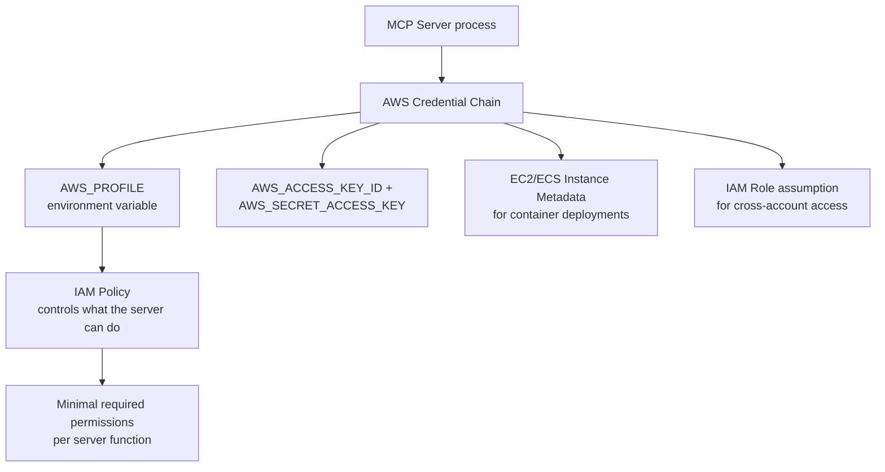
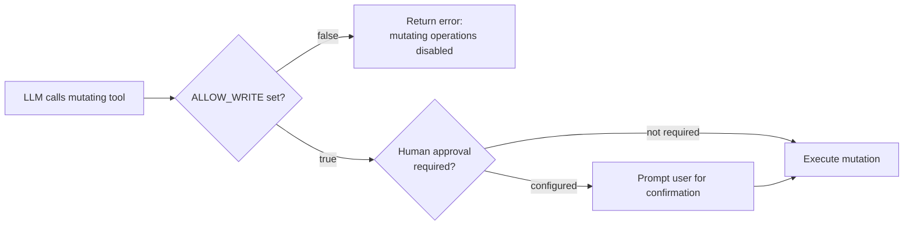
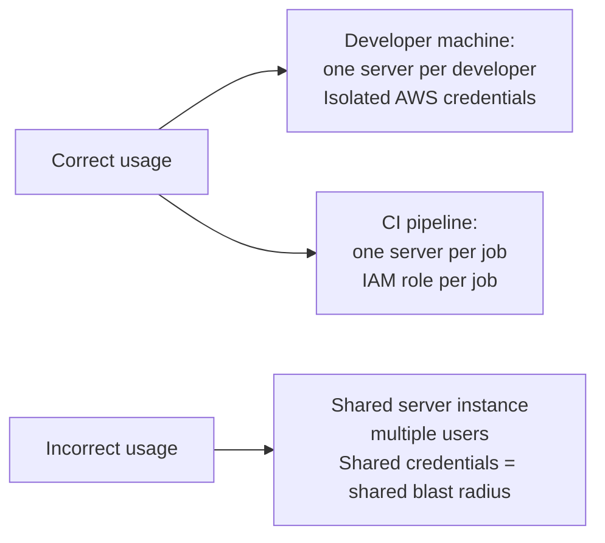
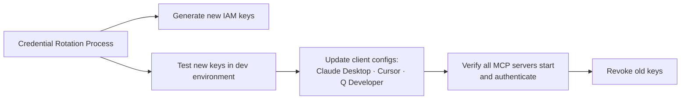

# Chapter 6: Security, Credentials, and Risk Controls

This chapter covers the IAM credential model for `awslabs/mcp` servers, risk controls for mutating operations, and design guidelines the project follows to limit blast radius.

## Learning Goals

- Map IAM role scope to operational blast radius
- Apply read-only and mutation-consent safeguards where servers support them
- Enforce single-tenant assumptions for server instances
- Reduce risk through explicit policy, allowlists, and timeout controls

## IAM as the Primary Control Plane

All `awslabs/mcp` servers authenticate to AWS using standard credential chain resolution: `AWS_PROFILE`, `AWS_ACCESS_KEY_ID`/`AWS_SECRET_ACCESS_KEY`, instance metadata (EC2/ECS), or assume-role chains.



## IAM Policy Principles

### Principle of Least Privilege Per Server

Each server should run with an IAM profile that grants only the permissions it needs.

| Server | Minimum Permissions Needed |
|:-------|:--------------------------|
| `aws-documentation-mcp-server` | None (public docs) or minimal read |
| `cloudwatch-mcp-server` | `cloudwatch:Describe*`, `cloudwatch:Get*`, `logs:Get*`, `logs:Describe*` |
| `dynamodb-mcp-server` (read) | `dynamodb:Describe*`, `dynamodb:List*`, `dynamodb:Query`, `dynamodb:Scan` |
| `dynamodb-mcp-server` (write) | Add `dynamodb:PutItem`, `dynamodb:UpdateItem`, `dynamodb:DeleteItem` |
| `terraform-mcp-server` | Read-only for plan; deployment permissions for apply |

### Separate Profiles by Risk Level

```json
{
  "mcpServers": {
    "cloudwatch-readonly": {
      "command": "uvx",
      "args": ["awslabs.cloudwatch-mcp-server"],
      "env": { "AWS_PROFILE": "mcp-readonly" }
    },
    "dynamodb-readwrite": {
      "command": "uvx",
      "args": ["awslabs.dynamodb-mcp-server"],
      "env": { "AWS_PROFILE": "mcp-dynamodb-dev" }
    }
  }
}
```

## Mutation Controls

Many servers support `ALLOW_WRITE` or equivalent flags that explicitly gate mutating operations:

```json
{
  "mcpServers": {
    "terraform": {
      "command": "uvx",
      "args": ["awslabs.terraform-mcp-server"],
      "env": {
        "AWS_PROFILE": "infra-dev",
        "ALLOW_WRITE": "false"
      }
    }
  }
}
```



## Design Guidelines Security Practices

The `DESIGN_GUIDELINES.md` specifies security practices that all `awslabs/mcp` servers must follow:

### Code Security Scanning

All servers run Bandit (Python security linter) as part of CI:
```bash
bandit -r src/ -c .bandit
```

This catches common issues: hardcoded credentials, unsafe subprocess calls, SQL injection risks.

### Controlled Execution Environments

Servers that execute code (like code runners or IaC tools) must use timeouts and resource limits:
```python
# From design guidelines pattern
async with asyncio.timeout(EXECUTION_TIMEOUT_SECONDS):
    result = await execute_command(cmd)
```

### Explicit Allowlists

For servers that interact with file systems or run commands, use explicit allowlists rather than denylists:

```python
ALLOWED_FILE_EXTENSIONS = {'.tf', '.json', '.yaml', '.yml'}

def validate_file_path(path: str) -> None:
    ext = Path(path).suffix
    if ext not in ALLOWED_FILE_EXTENSIONS:
        raise ValueError(f"File extension {ext} not allowed")
```

### Timeouts for Long-Running Operations

All long-running API calls must have explicit timeouts to prevent hanging tool executions that block the MCP client.

## Single-Tenant Assumption

`awslabs/mcp` servers are designed for single-user local development or CI usage. They are not designed for multi-tenant hosted deployments where multiple users share a single server instance.



If you need multi-tenant MCP deployment, run separate instances per user with separate IAM credentials.

## Sensitive Operations Requiring Human Approval

Never configure MCP servers to auto-execute these operations without explicit human confirmation:
- `terraform apply` or `cdk deploy` in production accounts
- Database `DELETE`, `DROP`, or bulk `UPDATE` statements
- IAM policy creation or modification
- Security group rule changes
- S3 bucket deletion or ACL modification
- EKS cluster creation or deletion

The `VIBE_CODING_TIPS_TRICKS.md` in the repo provides guidance on configuring AI coding tools to maintain appropriate human oversight.

## Credential Rotation



Use IAM Roles with short-lived STS tokens rather than long-lived access keys where possible. For developer machines, use `aws sso login` with SSO-backed profiles rather than static access keys.

## Source References

- [AWS API MCP Server Security Sections](https://github.com/awslabs/mcp/blob/main/src/aws-api-mcp-server/README.md)
- [Design Guidelines — Security Practices](https://github.com/awslabs/mcp/blob/main/DESIGN_GUIDELINES.md)
- [Vibe Coding Tips — Safety](https://github.com/awslabs/mcp/blob/main/VIBE_CODING_TIPS_TRICKS.md)

## Summary

IAM is the primary risk control — assign minimal necessary permissions per server and use separate profiles per risk level (read-only vs. read-write). Use `ALLOW_WRITE=false` for servers in exploration mode. Follow the design guidelines' explicit allowlist pattern for file and command operations. Servers are single-tenant by design — never share an instance or credentials across users. Prefer IAM Roles with STS tokens over static access keys for all deployments.

Next: [Chapter 7: Development, Testing, and Contribution Workflow](07-development-testing-and-contribution-workflow.md)
