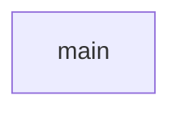

# Chapter 6: Security, Credentials, and Risk Controls

Welcome to **Chapter 6: Security, Credentials, and Risk Controls**. In this part of **awslabs/mcp Tutorial: Operating a Large-Scale MCP Server Ecosystem for AWS Workloads**, you will build an intuitive mental model first, then move into concrete implementation details and practical production tradeoffs.


This chapter covers credential boundaries, mutating-operation risk, and environment controls.

## Learning Goals

- map IAM role scope to operational blast radius
- apply read-only and mutation-consent style safeguards where supported
- enforce single-tenant assumptions for server instances
- reduce file-system and command execution risk through explicit policy

## Security Baseline

Treat IAM as the primary control plane, then layer server-side safety flags and client approval flows on top. Do not run single-user servers as shared multi-tenant services.

## Source References

- [AWS API MCP Server Security Sections](https://github.com/awslabs/mcp/blob/main/src/aws-api-mcp-server/README.md)
- [Repository README Security Notes](https://github.com/awslabs/mcp/blob/main/README.md)
- [Vibe Coding Tips](https://github.com/awslabs/mcp/blob/main/VIBE_CODING_TIPS_TRICKS.md)

## Summary

You now have a practical risk-control framework for production MCP usage on AWS.

Next: [Chapter 7: Development, Testing, and Contribution Workflow](07-development-testing-and-contribution-workflow.md)

## Depth Expansion Playbook

## Source Code Walkthrough

### `scripts/verify_package_name.py`

The `main` function in [`scripts/verify_package_name.py`](https://github.com/awslabs/mcp/blob/HEAD/scripts/verify_package_name.py) handles a key part of this chapter's functionality:

```py


def main():
    """Main function to verify package name consistency."""
    parser = argparse.ArgumentParser(
        description='Verify that README files correctly reference package names from pyproject.toml'
    )
    parser.add_argument(
        'package_dir', help='Path to the package directory (e.g., src/amazon-neptune-mcp-server)'
    )
    parser.add_argument('--verbose', '-v', action='store_true', help='Enable verbose output')

    args = parser.parse_args()

    package_dir = Path(args.package_dir)
    pyproject_path = package_dir / 'pyproject.toml'
    readme_path = package_dir / 'README.md'

    if not package_dir.exists():
        print(f"Error: Package directory '{package_dir}' does not exist", file=sys.stderr)
        sys.exit(1)

    if not pyproject_path.exists():
        print(f"Error: pyproject.toml not found in '{package_dir}'", file=sys.stderr)
        sys.exit(1)

    if not readme_path.exists():
        print(f"Warning: README.md not found in '{package_dir}'", file=sys.stderr)
        sys.exit(0)

    try:
        # Extract package name from pyproject.toml
```

This function is important because it defines how awslabs/mcp Tutorial: Operating a Large-Scale MCP Server Ecosystem for AWS Workloads implements the patterns covered in this chapter.


## How These Components Connect


