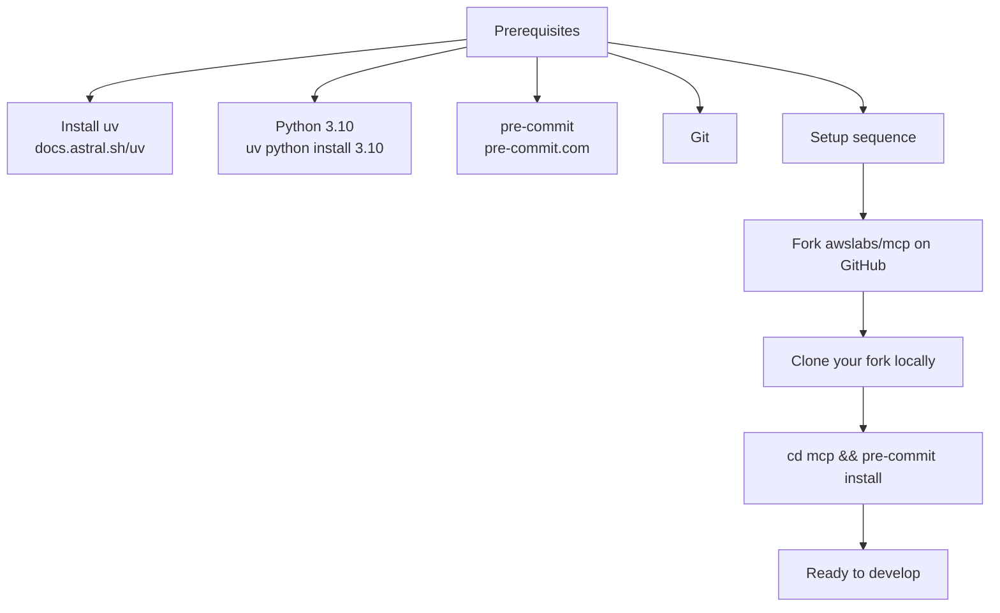
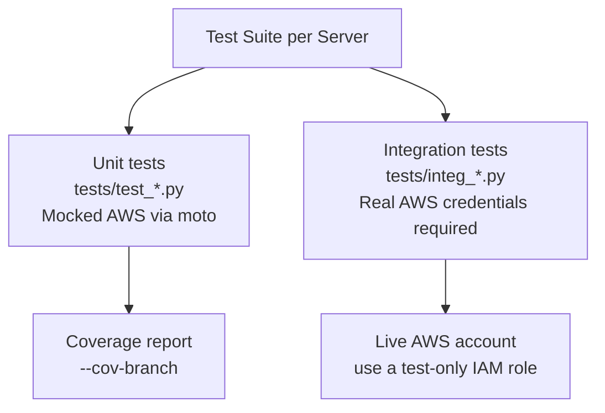
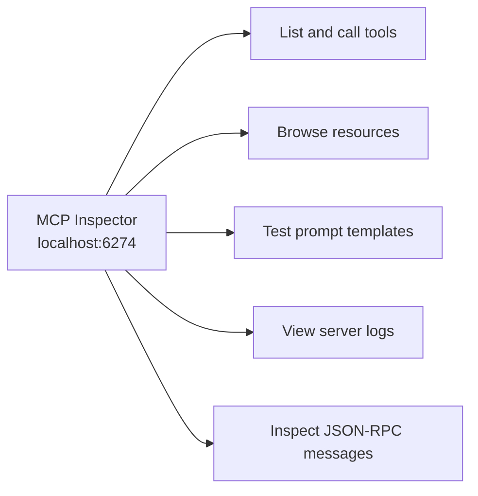
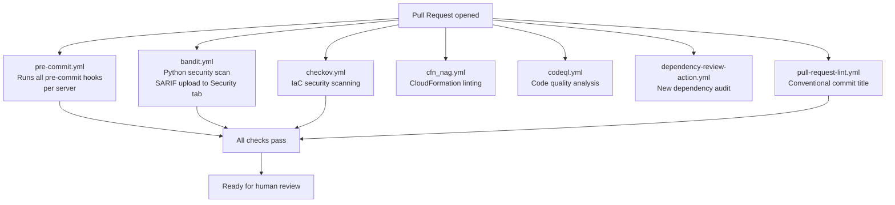
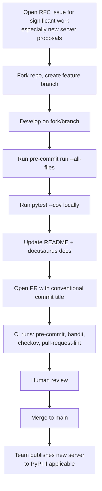

# Chapter 7: Development, Testing, and Contribution Workflow

This chapter covers the full contributor workflow for the `awslabs/mcp` monorepo: setting up a local development environment, running quality gates, writing and executing tests, and preparing pull requests that pass automated CI.

## Learning Goals

- Set up local tooling with uv, Python 3.10, and pre-commit hooks
- Use cookiecutter to scaffold a new server from the monorepo template
- Run server-level unit and integration tests with coverage reporting
- Use MCP Inspector for interactive local debugging
- Understand CI pipeline checks that all PRs must pass

## Local Development Setup

The `DEVELOPER_GUIDE.md` defines the prerequisites and setup sequence:



**Required tools:**

| Tool | Version | Install |
|:-----|:--------|:--------|
| uv | latest | `curl -LsSf https://astral.sh/uv/install.sh \| sh` |
| Python | 3.10 | `uv python install 3.10` |
| pre-commit | latest | `pip install pre-commit` |
| AWS CLI | v2 | Optional, needed for credential setup |

After cloning your fork, install pre-commit hooks at the repo root:

```bash
cd mcp
pre-commit install
```

Pre-commit runs before every commit. You can also trigger it manually:

```bash
pre-commit run --all-files
```

## Scaffolding a New Server

Use the cookiecutter template from the monorepo to generate a new server skeleton:

```bash
uvx cookiecutter https://github.com/awslabs/mcp.git \
  --checkout cookiecutters \
  --output-dir ./src \
  --directory python
```

The CLI prompts you for server name, description, and initial version. The generated project lands in `src/<your-server-name>-mcp-server/` following the standard server structure:

```
src/your-server-name-mcp-server/
├── README.md
├── CHANGELOG.md
├── pyproject.toml
├── .pre-commit-config.yaml
├── awslabs/
│   └── your_server_name/
│       ├── __init__.py
│       ├── server.py       # FastMCP app, tool registrations
│       ├── models.py       # Pydantic models
│       └── consts.py       # Constants
└── tests/
    ├── test_server.py
    └── integ_basic.py
```

After generation, install dependencies:

```bash
cd src/your-server-name-mcp-server
uv venv && uv sync --all-groups
```

## Design Guidelines: Code Organization

The `DESIGN_GUIDELINES.md` specifies the conventions all servers must follow:

### Module Structure

- `server.py`: FastMCP app initialization, tool definitions, `main()` entry point
- `models.py`: Pydantic models for request/response validation
- `consts.py`: Constants shared across modules — do not scatter magic strings

### Entry Point Convention

Each server must have a single `main()` function in `server.py`:

```python
# server.py — standard entry point pattern
import asyncio
from fastmcp import FastMCP, Context
from pydantic import Field

mcp = FastMCP(
    'awslabs-your-server-name',
    instructions="""
# Your Server Name

Describe what this server does for the LLM.
""",
    dependencies=['boto3', 'pydantic'],
)

@mcp.tool(name='your_tool_name')
async def your_tool(
    ctx: Context,
    param: str = Field(..., description='Clear description for the LLM'),
) -> str:
    """Tool docstring used by LLM for tool selection."""
    ...

def main():
    mcp.run()

if __name__ == '__main__':
    main()
```

### Code Style

All servers use `ruff` for formatting and linting, and `pyright` for type checking:

```toml
# pyproject.toml
[tool.ruff]
line-length = 99
target-version = "py310"

[tool.ruff.lint]
select = ["E", "F", "I", "B", "Q"]

[tool.ruff.lint.isort]
known-first-party = ["awslabs"]
```

## Testing

### Test Structure

Each server is expected to have a `tests/` directory with:
- **Unit tests**: test individual functions in isolation, mock AWS calls
- **Integration tests**: named `integ_<test-name>.py`, test against real AWS services

```bash
# Run all tests with coverage
cd src/your-server-name-mcp-server
uv run --frozen pytest --cov --cov-branch --cov-report=term-missing
```

### Mocking AWS with moto

```python
import pytest
from moto import mock_aws
import boto3

@mock_aws
def test_list_tables():
    # Create mock DynamoDB table
    client = boto3.client('dynamodb', region_name='us-east-1')
    client.create_table(
        TableName='test-table',
        KeySchema=[{'AttributeName': 'id', 'KeyType': 'HASH'}],
        AttributeDefinitions=[{'AttributeName': 'id', 'AttributeType': 'S'}],
        BillingMode='PAY_PER_REQUEST',
    )
    # Test your server tool against the mocked table
    ...
```



### Testing with a Local Development Server

Point your MCP client directly at your local server code — no publish step required:

```json
{
  "mcpServers": {
    "your-dev-server": {
      "command": "uv",
      "args": [
        "--directory",
        "/Users/yourname/mcp/src/your-server-name-mcp-server/awslabs/your_server_name",
        "run",
        "server.py"
      ],
      "env": {
        "FASTMCP_LOG_LEVEL": "ERROR"
      }
    }
  }
}
```

## MCP Inspector

The MCP Inspector is the standard interactive debugging tool for MCP servers. It runs without installation:

```bash
npx @modelcontextprotocol/inspector \
  uv \
  --directory /path/to/your/server/awslabs/your_server_name \
  run \
  server.py
```

Inspector starts a local server at `http://127.0.0.1:6274` where you can:
- Browse all registered tools, resources, and prompts
- Call tools interactively with custom parameters
- Inspect JSON-RPC request/response pairs
- View server log output in real time



## Pre-commit Hooks

The root `.pre-commit-config.yaml` runs a suite of checks before each commit. Key hooks include:

| Hook | What It Checks |
|:-----|:--------------|
| `ruff` | Python linting (import order, unused vars, style) |
| `ruff-format` | Code formatting |
| `detect-secrets` | Accidental credential leakage |
| `check-license-header` | Apache 2.0 header on all source files |
| `no-commit-to-branch` | Prevents direct commits to `main` |

If a hook fails, the commit is aborted. Fix the flagged issues, then re-stage and commit:

```bash
# Fix formatting issues automatically
ruff format src/your-server/

# Re-run all hooks to verify
pre-commit run --all-files

# Then commit
git add -u
git commit -m "fix: address pre-commit failures"
```

### Remediating Detected Secrets

If `detect-secrets` flags a false positive:

```bash
# Regenerate the secrets baseline
detect-secrets scan --baseline .secrets.baseline

# Review and approve the findings
detect-secrets audit .secrets.baseline

# Commit the updated baseline
git add .secrets.baseline
git commit -m "chore: update secrets baseline"
```

## CI Workflows

All PRs run the following GitHub Actions workflows defined in `.github/workflows/`:



The `pre-commit.yml` workflow discovers all `.pre-commit-config.yaml` files across the monorepo and runs them in a matrix — so each server's hooks run independently.

Bandit results upload to the repository's GitHub Security tab as SARIF. The workflow runs on push to `main`, on PRs targeting `main`, and on a weekly schedule.

## Documentation Requirements

When adding a new server, you must update:

1. **`README.md`** (root): Add the server to both "Browse by What You're Building" and "Browse by How You're Working" sections with a brief description and link to `src/your-server-name/`.

2. **`docusaurus/docs/servers/`**: Add a `.mdx` file describing the server.

3. **`docusaurus/sidebars.ts`**: Add the server to the appropriate sidebar category.

4. **`docusaurus/static/assets/server-cards.json`**: Add a card entry following the existing format.

You can preview the documentation site locally:

```bash
cd docusaurus && npm start
```

## Pull Request Workflow



PR titles must follow conventional commits format (enforced by `pull-request-lint.yml`):
- `feat(your-server): add new tool for X`
- `fix(cloudwatch-mcp-server): handle pagination in list_metrics`
- `chore(doc): update main README`

## Source References

- [DEVELOPER_GUIDE.md](https://github.com/awslabs/mcp/blob/main/DEVELOPER_GUIDE.md)
- [DESIGN_GUIDELINES.md](https://github.com/awslabs/mcp/blob/main/DESIGN_GUIDELINES.md)
- [CONTRIBUTING.md](https://github.com/awslabs/mcp/blob/main/CONTRIBUTING.md)
- [.github/workflows/](https://github.com/awslabs/mcp/tree/main/.github/workflows)
- [AWS Documentation Server tests (example)](https://github.com/awslabs/mcp/tree/main/src/aws-documentation-mcp-server/tests)

## Summary

The `awslabs/mcp` contributor workflow centers on three gates: pre-commit hooks (run locally and in CI), server-level pytest coverage, and documentation completeness. Use cookiecutter to scaffold new servers rather than copying existing ones. Test locally with MCP Inspector and direct client config pointing at your source directory before opening a PR. All CI workflows must pass — pre-commit, Bandit, Checkov, and PR lint — before a human review is requested.

Next: [Chapter 8: Production Operations and Governance](08-production-operations-and-governance.md)
