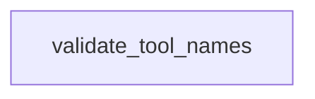

# Chapter 7: Development, Testing, and Contribution Workflow

Welcome to **Chapter 7: Development, Testing, and Contribution Workflow**. In this part of **awslabs/mcp Tutorial: Operating a Large-Scale MCP Server Ecosystem for AWS Workloads**, you will build an intuitive mental model first, then move into concrete implementation details and practical production tradeoffs.


This chapter focuses on contributor workflows in the monorepo.

## Learning Goals

- set up local tooling and pre-commit quality gates
- run server-level unit/integration tests reliably
- align docs updates with server changes
- prepare pull requests that satisfy repository standards

## Contribution Workflow

Adopt the repository pre-commit and test pipeline locally before opening PRs. Keep server changes, tests, and docs synchronized to reduce review churn.

## Source References

- [Developer Guide](https://github.com/awslabs/mcp/blob/main/DEVELOPER_GUIDE.md)
- [Design Guidelines](https://github.com/awslabs/mcp/blob/main/DESIGN_GUIDELINES.md)
- [Contributing](https://github.com/awslabs/mcp/blob/main/CONTRIBUTING.md)

## Summary

You now have a reliable workflow for shipping server changes in the `awslabs/mcp` ecosystem.

Next: [Chapter 8: Production Operations and Governance](08-production-operations-and-governance.md)

## Source Code Walkthrough

### `scripts/verify_tool_names.py`

The `validate_tool_names` function in [`scripts/verify_tool_names.py`](https://github.com/awslabs/mcp/blob/HEAD/scripts/verify_tool_names.py) handles a key part of this chapter's functionality:

```py


def validate_tool_names(
    package_name: str, tools: List[Tuple[str, Path, int]], verbose: bool = False
) -> Tuple[bool, List[str], List[str]]:
    """Validate all tool names in a package.

    Returns:
        Tuple of (is_valid, list_of_errors, list_of_warnings)
        - is_valid: True if no errors (warnings don't fail validation)
        - list_of_errors: Critical issues that fail the build
        - list_of_warnings: Recommendations that don't fail the build
    """
    errors = []
    warnings = []

    for tool_name, file_path, line_number in tools:
        # Validate tool name (length, characters, conventions)
        naming_errors, naming_warnings = validate_tool_name(tool_name)
        for error in naming_errors:
            errors.append(f'{file_path}:{line_number} - {error}')
        for warning in naming_warnings:
            warnings.append(f'{file_path}:{line_number} - {warning}')

        if verbose:
            status = '✓' if not naming_errors else '✗'
            style_note = ''
            if naming_warnings:
                style_note = ' (non-snake_case)'
            print(f'  {status} {tool_name} ({len(tool_name)} chars){style_note}')

    return len(errors) == 0, errors, warnings
```

This function is important because it defines how awslabs/mcp Tutorial: Operating a Large-Scale MCP Server Ecosystem for AWS Workloads implements the patterns covered in this chapter.


## How These Components Connect


