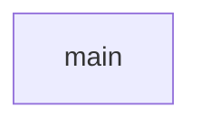

# Chapter 8: Production Operations and Governance

Welcome to **Chapter 8: Production Operations and Governance**. In this part of **awslabs/mcp Tutorial: Operating a Large-Scale MCP Server Ecosystem for AWS Workloads**, you will build an intuitive mental model first, then move into concrete implementation details and practical production tradeoffs.


This chapter closes with production operating patterns for long-term reliability.

## Learning Goals

- define deployment boundaries for local vs remote MCP use
- standardize release validation across selected servers
- monitor and prune server/tool sprawl over time
- maintain governance around approvals, logging, and incident response

## Operations Playbook

1. scope each deployment to explicit roles and use cases
2. run versioned validation suites before each upgrade window
3. centralize observability signals and security review outcomes
4. review client/server configs regularly for drift and overexposure
5. keep rollback runbooks tied to specific server versions

## Source References

- [Repository README](https://github.com/awslabs/mcp/blob/main/README.md)
- [Developer Guide](https://github.com/awslabs/mcp/blob/main/DEVELOPER_GUIDE.md)
- [Samples README](https://github.com/awslabs/mcp/blob/main/samples/README.md)

## Summary

You now have an end-to-end model for operating AWS MCP servers with stronger governance and maintainability.

## Source Code Walkthrough

### `scripts/verify_tool_names.py`

The `main` function in [`scripts/verify_tool_names.py`](https://github.com/awslabs/mcp/blob/HEAD/scripts/verify_tool_names.py) handles a key part of this chapter's functionality:

```py


def main():
    """Main function to verify tool name conventions."""
    parser = argparse.ArgumentParser(
        description='Verify that MCP tool names follow naming conventions and length limits'
    )
    parser.add_argument(
        'package_dir',
        help='Path to the package directory (e.g., src/git-repo-research-mcp-server)',
    )
    parser.add_argument('--verbose', '-v', action='store_true', help='Enable verbose output')

    args = parser.parse_args()

    package_dir = Path(args.package_dir)
    pyproject_path = package_dir / 'pyproject.toml'

    if not package_dir.exists():
        print(f"Error: Package directory '{package_dir}' does not exist", file=sys.stderr)
        sys.exit(1)

    if not pyproject_path.exists():
        print(f"Error: pyproject.toml not found in '{package_dir}'", file=sys.stderr)
        sys.exit(1)

    try:
        # Extract package name from pyproject.toml
        package_name = extract_package_name(pyproject_path)
        if args.verbose:
            print(f'Package name from pyproject.toml: {package_name}')

```

This function is important because it defines how awslabs/mcp Tutorial: Operating a Large-Scale MCP Server Ecosystem for AWS Workloads implements the patterns covered in this chapter.


## How These Components Connect


