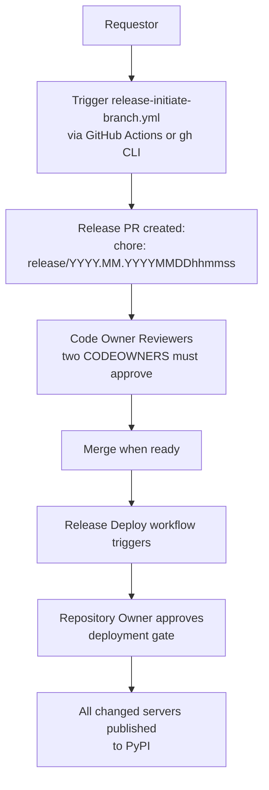
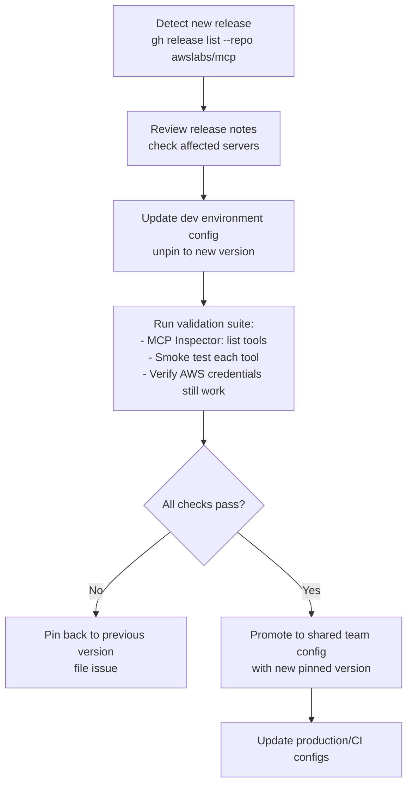
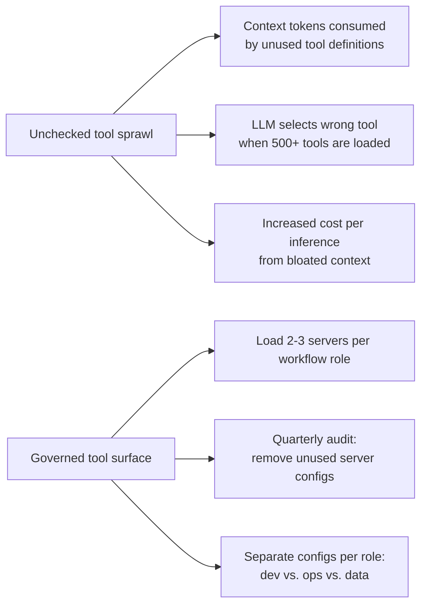
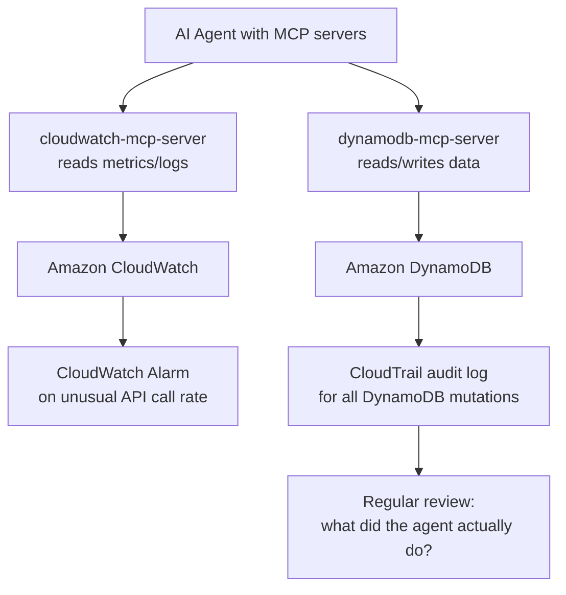
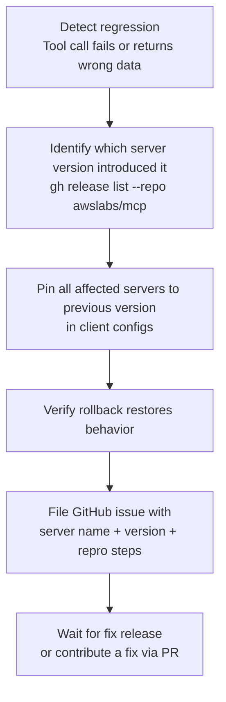
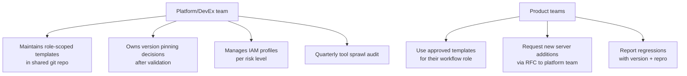

# Chapter 8: Production Operations and Governance

This chapter closes the tutorial with the operating model for long-term use of `awslabs/mcp` servers: release versioning, upgrade workflows, server/tool sprawl governance, observability, configuration drift prevention, and rollback procedures.

## Learning Goals

- Understand the release versioning scheme and how to pin server versions
- Manage upgrade windows with staged validation
- Monitor and reduce tool surface area sprawl over time
- Detect and remediate configuration drift across team environments
- Define rollback procedures tied to specific server versions

## Release Versioning

The `awslabs/mcp` project uses a date-based release tag scheme:

```
YYYY.MM.YYYYMMDDhhmmss
```

Example releases:
- `2026.04.20260410061424`
- `2026.04.20260409112122`
- `2026.04.20260408085348`

Multiple releases can occur on the same day. Each release bundles all servers with changes since the previous published release — there is no per-server versioning separate from the monorepo release cycle.

### Pinning a Specific Version

Pin your `uvx` invocations to a known-good version to prevent automatic upgrades:

```json
{
  "mcpServers": {
    "cloudwatch": {
      "command": "uvx",
      "args": ["awslabs.cloudwatch-mcp-server==0.2.1"],
      "env": { "AWS_PROFILE": "readonly" }
    }
  }
}
```

Always test unpinned (latest) in a development environment before promoting pinned versions to production or shared team configs.

## Release Process

The release workflow is documented in `.github/workflows/RELEASE_INSTRUCTIONS.md`. It uses a three-role model:



To check what changes will go into the next release:

```bash
LATEST=$(gh release list \
  --repo awslabs/mcp \
  --limit 1 \
  --exclude-drafts \
  --exclude-pre-releases \
  --json tagName | jq -r '.[0].tagName')

git diff "${LATEST}"...remotes/origin/main --name-only
```

## Upgrade Workflow for Teams

When a new release is available, follow a staged upgrade process:



Keep a validation checklist per server:

| Server | Validation Test |
|:-------|:---------------|
| `aws-documentation-mcp-server` | Call `search_documentation` with a known term |
| `cloudwatch-mcp-server` | List alarms in target account |
| `terraform-mcp-server` | Search Terraform Registry for `aws_s3_bucket` |
| `cdk-mcp-server` | Retrieve CDK construct docs for `aws-ecs` |
| `dynamodb-mcp-server` | List tables in dev account |

## Tool Sprawl Governance

Each loaded MCP server contributes its tool definitions to the LLM context window. With 65+ servers in the catalog, uncontrolled loading degrades tool selection accuracy and increases cost.



### Audit Checklist

Run a quarterly review of your team's MCP configurations:

1. **List all configured servers** across Claude Desktop, Cursor, Amazon Q Developer, and CI configs
2. **Check usage logs** — if `MCP_LOG_LEVEL=INFO`, look for tool call patterns to identify unused servers
3. **Remove servers** that haven't been invoked in the past 30 days
4. **Consolidate profiles** — if two team members have diverged configs, reconcile to a shared template

### Role-Scoped Configuration Files

Maintain separate configuration profiles for different work contexts rather than one catch-all config:

```
.mcp/
├── research.json        # aws-documentation + aws-api-mcp
├── iac-dev.json         # terraform + cdk + aws-docs
├── ops-readonly.json    # cloudwatch + cloudtrail (read-only IAM)
├── data-dev.json        # dynamodb + postgres + aws-docs
└── incident.json        # cloudwatch + cloudtrail + aws-docs (full incident kit)
```

Each file is a complete `mcpServers` block that team members can point their client at.

## Configuration Drift Prevention

Without active governance, team member configs diverge from the shared template. Prevent this with a version-controlled template and a setup script:

```bash
#!/bin/bash
# .mcp/setup.sh — run on new machine or after config template update
ROLE="${1:-research}"
CLIENT="${2:-claude}"

case "$CLIENT" in
  claude)
    TARGET="$HOME/Library/Application Support/Claude/claude_desktop_config.json"
    ;;
  cursor)
    TARGET="$HOME/.cursor/mcp.json"
    ;;
  amazonq)
    TARGET="$HOME/.aws/amazonq/mcp.json"
    ;;
esac

# Substitute environment-specific values
envsubst < ".mcp/${ROLE}.json.tmpl" > "$TARGET"
echo "MCP config deployed: $TARGET"
```

Template file `.mcp/research.json.tmpl`:

```json
{
  "mcpServers": {
    "aws-docs": {
      "command": "uvx",
      "args": ["awslabs.aws-documentation-mcp-server@${MCP_DOCS_VERSION}"],
      "env": {
        "AWS_PROFILE": "${AWS_PROFILE}",
        "AWS_REGION": "${AWS_REGION:-us-east-1}",
        "MCP_LOG_LEVEL": "WARNING"
      }
    }
  }
}
```

Store templates in the team's git repo. Pin `MCP_DOCS_VERSION` in a `.mcp/versions.env` file and update it deliberately after validation.

## Observability for MCP Operations

### Logging

Set `MCP_LOG_LEVEL=INFO` during validation and incident investigation to capture tool call activity:

```json
{
  "env": {
    "MCP_LOG_LEVEL": "INFO",
    "AWS_PROFILE": "readonly"
  }
}
```

Log output goes to stderr, captured by the MCP host client. For Claude Desktop, logs appear in the MCP server panel.

### CloudWatch Integration for AWS Operations

For production AI agent workflows that use `awslabs/mcp` servers, use CloudWatch to monitor the downstream AWS API call patterns the servers generate:



### CloudTrail Audit for Mutating Operations

For any workflow where MCP servers invoke mutating AWS operations, enable CloudTrail data events:

- **DynamoDB**: Enable data events to log every `PutItem`, `UpdateItem`, `DeleteItem`
- **S3**: Enable data events to log object-level operations
- **IAM**: Enable management events for policy and role changes

This creates an audit trail of all agent-driven changes, separate from human-initiated changes, if you use dedicated IAM roles for MCP servers.

## Rollback Procedures

When an upgrade introduces a regression, roll back by pinning the previous version:



Example rollback: if `cloudwatch-mcp-server@0.2.1` breaks `list_metrics`, update your config:

```json
{
  "mcpServers": {
    "cloudwatch": {
      "command": "uvx",
      "args": ["awslabs.cloudwatch-mcp-server==0.2.0"],
      "env": { "AWS_PROFILE": "readonly" }
    }
  }
}
```

Restart the MCP client to pick up the pinned version. `uvx` caches packages locally, so the rollback version is immediately available without a re-download if it was previously installed.

## Governance for Multi-Team Deployments

When multiple teams in an organization use `awslabs/mcp` servers, centralize the configuration management:



### Human Approval Gates

Document which operations always require human approval and enforce them at the configuration level:

| Operation | Enforcement |
|:----------|:-----------|
| `terraform apply` in production | `ALLOW_WRITE=false` in prod configs; manual override only |
| `dynamodb:DeleteItem` at scale | Separate read-write profile with scoped table ARN condition |
| IAM policy creation | Deny in IAM policy for MCP server role |
| `cdk deploy` to prod account | Separate IAM role requiring MFA for AssumeRole |
| S3 bucket deletion | Explicit IAM Deny on `s3:DeleteBucket` |

## Docusaurus Documentation Site

The `docusaurus/` directory at the repo root is the source for the public documentation site at `awslabs.github.io/mcp`. Key directories:

- `docusaurus/docs/servers/` — per-server `.md` reference pages
- `docusaurus/static/assets/server-cards.json` — card metadata for the catalog UI
- `docusaurus/sidebars.ts` — navigation structure

For teams operating a fork or internal mirror, you can run the site locally to verify documentation before merging:

```bash
cd docusaurus
npm install
npm start
# Opens at http://localhost:3000
```

## Source References

- [DEVELOPER_GUIDE.md — Release Process](https://github.com/awslabs/mcp/blob/main/.github/workflows/RELEASE_INSTRUCTIONS.md)
- [Repository README](https://github.com/awslabs/mcp/blob/main/README.md)
- [Samples README](https://github.com/awslabs/mcp/blob/main/samples/README.md)
- [Docusaurus site source](https://github.com/awslabs/mcp/tree/main/docusaurus)
- [DESIGN_GUIDELINES.md](https://github.com/awslabs/mcp/blob/main/DESIGN_GUIDELINES.md)

## Summary

The `awslabs/mcp` project uses a date-stamped release tag scheme where all changed servers ship together. Pin server versions in team configurations and validate before promoting upgrades. Prevent tool sprawl by scoping configuration files to workflow roles (research, IaC, ops, data) and running quarterly audits to remove unused servers. Use CloudTrail data events to audit all agent-driven mutations in production. Rollback is immediate — pin to a previous version in the client config and restart. For multi-team environments, centralize template ownership and version approval in a platform team, keeping individual teams on approved profiles rather than unmanaged personal configs.
