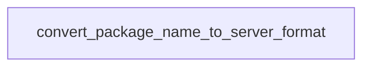

# Chapter 8: Production Operations and Governance

Welcome to **Chapter 8: Production Operations and Governance**. In this part of **awslabs/mcp Tutorial: Operating a Large-Scale MCP Server Ecosystem for AWS Workloads**, you will build an intuitive mental model first, then move into concrete implementation details and practical production tradeoffs.


This chapter closes with production operating patterns for long-term reliability.

## Learning Goals

- define deployment boundaries for local vs remote MCP use
- standardize release validation across selected servers
- monitor and prune server/tool sprawl over time
- maintain governance around approvals, logging, and incident response

## Operations Playbook

1. scope each deployment to explicit roles and use cases
2. run versioned validation suites before each upgrade window
3. centralize observability signals and security review outcomes
4. review client/server configs regularly for drift and overexposure
5. keep rollback runbooks tied to specific server versions

## Source References

- [Repository README](https://github.com/awslabs/mcp/blob/main/README.md)
- [Developer Guide](https://github.com/awslabs/mcp/blob/main/DEVELOPER_GUIDE.md)
- [Samples README](https://github.com/awslabs/mcp/blob/main/samples/README.md)

## Summary

You now have an end-to-end model for operating AWS MCP servers with stronger governance and maintainability.

## Depth Expansion Playbook

## Source Code Walkthrough

### `scripts/verify_tool_names.py`

The `convert_package_name_to_server_format` function in [`scripts/verify_tool_names.py`](https://github.com/awslabs/mcp/blob/HEAD/scripts/verify_tool_names.py) handles a key part of this chapter's functionality:

```py


def convert_package_name_to_server_format(package_name: str) -> str:
    """Convert package name to the format used in fully qualified tool names.

    Examples:
        awslabs.git-repo-research-mcp-server -> git_repo_research_mcp_server
        awslabs.nova-canvas-mcp-server -> nova_canvas_mcp_server
    """
    # Remove 'awslabs.' prefix if present
    if package_name.startswith('awslabs.'):
        package_name = package_name[8:]

    # Replace hyphens with underscores
    return package_name.replace('-', '_')


def calculate_fully_qualified_name(server_name: str, tool_name: str) -> str:
    """Calculate the fully qualified tool name as used by MCP clients.

    Format: awslabs<server_name>___<tool_name>

    Examples:
        awslabs + git_repo_research_mcp_server + ___ + search_repos_on_github
        = awslabsgit_repo_research_mcp_server___search_repos_on_github
    """
    return f'awslabs{server_name}___{tool_name}'


def find_tool_decorators(file_path: Path) -> List[Tuple[str, int]]:
    """Find all tool definitions in a Python file and extract tool names.

```

This function is important because it defines how awslabs/mcp Tutorial: Operating a Large-Scale MCP Server Ecosystem for AWS Workloads implements the patterns covered in this chapter.


## How These Components Connect


