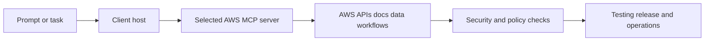

# awslabs/mcp Tutorial: Operating a Large-Scale MCP Server Ecosystem for AWS Workloads

> Learn how to use `awslabs/mcp` to compose, run, and govern AWS-focused MCP servers across development, infrastructure, data, and operations workflows.

## Why This Track Matters

`awslabs/mcp` is one of the largest public MCP server collections and a major reference point for real-world MCP usage at ecosystem scale.

This track focuses on:

- navigating a broad server catalog by outcome and risk profile
- choosing transport/client integration patterns that match your environment
- applying security, credential, and execution controls across AWS workflows
- operating contribution and testing workflows in a fast-moving monorepo

## Current Snapshot (auto-updated)

- repository: [`awslabs/mcp`](https://github.com/awslabs/mcp)
- stars: about **8.1k**
- latest release: [`2026.02.20260212091017`](https://github.com/awslabs/mcp/releases/tag/2026.02.20260212091017) (**February 12, 2026**)
- license: Apache-2.0
- recent activity: updates on **February 12, 2026**
- project positioning: official AWS MCP server ecosystem spanning multiple solution domains

## Mental Model

## Chapter Guide

| Chapter | Key Question | Outcome |
|:--------|:-------------|:--------|
| [01 - Getting Started](01-getting-started.md) | How do I choose and run the first AWS MCP servers quickly? | Working baseline |
| [02 - Server Catalog and Role Composition](02-server-catalog-and-role-composition.md) | How should I select servers from a large catalog? | Better server selection strategy |
| [03 - Transport and Client Integration Patterns](03-transport-and-client-integration-patterns.md) | How do I integrate reliably with IDE/chat clients? | Cleaner integration setup |
| [04 - Infrastructure and IaC Workflows](04-infrastructure-and-iac-workflows.md) | How do IaC-oriented servers support cloud delivery? | Better infra automation flow |
| [05 - Data, Knowledge, and Agent Workflows](05-data-knowledge-and-agent-workflows.md) | How do documentation/data servers improve agent outputs? | Higher-context task execution |
| [06 - Security, Credentials, and Risk Controls](06-security-credentials-and-risk-controls.md) | How should teams constrain risk while enabling capability? | Stronger governance controls |
| [07 - Development, Testing, and Contribution Workflow](07-development-testing-and-contribution-workflow.md) | How do contributors ship safely in this monorepo? | Reliable engineering workflow |
| [08 - Production Operations and Governance](08-production-operations-and-governance.md) | How do teams run this ecosystem sustainably in production? | Long-term operations playbook |

## What You Will Learn

- how to choose AWS MCP servers by use case, not by novelty
- how to run client integrations and transport settings with fewer surprises
- how to enforce security boundaries for credentials and mutating actions
- how to maintain quality in a rapidly evolving multi-server monorepo

## Source References

- [awslabs/mcp Repository](https://github.com/awslabs/mcp)
- [README](https://github.com/awslabs/mcp/blob/main/README.md)
- [Developer Guide](https://github.com/awslabs/mcp/blob/main/DEVELOPER_GUIDE.md)
- [Design Guidelines](https://github.com/awslabs/mcp/blob/main/DESIGN_GUIDELINES.md)
- [Vibe Coding Tips](https://github.com/awslabs/mcp/blob/main/VIBE_CODING_TIPS_TRICKS.md)
- [Samples README](https://github.com/awslabs/mcp/blob/main/samples/README.md)
- [Core MCP Server README](https://github.com/awslabs/mcp/blob/main/src/core-mcp-server/README.md)
- [AWS API MCP Server README](https://github.com/awslabs/mcp/blob/main/src/aws-api-mcp-server/README.md)
- [AWS Documentation MCP Server README](https://github.com/awslabs/mcp/blob/main/src/aws-documentation-mcp-server/README.md)
- [AWS Terraform MCP Server README](https://github.com/awslabs/mcp/blob/main/src/terraform-mcp-server/README.md)

## Related Tutorials

- [MCP Servers Tutorial](../mcp-servers-tutorial/)
- [GenAI Toolbox Tutorial](../genai-toolbox-tutorial/)
- [FastMCP Tutorial](../fastmcp-tutorial/)
- [Playwright MCP Tutorial](../playwright-mcp-tutorial/)

---

Start with [Chapter 1: Getting Started](01-getting-started.md).

## Navigation & Backlinks

- [Start Here: Chapter 1: Getting Started](01-getting-started.md)
- [Back to Main Catalog](../../README.md#-tutorial-catalog)
- [Browse A-Z Tutorial Directory](../../discoverability/tutorial-directory.md)
- [Search by Intent](../../discoverability/query-hub.md)
- [Explore Category Hubs](../../README.md#category-hubs)

## Full Chapter Map

1. [Chapter 1: Getting Started](01-getting-started.md)
2. [Chapter 2: Server Catalog and Role Composition](02-server-catalog-and-role-composition.md)
3. [Chapter 3: Transport and Client Integration Patterns](03-transport-and-client-integration-patterns.md)
4. [Chapter 4: Infrastructure and IaC Workflows](04-infrastructure-and-iac-workflows.md)
5. [Chapter 5: Data, Knowledge, and Agent Workflows](05-data-knowledge-and-agent-workflows.md)
6. [Chapter 6: Security, Credentials, and Risk Controls](06-security-credentials-and-risk-controls.md)
7. [Chapter 7: Development, Testing, and Contribution Workflow](07-development-testing-and-contribution-workflow.md)
8. [Chapter 8: Production Operations and Governance](08-production-operations-and-governance.md)

*Generated by [AI Codebase Knowledge Builder](https://github.com/The-Pocket/Tutorial-Codebase-Knowledge)*
