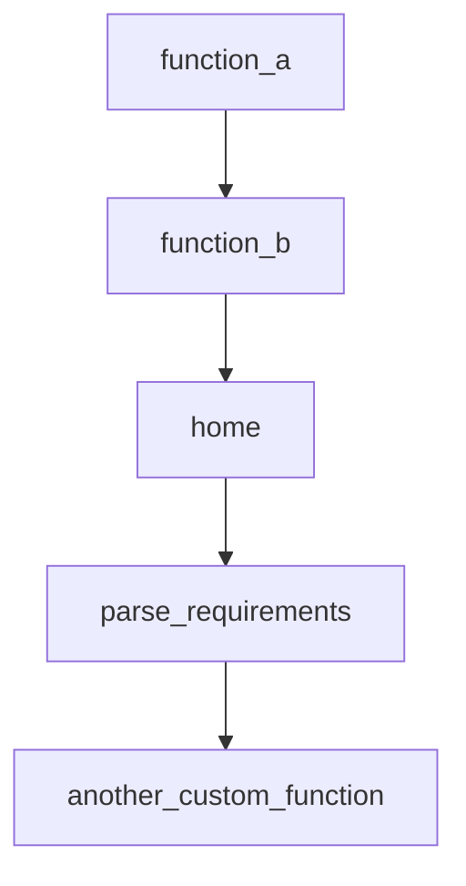

# Chapter 1: Getting Started

Welcome to **Chapter 1: Getting Started**. In this part of **BabyAGI Tutorial: The Original Autonomous AI Task Agent Framework**, you will build an intuitive mental model first, then move into concrete implementation details and practical production tradeoffs.

This chapter covers BabyAGI's origins, the core concept of autonomous task agents, environment setup, and how to run your first autonomous objective.

## Learning Goals

- understand BabyAGI's origin story and why it matters as a foundational reference
- set up a working local environment with required API credentials
- run your first autonomous objective and observe the three-agent loop
- identify common startup failures and how to resolve them

## Fast Start Checklist

1. clone the BabyAGI repository
2. install Python dependencies via pip
3. configure `OPENAI_API_KEY` and vector store credentials
4. copy `.env.example` to `.env` and set your objective
5. run `python babyagi.py` and watch the task loop execute

## Source References

- [BabyAGI Repository](https://github.com/yoheinakajima/babyagi)
- [BabyAGI README](https://github.com/yoheinakajima/babyagi/blob/main/README.md)
- [Original Twitter Announcement (March 2023)](https://twitter.com/yoheinakajima/status/1640934493489070080)

## Summary

You now have a working BabyAGI baseline and can observe the autonomous three-agent task loop on a real objective.

Next: [Chapter 2: Core Architecture: Task Queue and Agent Loop](02-core-architecture-task-queue-and-agent-loop.md)

## Depth Expansion Playbook

## Source Code Walkthrough

### `examples/trigger_example.py`

The `function_a` function in [`examples/trigger_example.py`](https://github.com/yoheinakajima/babyagi/blob/HEAD/examples/trigger_example.py) handles a key part of this chapter's functionality:

```py

@babyagi.register_function()
def function_a():
    print("Result from function A")
    return "Result from function A"

@babyagi.register_function(triggers=['function_a'])
def function_b(input_data):
    print(f"Function B triggered with input: {input_data}")
    return f"Function B triggered with input: {input_data}"

function_a()

@app.route('/')
def home():
    return f"Welcome to the main app. Visit <a href=\"/dashboard\">/dashboard</a> for BabyAGI dashboard."

if __name__ == "__main__":
    app = babyagi.create_app('/dashboard')
    app.run(host='0.0.0.0', port=8080)
```

This function is important because it defines how BabyAGI Tutorial: The Original Autonomous AI Task Agent Framework implements the patterns covered in this chapter.

### `examples/trigger_example.py`

The `function_b` function in [`examples/trigger_example.py`](https://github.com/yoheinakajima/babyagi/blob/HEAD/examples/trigger_example.py) handles a key part of this chapter's functionality:

```py

@babyagi.register_function(triggers=['function_a'])
def function_b(input_data):
    print(f"Function B triggered with input: {input_data}")
    return f"Function B triggered with input: {input_data}"

function_a()

@app.route('/')
def home():
    return f"Welcome to the main app. Visit <a href=\"/dashboard\">/dashboard</a> for BabyAGI dashboard."

if __name__ == "__main__":
    app = babyagi.create_app('/dashboard')
    app.run(host='0.0.0.0', port=8080)
```

This function is important because it defines how BabyAGI Tutorial: The Original Autonomous AI Task Agent Framework implements the patterns covered in this chapter.

### `examples/trigger_example.py`

The `home` function in [`examples/trigger_example.py`](https://github.com/yoheinakajima/babyagi/blob/HEAD/examples/trigger_example.py) handles a key part of this chapter's functionality:

```py

@app.route('/')
def home():
    return f"Welcome to the main app. Visit <a href=\"/dashboard\">/dashboard</a> for BabyAGI dashboard."

if __name__ == "__main__":
    app = babyagi.create_app('/dashboard')
    app.run(host='0.0.0.0', port=8080)
```

This function is important because it defines how BabyAGI Tutorial: The Original Autonomous AI Task Agent Framework implements the patterns covered in this chapter.

### `setup.py`

The `parse_requirements` function in [`setup.py`](https://github.com/yoheinakajima/babyagi/blob/HEAD/setup.py) handles a key part of this chapter's functionality:

```py

# Read requirements from requirements.txt
def parse_requirements(filename):
    with open(filename, "r") as f:
        lines = f.readlines()
    # Remove comments and empty lines
    return [line.strip() for line in lines if line.strip() and not line.startswith("#")]

setup(
    name="babyagi",  # Ensure this is the desired package name
    version="0.1.2",  # Update this version appropriately
    author="Yohei Nakajima",
    author_email="babyagi@untapped.vc",
    description="An experimental prototype framework for building self building autonomous agents.",
    long_description=  long_description,
    long_description_content_type="text/markdown",
    url="https://github.com/yoheinakajima/babyagi",  # Update if necessary
    packages=find_packages(),
    include_package_data=True,  # Include package data as specified in MANIFEST.in
    classifiers=[
        "Programming Language :: Python :: 3",
        "License :: OSI Approved :: MIT License",
        "Operating System :: OS Independent",
    ],
    python_requires='>=3.6',
    install_requires=parse_requirements("requirements.txt"),
    entry_points={
        'console_scripts': [
            'babyagi=babyagi.main:main',  # Example entry point
        ],
    },
    keywords="AGI, AI, Framework, Baby AGI",
```

This function is important because it defines how BabyAGI Tutorial: The Original Autonomous AI Task Agent Framework implements the patterns covered in this chapter.


## How These Components Connect


