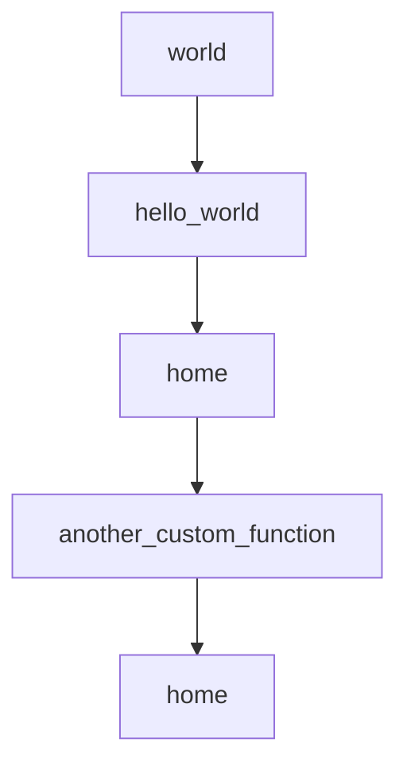

# Chapter 1: Getting Started

Welcome to **Chapter 1: Getting Started**. In this part of **BabyAGI Tutorial: The Original Autonomous AI Task Agent Framework**, you will build an intuitive mental model first, then move into concrete implementation details and practical production tradeoffs.

This chapter covers BabyAGI's origins, the core concept of autonomous task agents, environment setup, and how to run your first autonomous objective.

## Learning Goals

- understand BabyAGI's origin story and why it matters as a foundational reference
- set up a working local environment with required API credentials
- run your first autonomous objective and observe the three-agent loop
- identify common startup failures and how to resolve them

## Fast Start Checklist

1. clone the BabyAGI repository
2. install Python dependencies via pip
3. configure `OPENAI_API_KEY` and vector store credentials
4. copy `.env.example` to `.env` and set your objective
5. run `python babyagi.py` and watch the task loop execute

## Source References

- [BabyAGI Repository](https://github.com/yoheinakajima/babyagi)
- [BabyAGI README](https://github.com/yoheinakajima/babyagi/blob/main/README.md)
- [Original Twitter Announcement (March 2023)](https://twitter.com/yoheinakajima/status/1640934493489070080)

## Summary

You now have a working BabyAGI baseline and can observe the autonomous three-agent task loop on a real objective.

Next: [Chapter 2: Core Architecture: Task Queue and Agent Loop](02-core-architecture-task-queue-and-agent-loop.md)

## Source Code Walkthrough

### `examples/simple_example.py`

The `world` function in [`examples/simple_example.py`](https://github.com/yoheinakajima/babyagi/blob/HEAD/examples/simple_example.py) handles a key part of this chapter's functionality:

```py

@babyagi.register_function()
def world():
    return "world"

@babyagi.register_function(dependencies=["world"])
def hello_world():
    x = world()
    return f"Hello {x}!"

print(hello_world())

@app.route('/')
def home():
    return f"Welcome to the main app. Visit <a href=\"/dashboard\">/dashboard</a> for BabyAGI dashboard."

if __name__ == "__main__":
    app = babyagi.create_app('/dashboard')
    app.run(host='0.0.0.0', port=8080)

```

This function is important because it defines how BabyAGI Tutorial: The Original Autonomous AI Task Agent Framework implements the patterns covered in this chapter.

### `examples/simple_example.py`

The `hello_world` function in [`examples/simple_example.py`](https://github.com/yoheinakajima/babyagi/blob/HEAD/examples/simple_example.py) handles a key part of this chapter's functionality:

```py

@babyagi.register_function(dependencies=["world"])
def hello_world():
    x = world()
    return f"Hello {x}!"

print(hello_world())

@app.route('/')
def home():
    return f"Welcome to the main app. Visit <a href=\"/dashboard\">/dashboard</a> for BabyAGI dashboard."

if __name__ == "__main__":
    app = babyagi.create_app('/dashboard')
    app.run(host='0.0.0.0', port=8080)

```

This function is important because it defines how BabyAGI Tutorial: The Original Autonomous AI Task Agent Framework implements the patterns covered in this chapter.

### `examples/simple_example.py`

The `home` function in [`examples/simple_example.py`](https://github.com/yoheinakajima/babyagi/blob/HEAD/examples/simple_example.py) handles a key part of this chapter's functionality:

```py

@app.route('/')
def home():
    return f"Welcome to the main app. Visit <a href=\"/dashboard\">/dashboard</a> for BabyAGI dashboard."

if __name__ == "__main__":
    app = babyagi.create_app('/dashboard')
    app.run(host='0.0.0.0', port=8080)

```

This function is important because it defines how BabyAGI Tutorial: The Original Autonomous AI Task Agent Framework implements the patterns covered in this chapter.

### `examples/custom_route_example.py`

The `another_custom_function` function in [`examples/custom_route_example.py`](https://github.com/yoheinakajima/babyagi/blob/HEAD/examples/custom_route_example.py) handles a key part of this chapter's functionality:

```py

@register_function()
def another_custom_function():
    return "Hello from another custom function!"

@app.route('/')
def home():
    return f"Welcome to the main app. Visit <a href=\"/dashboard\">/dashboard</a> for BabyAGI dashboard."

if __name__ == "__main__":
    app.run(host='0.0.0.0', port=8080)

```

This function is important because it defines how BabyAGI Tutorial: The Original Autonomous AI Task Agent Framework implements the patterns covered in this chapter.


## How These Components Connect


