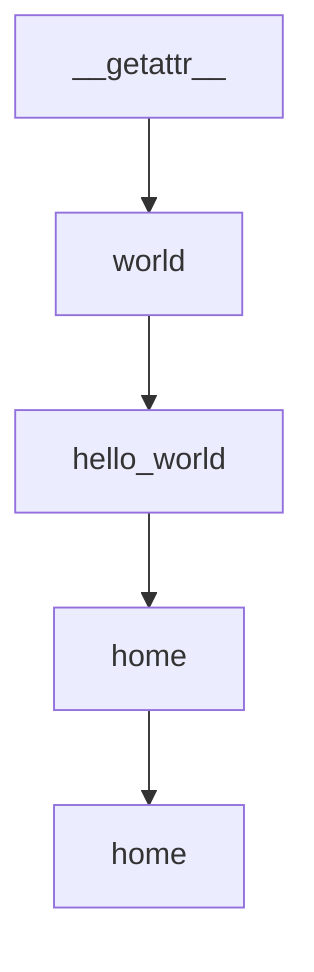

# Chapter 2: Core Architecture: Task Queue and Agent Loop

Welcome to **Chapter 2: Core Architecture: Task Queue and Agent Loop**. In this part of **BabyAGI Tutorial: The Original Autonomous AI Task Agent Framework**, you will build an intuitive mental model first, then move into concrete implementation details and practical production tradeoffs.

This chapter dissects the three-agent loop—execution, creation, prioritization—and the task queue data structure that ties them together into an autonomous system.

## Learning Goals

- understand the role of each of the three agents in the loop
- trace the data flow from task pop to task reprioritization
- identify the state model that persists across loop iterations
- reason about loop termination conditions and safety controls

## Fast Start Checklist

1. read the main loop in `babyagi.py` from top to bottom
2. identify the three agent function calls: `execution_agent`, `task_creation_agent`, `prioritization_agent`
3. trace what each agent receives as input and what it returns
4. observe how the task list is modified after each cycle
5. identify where the vector store is read from and written to

## Source References

- [BabyAGI Main Script](https://github.com/yoheinakajima/babyagi/blob/main/babyagi.py)
- [BabyAGI README Architecture Section](https://github.com/yoheinakajima/babyagi#readme)

## Summary

You now understand how BabyAGI's three-agent loop operates as a coherent autonomous system and can reason about each component's role, inputs, and outputs.

Next: [Chapter 3: LLM Backend Integration and Configuration](03-llm-backend-integration-and-configuration.md)

## Depth Expansion Playbook

## Source Code Walkthrough

### `babyagi/__init__.py`

The `__getattr__` function in [`babyagi/__init__.py`](https://github.com/yoheinakajima/babyagi/blob/HEAD/babyagi/__init__.py) handles a key part of this chapter's functionality:

```py


def __getattr__(name):
    """
    Dynamic attribute access for the babyagi module.
    If a function with the given name exists in the database,
    return a callable that executes the function via the executor.
    """
    try:
        if _func_instance.get_function(name):
            # Return a callable that executes the function via the executor
            return lambda *args, **kwargs: _func_instance.executor.execute(name, *args, **kwargs)
    except Exception as e:
        pass
    raise AttributeError(f"module '{__name__}' has no attribute '{name}'")


# Auto-load default function packs when babyagi is imported
try:
    print("Attempting to load default function packs...")
    # Uncomment if needed
    _func_instance.load_function_pack('default/default_functions')
    _func_instance.load_function_pack('default/ai_functions')
    _func_instance.load_function_pack('default/os')
    _func_instance.load_function_pack('default/function_calling_chat')
except Exception as e:
    print(f"Error loading default function packs: {e}")
    traceback.print_exc()

print("babyagi/__init__.py loaded")

```

This function is important because it defines how BabyAGI Tutorial: The Original Autonomous AI Task Agent Framework implements the patterns covered in this chapter.

### `examples/simple_example.py`

The `world` function in [`examples/simple_example.py`](https://github.com/yoheinakajima/babyagi/blob/HEAD/examples/simple_example.py) handles a key part of this chapter's functionality:

```py

@babyagi.register_function()
def world():
    return "world"

@babyagi.register_function(dependencies=["world"])
def hello_world():
    x = world()
    return f"Hello {x}!"

print(hello_world())

@app.route('/')
def home():
    return f"Welcome to the main app. Visit <a href=\"/dashboard\">/dashboard</a> for BabyAGI dashboard."

if __name__ == "__main__":
    app = babyagi.create_app('/dashboard')
    app.run(host='0.0.0.0', port=8080)

```

This function is important because it defines how BabyAGI Tutorial: The Original Autonomous AI Task Agent Framework implements the patterns covered in this chapter.

### `examples/simple_example.py`

The `hello_world` function in [`examples/simple_example.py`](https://github.com/yoheinakajima/babyagi/blob/HEAD/examples/simple_example.py) handles a key part of this chapter's functionality:

```py

@babyagi.register_function(dependencies=["world"])
def hello_world():
    x = world()
    return f"Hello {x}!"

print(hello_world())

@app.route('/')
def home():
    return f"Welcome to the main app. Visit <a href=\"/dashboard\">/dashboard</a> for BabyAGI dashboard."

if __name__ == "__main__":
    app = babyagi.create_app('/dashboard')
    app.run(host='0.0.0.0', port=8080)

```

This function is important because it defines how BabyAGI Tutorial: The Original Autonomous AI Task Agent Framework implements the patterns covered in this chapter.

### `examples/simple_example.py`

The `home` function in [`examples/simple_example.py`](https://github.com/yoheinakajima/babyagi/blob/HEAD/examples/simple_example.py) handles a key part of this chapter's functionality:

```py

@app.route('/')
def home():
    return f"Welcome to the main app. Visit <a href=\"/dashboard\">/dashboard</a> for BabyAGI dashboard."

if __name__ == "__main__":
    app = babyagi.create_app('/dashboard')
    app.run(host='0.0.0.0', port=8080)

```

This function is important because it defines how BabyAGI Tutorial: The Original Autonomous AI Task Agent Framework implements the patterns covered in this chapter.


## How These Components Connect


