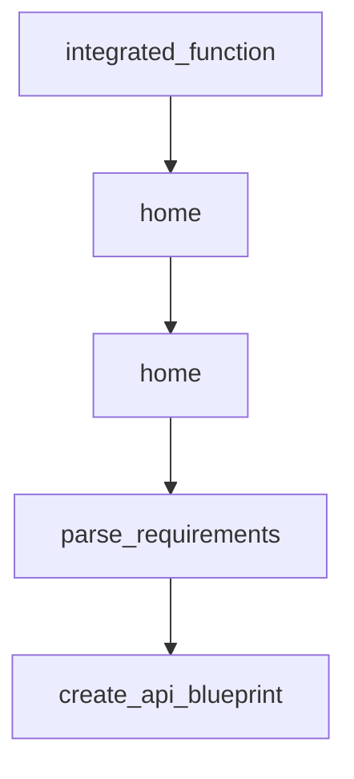

# Chapter 2: Core Architecture: Task Queue and Agent Loop

Welcome to **Chapter 2: Core Architecture: Task Queue and Agent Loop**. In this part of **BabyAGI Tutorial: The Original Autonomous AI Task Agent Framework**, you will build an intuitive mental model first, then move into concrete implementation details and practical production tradeoffs.

This chapter dissects the three-agent loop—execution, creation, prioritization—and the task queue data structure that ties them together into an autonomous system.

## Learning Goals

- understand the role of each of the three agents in the loop
- trace the data flow from task pop to task reprioritization
- identify the state model that persists across loop iterations
- reason about loop termination conditions and safety controls

## Fast Start Checklist

1. read the main loop in `babyagi.py` from top to bottom
2. identify the three agent function calls: `execution_agent`, `task_creation_agent`, `prioritization_agent`
3. trace what each agent receives as input and what it returns
4. observe how the task list is modified after each cycle
5. identify where the vector store is read from and written to

## Source References

- [BabyAGI Main Script](https://github.com/yoheinakajima/babyagi/blob/main/babyagi.py)
- [BabyAGI README Architecture Section](https://github.com/yoheinakajima/babyagi#readme)

## Summary

You now understand how BabyAGI's three-agent loop operates as a coherent autonomous system and can reason about each component's role, inputs, and outputs.

Next: [Chapter 3: LLM Backend Integration and Configuration](03-llm-backend-integration-and-configuration.md)

## Source Code Walkthrough

### `examples/custom_flask_example.py`

The `integrated_function` function in [`examples/custom_flask_example.py`](https://github.com/yoheinakajima/babyagi/blob/HEAD/examples/custom_flask_example.py) handles a key part of this chapter's functionality:

```py

@register_function()
def integrated_function():
    return "Hello from integrated function!"

load_functions('plugins/firecrawl')

@app.route('/')
def home():
    return "Welcome to the main app. Visit /dashboard for BabyAGI dashboard."

if __name__ == "__main__":
    app.run(host='0.0.0.0', port=8080)

```

This function is important because it defines how BabyAGI Tutorial: The Original Autonomous AI Task Agent Framework implements the patterns covered in this chapter.

### `examples/custom_flask_example.py`

The `home` function in [`examples/custom_flask_example.py`](https://github.com/yoheinakajima/babyagi/blob/HEAD/examples/custom_flask_example.py) handles a key part of this chapter's functionality:

```py

@app.route('/')
def home():
    return "Welcome to the main app. Visit /dashboard for BabyAGI dashboard."

if __name__ == "__main__":
    app.run(host='0.0.0.0', port=8080)

```

This function is important because it defines how BabyAGI Tutorial: The Original Autonomous AI Task Agent Framework implements the patterns covered in this chapter.

### `main.py`

The `home` function in [`main.py`](https://github.com/yoheinakajima/babyagi/blob/HEAD/main.py) handles a key part of this chapter's functionality:

```py

@app.route('/')
def home():
    return f"Welcome to the main app. Visit <a href=\"/dashboard\">/dashboard</a> for BabyAGI dashboard."

if __name__ == "__main__":
    app.run(host='0.0.0.0', port=8080)

```

This function is important because it defines how BabyAGI Tutorial: The Original Autonomous AI Task Agent Framework implements the patterns covered in this chapter.

### `setup.py`

The `parse_requirements` function in [`setup.py`](https://github.com/yoheinakajima/babyagi/blob/HEAD/setup.py) handles a key part of this chapter's functionality:

```py

# Read requirements from requirements.txt
def parse_requirements(filename):
    with open(filename, "r") as f:
        lines = f.readlines()
    # Remove comments and empty lines
    return [line.strip() for line in lines if line.strip() and not line.startswith("#")]

setup(
    name="babyagi",  # Ensure this is the desired package name
    version="0.1.2",  # Update this version appropriately
    author="Yohei Nakajima",
    author_email="babyagi@untapped.vc",
    description="An experimental prototype framework for building self building autonomous agents.",
    long_description=  long_description,
    long_description_content_type="text/markdown",
    url="https://github.com/yoheinakajima/babyagi",  # Update if necessary
    packages=find_packages(),
    include_package_data=True,  # Include package data as specified in MANIFEST.in
    classifiers=[
        "Programming Language :: Python :: 3",
        "License :: OSI Approved :: MIT License",
        "Operating System :: OS Independent",
    ],
    python_requires='>=3.6',
    install_requires=parse_requirements("requirements.txt"),
    entry_points={
        'console_scripts': [
            'babyagi=babyagi.main:main',  # Example entry point
        ],
    },
    keywords="AGI, AI, Framework, Baby AGI",
```

This function is important because it defines how BabyAGI Tutorial: The Original Autonomous AI Task Agent Framework implements the patterns covered in this chapter.


## How These Components Connect


