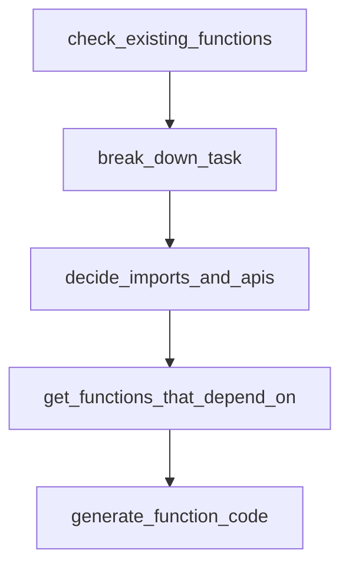

# Chapter 3: LLM Backend Integration and Configuration

Welcome to **Chapter 3: LLM Backend Integration and Configuration**. In this part of **BabyAGI Tutorial: The Original Autonomous AI Task Agent Framework**, you will build an intuitive mental model first, then move into concrete implementation details and practical production tradeoffs.

This chapter covers how BabyAGI integrates with OpenAI, Anthropic, and local LLM backends, and how to configure each for different cost, quality, and latency tradeoffs.

## Learning Goals

- understand how BabyAGI makes LLM calls and what parameters matter most
- configure the OpenAI backend with different model tiers
- integrate Anthropic Claude as an alternative backend
- run BabyAGI with local models via Ollama or LM Studio

## Fast Start Checklist

1. identify the `openai.ChatCompletion.create` (or `openai.Completion.create`) call sites in `babyagi.py`
2. understand which parameters control model behavior: `model`, `temperature`, `max_tokens`
3. swap the model from `gpt-3.5-turbo` to `gpt-4` and compare output quality
4. optionally, set up an Anthropic or local model adapter

## Source References

- [BabyAGI Main Script](https://github.com/yoheinakajima/babyagi/blob/main/babyagi.py)
- [OpenAI Python SDK](https://github.com/openai/openai-python)
- [Anthropic Python SDK](https://github.com/anthropic/anthropic-sdk-python)
- [Ollama Documentation](https://ollama.ai/docs)

## Summary

You now know how to configure BabyAGI's LLM backend for different providers and model tiers, and can reason about the cost, quality, and latency tradeoffs for each choice.

Next: [Chapter 4: Task Creation and Prioritization Engine](04-task-creation-and-prioritization-engine.md)

## Depth Expansion Playbook

## Source Code Walkthrough

### `babyagi/functionz/packs/drafts/code_writing_functions.py`

The `check_existing_functions` function in [`babyagi/functionz/packs/drafts/code_writing_functions.py`](https://github.com/yoheinakajima/babyagi/blob/HEAD/babyagi/functionz/packs/drafts/code_writing_functions.py) handles a key part of this chapter's functionality:

```py
  dependencies=["gpt_call", "get_all_functions_wrapper"]
)
def check_existing_functions(user_input):
  import json

  while True:
      # Get all functions and their descriptions
      functions = get_all_functions_wrapper()
      function_descriptions = [
          {"name": f['name'], "description": f['metadata'].get('description', '')}
          for f in functions
      ]

      # Prepare the prompt
      prompt = f"""
You are an expert software assistant. The user has provided the following request:

"{user_input}"

Below is a list of available functions with their descriptions:

{function_descriptions}

Determine if any of the existing functions perfectly fulfill the user's request. If so, return the name of the function.

Provide your answer in the following JSON format:
{{
  "function_found": true or false,
  "function_name": "<name of the function if found, else null>"
}}

Examples:
```

This function is important because it defines how BabyAGI Tutorial: The Original Autonomous AI Task Agent Framework implements the patterns covered in this chapter.

### `babyagi/functionz/packs/drafts/code_writing_functions.py`

The `break_down_task` function in [`babyagi/functionz/packs/drafts/code_writing_functions.py`](https://github.com/yoheinakajima/babyagi/blob/HEAD/babyagi/functionz/packs/drafts/code_writing_functions.py) handles a key part of this chapter's functionality:

```py
  dependencies=["gpt_call"]
)
def break_down_task(user_input):
  import json
  while True:
      # Prepare the prompt with detailed context
      prompt = f"""
You are an expert software assistant helping to break down a user's request into smaller functions for a microservice-inspired architecture. The system is designed to be modular, with each function being small and designed optimally for potential future reuse.

When breaking down the task, consider the following:

- Each function should be as small as possible and do one thing well.
- Use existing functions where possible. You have access to functions such as 'gpt_call', 'find_similar_function', and others in our function database.
- Functions can depend on each other. Use 'dependencies' to specify which functions a function relies on.
- Functions should include appropriate 'imports' if external libraries are needed.
- Provide the breakdown as a list of functions, where each function includes its 'name', 'description', 'input_parameters', 'output_parameters', 'dependencies', and 'code' (just a placeholder or brief description at this stage).
- Make sure descriptions are detailed so an engineer could build it to spec.
- Every sub function you create should be designed to be reusable by turning things into parameters, vs hardcoding them.

User request:

"{user_input}"

Provide your answer in JSON format as a list of functions. Each function should have the following structure:

{{
  "name": "function_name",
  "description": "Brief description of the function",
  "input_parameters": [{{"name": "param1", "type": "type1"}}, ...],
  "output_parameters": [{{"name": "output", "type": "type"}}, ...],
  "dependencies": ["dependency1", "dependency2", ...],
  "imports": ["import1", "import2", ...],
```

This function is important because it defines how BabyAGI Tutorial: The Original Autonomous AI Task Agent Framework implements the patterns covered in this chapter.

### `babyagi/functionz/packs/drafts/code_writing_functions.py`

The `decide_imports_and_apis` function in [`babyagi/functionz/packs/drafts/code_writing_functions.py`](https://github.com/yoheinakajima/babyagi/blob/HEAD/babyagi/functionz/packs/drafts/code_writing_functions.py) handles a key part of this chapter's functionality:

```py
  dependencies=["gpt_call", "get_all_functions_wrapper"]
)
def decide_imports_and_apis(context):
  import json
  while True:
      # Get all available functions and their imports
      all_functions = get_all_functions_wrapper()
      existing_imports = set()
      for func in all_functions:
          existing_imports.update(func.get('imports', []))

      # Prepare the prompt
      prompt = f"""
You are an expert software assistant helping to decide what imports and external APIs are needed for a set of functions based on the context provided.

Context:

{context}

Existing standard Python imports:

{list(existing_imports)}

Determine the libraries (imports) and external APIs needed for these functions. Separate standard Python libraries from external libraries or APIs.

Provide your answer in the following JSON format:

{{
  "standard_imports": ["import1", "import2", ...],
  "external_imports": ["external_import1", "external_import2", ...],
  "external_apis": ["api1", "api2", ...],
  "documentation_needed": [
```

This function is important because it defines how BabyAGI Tutorial: The Original Autonomous AI Task Agent Framework implements the patterns covered in this chapter.

### `babyagi/functionz/packs/drafts/code_writing_functions.py`

The `get_functions_that_depend_on` function in [`babyagi/functionz/packs/drafts/code_writing_functions.py`](https://github.com/yoheinakajima/babyagi/blob/HEAD/babyagi/functionz/packs/drafts/code_writing_functions.py) handles a key part of this chapter's functionality:

```py
  dependencies=["get_all_functions_wrapper"]
)
def get_functions_that_depend_on(function_name):
  all_functions = get_all_functions_wrapper()
  dependent_functions = []
  for function in all_functions:
      if function_name in function.get('dependencies', []):
          dependent_functions.append(function['name'])
  return dependent_functions


@func.register_function(
    metadata={"description": "Generates the function code using LLM"},
    dependencies=["gpt_call", "get_function_wrapper", "get_functions_that_depend_on", "get_all_functions_wrapper"]
)
def generate_function_code(function, context):
    while True:

        print("\033[1;32mGenerating code for function: ", function["name"], "\033[0m")
        # Gather dependent functions and their code
        dependencies = function.get('dependencies', [])
        dependency_code = ''
        for dep in dependencies:
            dep_function = get_function_wrapper(dep)
            if dep_function:
                dependency_code += f"\n# Code for dependency function '{dep}':\n{dep_function['code']}\n"

        # Gather functions that depend on the same imports
        imports = function.get('imports', [])
        functions_with_same_imports = []
        all_functions = get_all_functions_wrapper()
        for func_with_imports in all_functions:
```

This function is important because it defines how BabyAGI Tutorial: The Original Autonomous AI Task Agent Framework implements the patterns covered in this chapter.


## How These Components Connect


