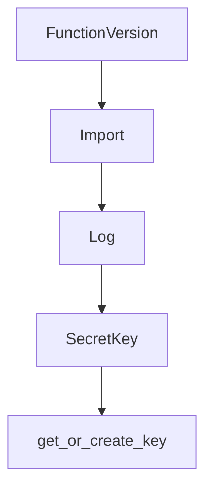

# Chapter 3: LLM Backend Integration and Configuration

Welcome to **Chapter 3: LLM Backend Integration and Configuration**. In this part of **BabyAGI Tutorial: The Original Autonomous AI Task Agent Framework**, you will build an intuitive mental model first, then move into concrete implementation details and practical production tradeoffs.

This chapter covers how BabyAGI integrates with OpenAI, Anthropic, and local LLM backends, and how to configure each for different cost, quality, and latency tradeoffs.

## Learning Goals

- understand how BabyAGI makes LLM calls and what parameters matter most
- configure the OpenAI backend with different model tiers
- integrate Anthropic Claude as an alternative backend
- run BabyAGI with local models via Ollama or LM Studio

## Fast Start Checklist

1. identify the `openai.ChatCompletion.create` (or `openai.Completion.create`) call sites in `babyagi.py`
2. understand which parameters control model behavior: `model`, `temperature`, `max_tokens`
3. swap the model from `gpt-3.5-turbo` to `gpt-4` and compare output quality
4. optionally, set up an Anthropic or local model adapter

## Source References

- [BabyAGI Main Script](https://github.com/yoheinakajima/babyagi/blob/main/babyagi.py)
- [OpenAI Python SDK](https://github.com/openai/openai-python)
- [Anthropic Python SDK](https://github.com/anthropic/anthropic-sdk-python)
- [Ollama Documentation](https://ollama.ai/docs)

## Summary

You now know how to configure BabyAGI's LLM backend for different providers and model tiers, and can reason about the cost, quality, and latency tradeoffs for each choice.

Next: [Chapter 4: Task Creation and Prioritization Engine](04-task-creation-and-prioritization-engine.md)

## Source Code Walkthrough

### `babyagi/functionz/db/models.py`

The `FunctionVersion` class in [`babyagi/functionz/db/models.py`](https://github.com/yoheinakajima/babyagi/blob/HEAD/babyagi/functionz/db/models.py) handles a key part of this chapter's functionality:

```py
fernet = Fernet(ENCRYPTION_KEY.encode())

# Association table for function dependencies (many-to-many between FunctionVersion and Function)
function_dependency = Table('function_dependency', Base.metadata,
    Column('function_version_id', Integer, ForeignKey('function_versions.id')),
    Column('dependency_id', Integer, ForeignKey('functions.id'))
)

# **Define function_version_imports association table here**
function_version_imports = Table('function_version_imports', Base.metadata,
    Column('function_version_id', Integer, ForeignKey('function_versions.id')),
    Column('import_id', Integer, ForeignKey('imports.id'))
)


class Function(Base):
    __tablename__ = 'functions'
    id = Column(Integer, primary_key=True)
    name = Column(String, unique=True)
    versions = relationship("FunctionVersion", back_populates="function", cascade="all, delete-orphan")

class FunctionVersion(Base):
    __tablename__ = 'function_versions'
    id = Column(Integer, primary_key=True)
    function_id = Column(Integer, ForeignKey('functions.id'))
    version = Column(Integer)
    code = Column(String)
    function_metadata = Column(JSON)
    is_active = Column(Boolean, default=False)
    created_date = Column(DateTime, default=datetime.utcnow)
    input_parameters = Column(JSON)
    output_parameters = Column(JSON)
```

This class is important because it defines how BabyAGI Tutorial: The Original Autonomous AI Task Agent Framework implements the patterns covered in this chapter.

### `babyagi/functionz/db/models.py`

The `Import` class in [`babyagi/functionz/db/models.py`](https://github.com/yoheinakajima/babyagi/blob/HEAD/babyagi/functionz/db/models.py) handles a key part of this chapter's functionality:

```py
                                primaryjoin=(function_dependency.c.function_version_id == id),
                                secondaryjoin=(function_dependency.c.dependency_id == Function.id))
    imports = relationship('Import', secondary=function_version_imports, back_populates='function_versions')
    triggers = Column(JSON, nullable=True)  # Store triggers as a JSON field


class Import(Base):
    __tablename__ = 'imports'
    id = Column(Integer, primary_key=True)
    name = Column(String, unique=True)
    lib = Column(String, nullable=True)
    source = Column(String)
    function_versions = relationship('FunctionVersion', secondary=function_version_imports, back_populates='imports')


class Log(Base):
    __tablename__ = 'logs'

    id = Column(Integer, primary_key=True)
    function_name = Column(String, nullable=False)
    message = Column(String, nullable=False)
    timestamp = Column(DateTime, nullable=False)
    params = Column(JSON, nullable=True)
    output = Column(JSON, nullable=True)
    time_spent = Column(Float, nullable=True)
    log_type = Column(String, nullable=False)

    # Parent Log Relationship
    parent_log_id = Column(Integer, ForeignKey('logs.id'), nullable=True)
    parent_log = relationship(
        'Log',
```

This class is important because it defines how BabyAGI Tutorial: The Original Autonomous AI Task Agent Framework implements the patterns covered in this chapter.

### `babyagi/functionz/db/models.py`

The `Log` class in [`babyagi/functionz/db/models.py`](https://github.com/yoheinakajima/babyagi/blob/HEAD/babyagi/functionz/db/models.py) handles a key part of this chapter's functionality:

```py


class Log(Base):
    __tablename__ = 'logs'

    id = Column(Integer, primary_key=True)
    function_name = Column(String, nullable=False)
    message = Column(String, nullable=False)
    timestamp = Column(DateTime, nullable=False)
    params = Column(JSON, nullable=True)
    output = Column(JSON, nullable=True)
    time_spent = Column(Float, nullable=True)
    log_type = Column(String, nullable=False)

    # Parent Log Relationship
    parent_log_id = Column(Integer, ForeignKey('logs.id'), nullable=True)
    parent_log = relationship(
        'Log',
        remote_side=[id],
        backref='child_logs',
        foreign_keys=[parent_log_id]
    )

    # Triggered By Log Relationship
    triggered_by_log_id = Column(Integer, ForeignKey('logs.id'), nullable=True)
    triggered_by_log = relationship(
        'Log',
        remote_side=[id],
        backref='triggered_logs',
        foreign_keys=[triggered_by_log_id]
    )

```

This class is important because it defines how BabyAGI Tutorial: The Original Autonomous AI Task Agent Framework implements the patterns covered in this chapter.

### `babyagi/functionz/db/models.py`

The `SecretKey` class in [`babyagi/functionz/db/models.py`](https://github.com/yoheinakajima/babyagi/blob/HEAD/babyagi/functionz/db/models.py) handles a key part of this chapter's functionality:

```py


class SecretKey(Base):
    __tablename__ = 'secret_keys'
    id = Column(Integer, primary_key=True)
    name = Column(String, nullable=False, unique=True)  # Make name unique
    _encrypted_value = Column(LargeBinary, nullable=False)

    @hybrid_property
    def value(self):
        if self._encrypted_value:
            try:
                return fernet.decrypt(self._encrypted_value).decode()
            except InvalidToken:
                print(f"Error decrypting value for key: {self.name}. The encryption key may have changed.")
                return None
        return None

    @value.setter
    def value(self, plaintext_value):
        if plaintext_value:
            self._encrypted_value = fernet.encrypt(plaintext_value.encode())
        else:
            self._encrypted_value = None


```

This class is important because it defines how BabyAGI Tutorial: The Original Autonomous AI Task Agent Framework implements the patterns covered in this chapter.


## How These Components Connect


