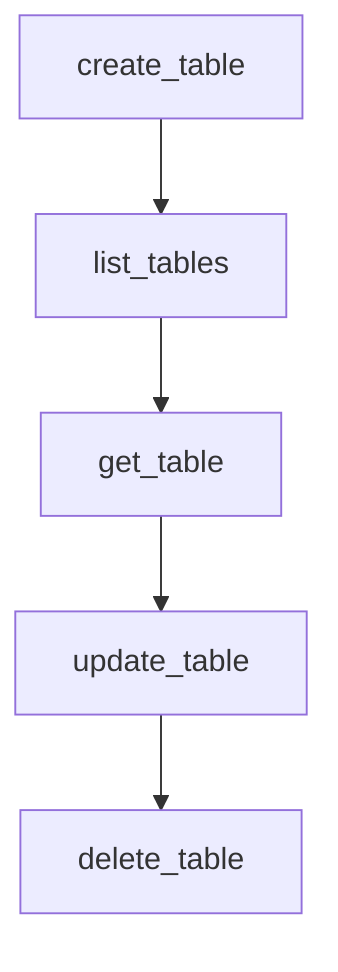

# Chapter 4: Task Creation and Prioritization Engine

Welcome to **Chapter 4: Task Creation and Prioritization Engine**. In this part of **BabyAGI Tutorial: The Original Autonomous AI Task Agent Framework**, you will build an intuitive mental model first, then move into concrete implementation details and practical production tradeoffs.

This chapter examines how BabyAGI generates new tasks from execution results, how it ranks them, and how the quality of objective framing determines the quality of the entire task lifecycle.

## Learning Goals

- understand the prompt design for the task creation and prioritization agents
- identify what inputs drive task quality and how to improve them
- reason about convergence: when does a task list meaningfully shrink toward a completed objective?
- build a mental model for objective-to-task decomposition quality

## Fast Start Checklist

1. read the `task_creation_agent` function and its prompt template
2. read the `prioritization_agent` function and its prompt template
3. run BabyAGI for 5 iterations on two different objectives and compare the task lists
4. identify which parts of the creation prompt anchor generated tasks to the objective
5. experiment with adding explicit constraints to the creation prompt

## Source References

- [BabyAGI Main Script](https://github.com/yoheinakajima/babyagi/blob/main/babyagi.py)
- [BabyAGI README](https://github.com/yoheinakajima/babyagi/blob/main/README.md)

## Summary

You now understand how the task creation and prioritization engine generates, deduplicates, and reorders tasks to drive the autonomous loop toward objective completion.

Next: [Chapter 5: Memory Systems and Vector Store Integration](05-memory-systems-and-vector-store-integration.md)

## Source Code Walkthrough

### `babyagi/functionz/packs/drafts/user_db.py`

The `create_table` function in [`babyagi/functionz/packs/drafts/user_db.py`](https://github.com/yoheinakajima/babyagi/blob/HEAD/babyagi/functionz/packs/drafts/user_db.py) handles a key part of this chapter's functionality:

```py
    imports=["sqlalchemy", "json"]  # Added 'json' to imports
)
def create_table(db_name: str, table_name: str, columns: str):
    from sqlalchemy import create_engine, MetaData, Table, Column, String, Integer, Float, Boolean, DateTime, LargeBinary
    import json  # Imported json within the function


    try:
        columns = json.loads(columns)
        print("Parsed columns:", columns)  # Debugging statement
    except json.JSONDecodeError as e:
        return f"Invalid JSON for columns: {e}"

    def get_column_type(type_name):
        type_map = {
            'string': String,
            'integer': Integer,
            'float': Float,
            'boolean': Boolean,
            'datetime': DateTime,
            'binary': LargeBinary,
            'embedding': LargeBinary  # We'll use LargeBinary for embeddings
        }
        return type_map.get(type_name.lower(), String)  # Default to String if type not found

    UserDB_name = func.get_user_db_class()
    UserDB = type(UserDB_name, (), {
        '__init__': lambda self, db_url: setattr(self, 'engine', create_engine(db_url)),
        'metadata': MetaData(),
    })
    user_db = UserDB(f'sqlite:///{db_name}.sqlite')

```

This function is important because it defines how BabyAGI Tutorial: The Original Autonomous AI Task Agent Framework implements the patterns covered in this chapter.

### `babyagi/functionz/packs/drafts/user_db.py`

The `list_tables` function in [`babyagi/functionz/packs/drafts/user_db.py`](https://github.com/yoheinakajima/babyagi/blob/HEAD/babyagi/functionz/packs/drafts/user_db.py) handles a key part of this chapter's functionality:

```py
    imports=["sqlalchemy"]
)
def list_tables(db_name: str):
    from sqlalchemy import create_engine, MetaData
    UserDB_name = func.get_user_db_class()
    UserDB = type(UserDB_name, (), {
        '__init__': lambda self, db_url: setattr(self, 'engine', create_engine(db_url)),
        'metadata': MetaData()
    })
    user_db = UserDB(f'sqlite:///{db_name}.sqlite')
    user_db.metadata.reflect(user_db.engine)
    return [table.name for table in user_db.metadata.tables.values()]

@func.register_function(
    metadata={"description": "Get details of a specific table."},
    dependencies=["get_user_db_class"],
    imports=["sqlalchemy"]
)
def get_table(db_name: str, table_name: str):
    from sqlalchemy import create_engine, MetaData, Table
    from sqlalchemy.exc import NoSuchTableError

    UserDB_name = func.get_user_db_class()
    UserDB = type(UserDB_name, (), {
        '__init__': lambda self, db_url: setattr(self, 'engine', create_engine(db_url)),
        'metadata': MetaData()
    })

    try:
        user_db = UserDB(f'sqlite:///{db_name}.sqlite')
        user_db.metadata.reflect(user_db.engine)

```

This function is important because it defines how BabyAGI Tutorial: The Original Autonomous AI Task Agent Framework implements the patterns covered in this chapter.

### `babyagi/functionz/packs/drafts/user_db.py`

The `get_table` function in [`babyagi/functionz/packs/drafts/user_db.py`](https://github.com/yoheinakajima/babyagi/blob/HEAD/babyagi/functionz/packs/drafts/user_db.py) handles a key part of this chapter's functionality:

```py
    imports=["sqlalchemy"]
)
def get_table(db_name: str, table_name: str):
    from sqlalchemy import create_engine, MetaData, Table
    from sqlalchemy.exc import NoSuchTableError

    UserDB_name = func.get_user_db_class()
    UserDB = type(UserDB_name, (), {
        '__init__': lambda self, db_url: setattr(self, 'engine', create_engine(db_url)),
        'metadata': MetaData()
    })

    try:
        user_db = UserDB(f'sqlite:///{db_name}.sqlite')
        user_db.metadata.reflect(user_db.engine)

        if table_name in user_db.metadata.tables:
            table = Table(table_name, user_db.metadata, autoload_with=user_db.engine)
            return {
                "name": table.name,
                "columns": [{"name": column.name, "type": str(column.type)} for column in table.columns]
            }
        else:
            return f"Table '{table_name}' not found in database '{db_name}'."
    except NoSuchTableError:
        return f"Table '{table_name}' not found in database '{db_name}'."
    except Exception as e:
        return f"Error getting table details: {str(e)}"
        
@func.register_function(
    metadata={"description": "Update a table by adding new columns."},
    dependencies=["get_user_db_class"],
```

This function is important because it defines how BabyAGI Tutorial: The Original Autonomous AI Task Agent Framework implements the patterns covered in this chapter.

### `babyagi/functionz/packs/drafts/user_db.py`

The `update_table` function in [`babyagi/functionz/packs/drafts/user_db.py`](https://github.com/yoheinakajima/babyagi/blob/HEAD/babyagi/functionz/packs/drafts/user_db.py) handles a key part of this chapter's functionality:

```py
    imports=["sqlalchemy", "json"]  # Added 'json' to imports
)
def update_table(db_name: str, table_name: str, new_columns: str):
    from sqlalchemy import create_engine, MetaData, Table, Column, String, Integer, Float, Boolean, DateTime, LargeBinary
    from sqlalchemy.schema import CreateTable
    import json  # Imported json within the function

    try:
        new_columns = json.loads(new_columns)
        print("Parsed columns:", new_columns)  # Debugging statement
    except json.JSONDecodeError as e:
        return f"Invalid JSON for columns: {e}"

    def get_column_type(type_name):
        type_map = {
            'string': String,
            'integer': Integer,
            'float': Float,
            'boolean': Boolean,
            'datetime': DateTime,
            'binary': LargeBinary,
            'embedding': LargeBinary  # We'll use LargeBinary for embeddings
        }
        return type_map.get(type_name.lower(), String)  # Default to String if type not found


    UserDB_name = func.get_user_db_class()
    UserDB = type(UserDB_name, (), {
        '__init__': lambda self, db_url: setattr(self, 'engine', create_engine(db_url)),
        'metadata': MetaData()
    })

```

This function is important because it defines how BabyAGI Tutorial: The Original Autonomous AI Task Agent Framework implements the patterns covered in this chapter.


## How These Components Connect


