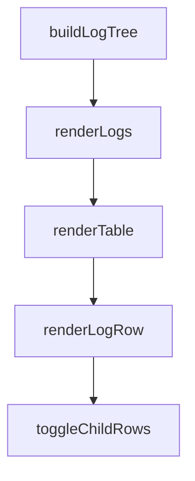

# Chapter 4: Task Creation and Prioritization Engine

Welcome to **Chapter 4: Task Creation and Prioritization Engine**. In this part of **BabyAGI Tutorial: The Original Autonomous AI Task Agent Framework**, you will build an intuitive mental model first, then move into concrete implementation details and practical production tradeoffs.

This chapter examines how BabyAGI generates new tasks from execution results, how it ranks them, and how the quality of objective framing determines the quality of the entire task lifecycle.

## Learning Goals

- understand the prompt design for the task creation and prioritization agents
- identify what inputs drive task quality and how to improve them
- reason about convergence: when does a task list meaningfully shrink toward a completed objective?
- build a mental model for objective-to-task decomposition quality

## Fast Start Checklist

1. read the `task_creation_agent` function and its prompt template
2. read the `prioritization_agent` function and its prompt template
3. run BabyAGI for 5 iterations on two different objectives and compare the task lists
4. identify which parts of the creation prompt anchor generated tasks to the objective
5. experiment with adding explicit constraints to the creation prompt

## Source References

- [BabyAGI Main Script](https://github.com/yoheinakajima/babyagi/blob/main/babyagi.py)
- [BabyAGI README](https://github.com/yoheinakajima/babyagi/blob/main/README.md)

## Summary

You now understand how the task creation and prioritization engine generates, deduplicates, and reorders tasks to drive the autonomous loop toward objective completion.

Next: [Chapter 5: Memory Systems and Vector Store Integration](05-memory-systems-and-vector-store-integration.md)

## Depth Expansion Playbook

## Source Code Walkthrough

### `babyagi/dashboard/static/js/log_dashboard.js`

The `buildLogTree` function in [`babyagi/dashboard/static/js/log_dashboard.js`](https://github.com/yoheinakajima/babyagi/blob/HEAD/babyagi/dashboard/static/js/log_dashboard.js) handles a key part of this chapter's functionality:

```js

        // Build the tree structure
        rootLogs = buildLogTree(filteredLogs);

        renderLogs();
    } catch (error) {
        console.error('Error populating filters:', error);
        alert('Failed to load logs for filters. Please try again later.');
    }
}

// Build log tree based on parent_log_id
function buildLogTree(logs) {
    const logsById = {};
    const rootLogs = [];

    // Initialize logsById mapping and add children array to each log
    logs.forEach(log => {
        log.children = [];
        logsById[log.id] = log;
    });

    // Build the tree
    logs.forEach(log => {
        if (log.parent_log_id !== null) {
            const parentLog = logsById[log.parent_log_id];
            if (parentLog) {
                parentLog.children.push(log);
            } else {
                // Parent log not found, treat as root
                rootLogs.push(log);
            }
```

This function is important because it defines how BabyAGI Tutorial: The Original Autonomous AI Task Agent Framework implements the patterns covered in this chapter.

### `babyagi/dashboard/static/js/log_dashboard.js`

The `renderLogs` function in [`babyagi/dashboard/static/js/log_dashboard.js`](https://github.com/yoheinakajima/babyagi/blob/HEAD/babyagi/dashboard/static/js/log_dashboard.js) handles a key part of this chapter's functionality:

```js
        rootLogs = buildLogTree(filteredLogs);

        renderLogs();
    } catch (error) {
        console.error('Error populating filters:', error);
        alert('Failed to load logs for filters. Please try again later.');
    }
}

// Build log tree based on parent_log_id
function buildLogTree(logs) {
    const logsById = {};
    const rootLogs = [];

    // Initialize logsById mapping and add children array to each log
    logs.forEach(log => {
        log.children = [];
        logsById[log.id] = log;
    });

    // Build the tree
    logs.forEach(log => {
        if (log.parent_log_id !== null) {
            const parentLog = logsById[log.parent_log_id];
            if (parentLog) {
                parentLog.children.push(log);
            } else {
                // Parent log not found, treat as root
                rootLogs.push(log);
            }
        } else {
            rootLogs.push(log);
```

This function is important because it defines how BabyAGI Tutorial: The Original Autonomous AI Task Agent Framework implements the patterns covered in this chapter.

### `babyagi/dashboard/static/js/log_dashboard.js`

The `renderTable` function in [`babyagi/dashboard/static/js/log_dashboard.js`](https://github.com/yoheinakajima/babyagi/blob/HEAD/babyagi/dashboard/static/js/log_dashboard.js) handles a key part of this chapter's functionality:

```js
// Render logs in table and grid formats
function renderLogs() {
    renderTable();
    renderGrid();
}

// Render Logs Table (Desktop View)
function renderTable() {
    const tableBody = document.querySelector('#logTable tbody');
    tableBody.innerHTML = '';

    rootLogs.forEach(log => {
        renderLogRow(tableBody, log, 0);
    });
}

// Recursive function to render each log row and its children
function renderLogRow(tableBody, log, depth, parentRowId) {
    const row = document.createElement('tr');
    const rowId = 'log-' + log.id;
    row.id = rowId;

    // If it's a child row, add a class to indicate it's a child
    if (parentRowId) {
        row.classList.add('child-of-log-' + parentRowId);
        row.style.display = 'none'; // Hide child rows by default
    }

    // Check if log has children
    const hasChildren = log.children && log.children.length > 0;

    // Create expand/collapse icon
```

This function is important because it defines how BabyAGI Tutorial: The Original Autonomous AI Task Agent Framework implements the patterns covered in this chapter.

### `babyagi/dashboard/static/js/log_dashboard.js`

The `renderLogRow` function in [`babyagi/dashboard/static/js/log_dashboard.js`](https://github.com/yoheinakajima/babyagi/blob/HEAD/babyagi/dashboard/static/js/log_dashboard.js) handles a key part of this chapter's functionality:

```js

    rootLogs.forEach(log => {
        renderLogRow(tableBody, log, 0);
    });
}

// Recursive function to render each log row and its children
function renderLogRow(tableBody, log, depth, parentRowId) {
    const row = document.createElement('tr');
    const rowId = 'log-' + log.id;
    row.id = rowId;

    // If it's a child row, add a class to indicate it's a child
    if (parentRowId) {
        row.classList.add('child-of-log-' + parentRowId);
        row.style.display = 'none'; // Hide child rows by default
    }

    // Check if log has children
    const hasChildren = log.children && log.children.length > 0;

    // Create expand/collapse icon
    let toggleIcon = '';
    if (hasChildren) {
        toggleIcon = `<span class="toggle-icon" data-log-id="${log.id}" style="cursor:pointer;">[+]</span> `;
    }

    row.innerHTML = `
        <td><a href="${dashboardRoute}/log/${log.id}" class="function-link">${log.id}</a></td>
        <td><a href="${dashboardRoute}/function/${encodeURIComponent(log.function_name)}" class="function-link">${log.function_name}</a></td>
        <td style="padding-left:${depth * 20}px">${toggleIcon}${log.message}</td>
        <td>${new Date(log.timestamp).toLocaleString()}</td>
```

This function is important because it defines how BabyAGI Tutorial: The Original Autonomous AI Task Agent Framework implements the patterns covered in this chapter.


## How These Components Connect


