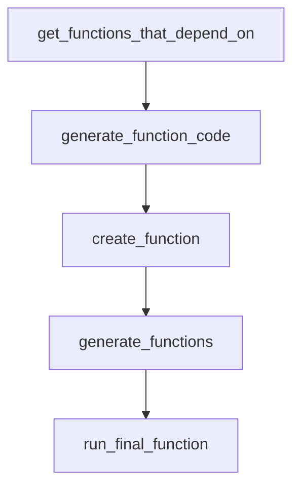

# Chapter 5: Memory Systems and Vector Store Integration

Welcome to **Chapter 5: Memory Systems and Vector Store Integration**. In this part of **BabyAGI Tutorial: The Original Autonomous AI Task Agent Framework**, you will build an intuitive mental model first, then move into concrete implementation details and practical production tradeoffs.

This chapter covers how BabyAGI uses vector stores (originally Pinecone, now also Chroma and Qdrant) as its long-term memory layer, and how the retrieval quality of this memory directly determines the quality of task execution.

## Learning Goals

- understand why BabyAGI uses a vector store instead of a simple list for memory
- configure and operate Pinecone, Chroma, and Qdrant as BabyAGI backends
- reason about retrieval quality and how it affects execution agent output
- implement memory hygiene practices for long-running autonomous experiments

## Fast Start Checklist

1. identify the vector store initialization, upsert, and query code in `babyagi.py`
2. set up Chroma locally as the simplest backend option
3. run a 5-cycle test and inspect the stored embeddings via Chroma's client API
4. run two objectives and compare retrieval results for a sample query
5. measure the impact of `PINECONE_API_KEY` vs `USE_CHROMA` on startup latency

## Source References

- [BabyAGI Main Script](https://github.com/yoheinakajima/babyagi/blob/main/babyagi.py)
- [Pinecone Documentation](https://docs.pinecone.io/)
- [Chroma Documentation](https://docs.trychroma.com/)
- [Qdrant Documentation](https://qdrant.tech/documentation/)

## Summary

You now understand how BabyAGI's vector memory layer works, how to configure different backends, and how retrieval quality shapes the execution agent's output at each cycle.

Next: [Chapter 6: Extending BabyAGI: Custom Tools and Skills](06-extending-babyagi-custom-tools-and-skills.md)

## Source Code Walkthrough

### `babyagi/functionz/packs/drafts/code_writing_functions.py`

The `get_functions_that_depend_on` function in [`babyagi/functionz/packs/drafts/code_writing_functions.py`](https://github.com/yoheinakajima/babyagi/blob/HEAD/babyagi/functionz/packs/drafts/code_writing_functions.py) handles a key part of this chapter's functionality:

```py
  dependencies=["get_all_functions_wrapper"]
)
def get_functions_that_depend_on(function_name):
  all_functions = get_all_functions_wrapper()
  dependent_functions = []
  for function in all_functions:
      if function_name in function.get('dependencies', []):
          dependent_functions.append(function['name'])
  return dependent_functions


@func.register_function(
    metadata={"description": "Generates the function code using LLM"},
    dependencies=["gpt_call", "get_function_wrapper", "get_functions_that_depend_on", "get_all_functions_wrapper"]
)
def generate_function_code(function, context):
    while True:

        print("\033[1;32mGenerating code for function: ", function["name"], "\033[0m")
        # Gather dependent functions and their code
        dependencies = function.get('dependencies', [])
        dependency_code = ''
        for dep in dependencies:
            dep_function = get_function_wrapper(dep)
            if dep_function:
                dependency_code += f"\n# Code for dependency function '{dep}':\n{dep_function['code']}\n"

        # Gather functions that depend on the same imports
        imports = function.get('imports', [])
        functions_with_same_imports = []
        all_functions = get_all_functions_wrapper()
        for func_with_imports in all_functions:
```

This function is important because it defines how BabyAGI Tutorial: The Original Autonomous AI Task Agent Framework implements the patterns covered in this chapter.

### `babyagi/functionz/packs/drafts/code_writing_functions.py`

The `generate_function_code` function in [`babyagi/functionz/packs/drafts/code_writing_functions.py`](https://github.com/yoheinakajima/babyagi/blob/HEAD/babyagi/functionz/packs/drafts/code_writing_functions.py) handles a key part of this chapter's functionality:

```py
    dependencies=["gpt_call", "get_function_wrapper", "get_functions_that_depend_on", "get_all_functions_wrapper"]
)
def generate_function_code(function, context):
    while True:

        print("\033[1;32mGenerating code for function: ", function["name"], "\033[0m")
        # Gather dependent functions and their code
        dependencies = function.get('dependencies', [])
        dependency_code = ''
        for dep in dependencies:
            dep_function = get_function_wrapper(dep)
            if dep_function:
                dependency_code += f"\n# Code for dependency function '{dep}':\n{dep_function['code']}\n"

        # Gather functions that depend on the same imports
        imports = function.get('imports', [])
        functions_with_same_imports = []
        all_functions = get_all_functions_wrapper()
        for func_with_imports in all_functions:
            if set(func_with_imports.get('imports', [])) & set(imports):
                functions_with_same_imports.append(func_with_imports)

        similar_imports_functions_code = ''
        for func_with_imports in functions_with_same_imports:
            similar_imports_functions_code += f"\n# Code for function '{func_with_imports['name']}' that uses similar imports:\n{func_with_imports['code']}\n"

        # Prepare the prompt
        prompt = f"""
You are an expert Python programmer. Your task is to write detailed and working code for the following function based on the context provided. Do not provide placeholder code, but rather do your best like you are the best senior engineer in the world and provide the best code possible. DO NOT PROVIDE PLACEHOLDER CODE.

Function details:

```

This function is important because it defines how BabyAGI Tutorial: The Original Autonomous AI Task Agent Framework implements the patterns covered in this chapter.

### `babyagi/functionz/packs/drafts/code_writing_functions.py`

The `create_function` function in [`babyagi/functionz/packs/drafts/code_writing_functions.py`](https://github.com/yoheinakajima/babyagi/blob/HEAD/babyagi/functionz/packs/drafts/code_writing_functions.py) handles a key part of this chapter's functionality:

```py
    dependencies=["decide_imports_and_apis", "generate_function_code","add_new_function"]
)
def create_function(function, context):
    # Decide imports and APIs
    imports_and_apis = decide_imports_and_apis(context)
    function['imports'] = imports_and_apis.get('standard_imports', []) + imports_and_apis.get('external_imports', [])

    # Update context with imports and APIs
    context.update({'imports_and_apis': imports_and_apis})

    # Generate function code
    function_data = generate_function_code(function, context)

    if function_data:
        # Register the function using the parsed JSON data
        add_new_function(
            name=function_data['function_name'],
            code=function_data['code'],
            metadata=function_data['metadata'],
            imports=function_data.get('imports', []),
            dependencies=function_data.get('dependencies', []),
            key_dependencies=function_data.get('key_dependencies', []),
            triggers=function_data.get('triggers', [])
        )

        #print(f"Function '{function_data['function_name']}' registered successfully.")

        return {
            'name': function_data['function_name'],
            'code': function_data['code'],
            'metadata': function_data['metadata'],
            'imports': function_data.get('imports', []),
```

This function is important because it defines how BabyAGI Tutorial: The Original Autonomous AI Task Agent Framework implements the patterns covered in this chapter.

### `babyagi/functionz/packs/drafts/code_writing_functions.py`

The `generate_functions` function in [`babyagi/functionz/packs/drafts/code_writing_functions.py`](https://github.com/yoheinakajima/babyagi/blob/HEAD/babyagi/functionz/packs/drafts/code_writing_functions.py) handles a key part of this chapter's functionality:

```py
  dependencies=["find_similar_function", "create_function", "get_function_wrapper"]
)
def generate_functions(function_breakdown, context):
  for function in function_breakdown:
      function_name = function['name']
      # Find similar functions
      similar_functions = find_similar_function(function['description'])
      function_found = False
      for similar_function_name in similar_functions:
          similar_function = get_function_wrapper(similar_function_name)
          if similar_function and similar_function['metadata'].get('description', '') == function['description']:
              function_found = True
              break
      if not function_found:
          # Combine context for this function
          function_context = context.copy()
          function_context.update({'function': function})
          create_function(function, function_context)

@func.register_function(
  metadata={"description": "Runs the final function to produce the output for the user"},
  dependencies=["func"]
)
def run_final_function(function_name, *args, **kwargs):
  result = func.execute_function(function_name, *args, **kwargs)
  return result

@func.register_function(
    metadata={"description": "Extracts parameters from user input for a given function"},
    dependencies=["gpt_call", "get_function_wrapper"]
)
def extract_function_parameters(user_input, function_name):
```

This function is important because it defines how BabyAGI Tutorial: The Original Autonomous AI Task Agent Framework implements the patterns covered in this chapter.


## How These Components Connect


