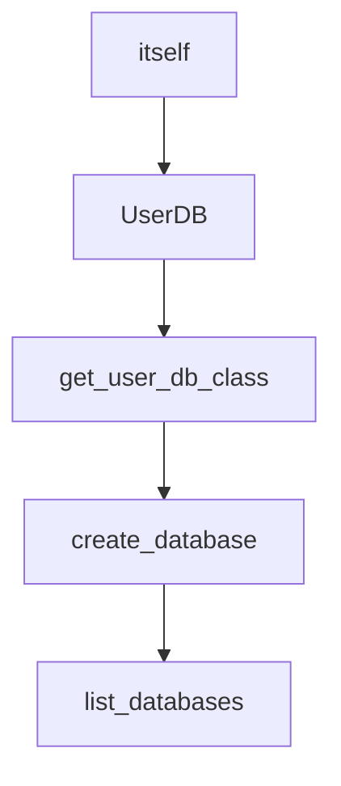

# Chapter 5: Memory Systems and Vector Store Integration

Welcome to **Chapter 5: Memory Systems and Vector Store Integration**. In this part of **BabyAGI Tutorial: The Original Autonomous AI Task Agent Framework**, you will build an intuitive mental model first, then move into concrete implementation details and practical production tradeoffs.

This chapter covers how BabyAGI uses vector stores (originally Pinecone, now also Chroma and Qdrant) as its long-term memory layer, and how the retrieval quality of this memory directly determines the quality of task execution.

## Learning Goals

- understand why BabyAGI uses a vector store instead of a simple list for memory
- configure and operate Pinecone, Chroma, and Qdrant as BabyAGI backends
- reason about retrieval quality and how it affects execution agent output
- implement memory hygiene practices for long-running autonomous experiments

## Fast Start Checklist

1. identify the vector store initialization, upsert, and query code in `babyagi.py`
2. set up Chroma locally as the simplest backend option
3. run a 5-cycle test and inspect the stored embeddings via Chroma's client API
4. run two objectives and compare retrieval results for a sample query
5. measure the impact of `PINECONE_API_KEY` vs `USE_CHROMA` on startup latency

## Source References

- [BabyAGI Main Script](https://github.com/yoheinakajima/babyagi/blob/main/babyagi.py)
- [Pinecone Documentation](https://docs.pinecone.io/)
- [Chroma Documentation](https://docs.trychroma.com/)
- [Qdrant Documentation](https://qdrant.tech/documentation/)

## Summary

You now understand how BabyAGI's vector memory layer works, how to configure different backends, and how retrieval quality shapes the execution agent's output at each cycle.

Next: [Chapter 6: Extending BabyAGI: Custom Tools and Skills](06-extending-babyagi-custom-tools-and-skills.md)

## Depth Expansion Playbook

## Source Code Walkthrough

### `babyagi/functionz/packs/drafts/user_db.py`

The `itself` class in [`babyagi/functionz/packs/drafts/user_db.py`](https://github.com/yoheinakajima/babyagi/blob/HEAD/babyagi/functionz/packs/drafts/user_db.py) handles a key part of this chapter's functionality:

```py
                session.close()

    return UserDB.__name__  # Return the name of the class instead of the class itself

@func.register_function(
    metadata={"description": "Create a new database."},
    dependencies=["get_user_db_class"],
    imports=["sqlalchemy"]
)
def create_database(db_name: str, db_type: str = 'sqlite', **kwargs):
    from sqlalchemy import create_engine, MetaData

    if db_type == 'sqlite':
        db_url = f'sqlite:///{db_name}.sqlite'
    elif db_type == 'postgresql':
        db_url = f'postgresql://{kwargs.get("user")}:{kwargs.get("password")}@{kwargs.get("host", "localhost")}:{kwargs.get("port", 5432)}/{db_name}'
    elif db_type == 'mysql':
        db_url = f'mysql+pymysql://{kwargs.get("user")}:{kwargs.get("password")}@{kwargs.get("host", "localhost")}:{kwargs.get("port", 3306)}/{db_name}'
    else:
        raise ValueError(f"Unsupported database type: {db_type}")

    UserDB_name = func.get_user_db_class()
    # Reconstruct the UserDB class
    UserDB = type(UserDB_name, (), {
        '__init__': lambda self, db_url: setattr(self, 'engine', create_engine(db_url)),
        'metadata': MetaData()
    })

    user_db = UserDB(db_url)  # Pass db_url here

    new_engine = create_engine(db_url)
    user_db.metadata.create_all(new_engine)
```

This class is important because it defines how BabyAGI Tutorial: The Original Autonomous AI Task Agent Framework implements the patterns covered in this chapter.

### `babyagi/functionz/packs/drafts/user_db.py`

The `UserDB` class in [`babyagi/functionz/packs/drafts/user_db.py`](https://github.com/yoheinakajima/babyagi/blob/HEAD/babyagi/functionz/packs/drafts/user_db.py) handles a key part of this chapter's functionality:

```py

@func.register_function(
    metadata={"description": "Base UserDB class for database operations."},
    imports=["sqlalchemy", "contextlib"]
)
def get_user_db_class():
    from sqlalchemy import create_engine, Column, Integer, String, MetaData
    from sqlalchemy.ext.declarative import declarative_base
    from sqlalchemy.orm import sessionmaker
    from contextlib import contextmanager
    from sqlalchemy.exc import SQLAlchemyError

    class UserDB:
        def __init__(self, db_url='sqlite:///user_db.sqlite'):
            self.engine = create_engine(db_url)
            self.Session = sessionmaker(bind=self.engine)
            self.metadata = MetaData()
            self.Base = declarative_base(metadata=self.metadata)

        @contextmanager
        def session_scope(self):
            session = self.Session()
            try:
                yield session
                session.commit()
            except SQLAlchemyError as e:
                session.rollback()
                raise e
            finally:
                session.close()

    return UserDB.__name__  # Return the name of the class instead of the class itself
```

This class is important because it defines how BabyAGI Tutorial: The Original Autonomous AI Task Agent Framework implements the patterns covered in this chapter.

### `babyagi/functionz/packs/drafts/user_db.py`

The `get_user_db_class` function in [`babyagi/functionz/packs/drafts/user_db.py`](https://github.com/yoheinakajima/babyagi/blob/HEAD/babyagi/functionz/packs/drafts/user_db.py) handles a key part of this chapter's functionality:

```py
    imports=["sqlalchemy", "contextlib"]
)
def get_user_db_class():
    from sqlalchemy import create_engine, Column, Integer, String, MetaData
    from sqlalchemy.ext.declarative import declarative_base
    from sqlalchemy.orm import sessionmaker
    from contextlib import contextmanager
    from sqlalchemy.exc import SQLAlchemyError

    class UserDB:
        def __init__(self, db_url='sqlite:///user_db.sqlite'):
            self.engine = create_engine(db_url)
            self.Session = sessionmaker(bind=self.engine)
            self.metadata = MetaData()
            self.Base = declarative_base(metadata=self.metadata)

        @contextmanager
        def session_scope(self):
            session = self.Session()
            try:
                yield session
                session.commit()
            except SQLAlchemyError as e:
                session.rollback()
                raise e
            finally:
                session.close()

    return UserDB.__name__  # Return the name of the class instead of the class itself

@func.register_function(
    metadata={"description": "Create a new database."},
```

This function is important because it defines how BabyAGI Tutorial: The Original Autonomous AI Task Agent Framework implements the patterns covered in this chapter.

### `babyagi/functionz/packs/drafts/user_db.py`

The `create_database` function in [`babyagi/functionz/packs/drafts/user_db.py`](https://github.com/yoheinakajima/babyagi/blob/HEAD/babyagi/functionz/packs/drafts/user_db.py) handles a key part of this chapter's functionality:

```py
    imports=["sqlalchemy"]
)
def create_database(db_name: str, db_type: str = 'sqlite', **kwargs):
    from sqlalchemy import create_engine, MetaData

    if db_type == 'sqlite':
        db_url = f'sqlite:///{db_name}.sqlite'
    elif db_type == 'postgresql':
        db_url = f'postgresql://{kwargs.get("user")}:{kwargs.get("password")}@{kwargs.get("host", "localhost")}:{kwargs.get("port", 5432)}/{db_name}'
    elif db_type == 'mysql':
        db_url = f'mysql+pymysql://{kwargs.get("user")}:{kwargs.get("password")}@{kwargs.get("host", "localhost")}:{kwargs.get("port", 3306)}/{db_name}'
    else:
        raise ValueError(f"Unsupported database type: {db_type}")

    UserDB_name = func.get_user_db_class()
    # Reconstruct the UserDB class
    UserDB = type(UserDB_name, (), {
        '__init__': lambda self, db_url: setattr(self, 'engine', create_engine(db_url)),
        'metadata': MetaData()
    })

    user_db = UserDB(db_url)  # Pass db_url here

    new_engine = create_engine(db_url)
    user_db.metadata.create_all(new_engine)
    return f"Database '{db_name}' created successfully."


@func.register_function(
    metadata={"description": "List all SQLite databases."},
    dependencies=["get_user_db_class"],
    imports=["os", "sqlalchemy"]
```

This function is important because it defines how BabyAGI Tutorial: The Original Autonomous AI Task Agent Framework implements the patterns covered in this chapter.


## How These Components Connect


