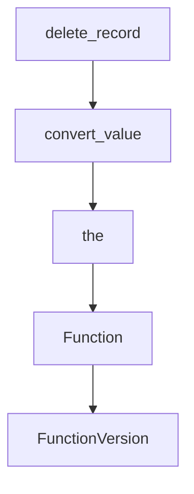

# Chapter 6: Extending BabyAGI: Custom Tools and Skills

Welcome to **Chapter 6: Extending BabyAGI: Custom Tools and Skills**. In this part of **BabyAGI Tutorial: The Original Autonomous AI Task Agent Framework**, you will build an intuitive mental model first, then move into concrete implementation details and practical production tradeoffs.

This chapter covers how to extend BabyAGI beyond pure LLM reasoning by adding web search, file I/O, code execution, and domain-specific tool integrations into the execution agent's capability set.

## Learning Goals

- understand how the execution agent can be extended to call external tools
- implement a web search tool integration using SerpAPI or Tavily
- add file read/write capabilities to enable persistent artifacts
- design a tool routing layer that selects the right tool for each task

## Fast Start Checklist

1. identify where the execution agent's output is currently produced (pure LLM text)
2. add a SerpAPI or Tavily web search function that can be called from the execution agent
3. modify the execution agent to detect when a task requires web search vs pure reasoning
4. run a 5-cycle test with an objective that explicitly requires current web information
5. verify that search results are stored in the vector store alongside LLM-generated results

## Source References

- [BabyAGI Main Script](https://github.com/yoheinakajima/babyagi/blob/main/babyagi.py)
- [BabyAGI README Extensions Section](https://github.com/yoheinakajima/babyagi#readme)
- [SerpAPI Documentation](https://serpapi.com/search-api)
- [Tavily Search API](https://tavily.com/docs)

## Summary

You now know how to extend BabyAGI with external tools and skills, enabling the execution agent to go beyond pure LLM reasoning and interact with the web, file systems, and domain-specific APIs.

Next: [Chapter 7: BabyAGI Evolution: 2o and Functionz Framework](07-babyagi-evolution-2o-and-functionz-framework.md)

## Depth Expansion Playbook

## Source Code Walkthrough

### `babyagi/functionz/packs/drafts/user_db.py`

The `delete_record` function in [`babyagi/functionz/packs/drafts/user_db.py`](https://github.com/yoheinakajima/babyagi/blob/HEAD/babyagi/functionz/packs/drafts/user_db.py) handles a key part of this chapter's functionality:

```py
    imports=["sqlalchemy"]
)
def delete_record(db_name: str, table_name: str, record_id: int):
    from sqlalchemy import create_engine, MetaData, Table
    from sqlalchemy.orm import sessionmaker
    UserDB_name = func.get_user_db_class()
    UserDB = type(UserDB_name, (), {
        '__init__': lambda self, db_url: setattr(self, 'engine', create_engine(db_url)),
        'metadata': MetaData()
    })
    user_db = UserDB(f'sqlite:///{db_name}.sqlite')
    user_db.metadata.reflect(user_db.engine)
    table = Table(table_name, user_db.metadata, autoload_with=user_db.engine)
    Session = sessionmaker(bind=user_db.engine)
    with Session() as session:
        delete = table.delete().where(table.c.id == record_id)
        result = session.execute(delete)
        session.commit()
        if result.rowcount:
            return f"Record {record_id} in table '{table_name}' of database '{db_name}' deleted successfully."
        return f"Record {record_id} not found in table '{table_name}' of database '{db_name}'."


@func.register_function(
    metadata={"description": "Convert value to specified SQLAlchemy type"},
    imports=["sqlalchemy", "json", "datetime"]
)
def convert_value(value, target_type):
    from sqlalchemy import Boolean, DateTime, LargeBinary, Integer, Float
    import json
    from datetime import datetime

```

This function is important because it defines how BabyAGI Tutorial: The Original Autonomous AI Task Agent Framework implements the patterns covered in this chapter.

### `babyagi/functionz/packs/drafts/user_db.py`

The `convert_value` function in [`babyagi/functionz/packs/drafts/user_db.py`](https://github.com/yoheinakajima/babyagi/blob/HEAD/babyagi/functionz/packs/drafts/user_db.py) handles a key part of this chapter's functionality:

```py
@func.register_function(
    metadata={"description": "Create a new record in a table."},
    dependencies=["get_user_db_class", "convert_value"],
    imports=["sqlalchemy", "json"]
)
def create_record(db_name: str, table_name: str, data: list):
    from sqlalchemy import create_engine, MetaData, Table, String
    from sqlalchemy.orm import sessionmaker
    import json

    if not isinstance(data_dict, dict):
        return "Error: Data must be a JSON object"

    UserDB_name = func.get_user_db_class()
    UserDB = type(UserDB_name, (), {
        '__init__': lambda self, db_url: setattr(self, 'engine', create_engine(db_url)),
        'metadata': MetaData()
    })
    user_db = UserDB(f'sqlite:///{db_name}.sqlite')
    user_db.metadata.reflect(user_db.engine)
    table = Table(table_name, user_db.metadata, autoload_with=user_db.engine)
    Session = sessionmaker(bind=user_db.engine)

    # Get column types
    column_types = {c.name: c.type for c in table.columns}

    # Convert input data to appropriate types
    converted_data = {key: func.convert_value(value, column_types.get(key, String)) for key, value in data.items()}

    try:
        with Session() as session:
            ins = table.insert().values(**converted_data)
```

This function is important because it defines how BabyAGI Tutorial: The Original Autonomous AI Task Agent Framework implements the patterns covered in this chapter.

### `babyagi/functionz/packs/drafts/user_db.py`

The `the` interface in [`babyagi/functionz/packs/drafts/user_db.py`](https://github.com/yoheinakajima/babyagi/blob/HEAD/babyagi/functionz/packs/drafts/user_db.py) handles a key part of this chapter's functionality:

```py
                session.close()

    return UserDB.__name__  # Return the name of the class instead of the class itself

@func.register_function(
    metadata={"description": "Create a new database."},
    dependencies=["get_user_db_class"],
    imports=["sqlalchemy"]
)
def create_database(db_name: str, db_type: str = 'sqlite', **kwargs):
    from sqlalchemy import create_engine, MetaData

    if db_type == 'sqlite':
        db_url = f'sqlite:///{db_name}.sqlite'
    elif db_type == 'postgresql':
        db_url = f'postgresql://{kwargs.get("user")}:{kwargs.get("password")}@{kwargs.get("host", "localhost")}:{kwargs.get("port", 5432)}/{db_name}'
    elif db_type == 'mysql':
        db_url = f'mysql+pymysql://{kwargs.get("user")}:{kwargs.get("password")}@{kwargs.get("host", "localhost")}:{kwargs.get("port", 3306)}/{db_name}'
    else:
        raise ValueError(f"Unsupported database type: {db_type}")

    UserDB_name = func.get_user_db_class()
    # Reconstruct the UserDB class
    UserDB = type(UserDB_name, (), {
        '__init__': lambda self, db_url: setattr(self, 'engine', create_engine(db_url)),
        'metadata': MetaData()
    })

    user_db = UserDB(db_url)  # Pass db_url here

    new_engine = create_engine(db_url)
    user_db.metadata.create_all(new_engine)
```

This interface is important because it defines how BabyAGI Tutorial: The Original Autonomous AI Task Agent Framework implements the patterns covered in this chapter.

### `babyagi/functionz/db/models.py`

The `Function` class in [`babyagi/functionz/db/models.py`](https://github.com/yoheinakajima/babyagi/blob/HEAD/babyagi/functionz/db/models.py) handles a key part of this chapter's functionality:

```py
fernet = Fernet(ENCRYPTION_KEY.encode())

# Association table for function dependencies (many-to-many between FunctionVersion and Function)
function_dependency = Table('function_dependency', Base.metadata,
    Column('function_version_id', Integer, ForeignKey('function_versions.id')),
    Column('dependency_id', Integer, ForeignKey('functions.id'))
)

# **Define function_version_imports association table here**
function_version_imports = Table('function_version_imports', Base.metadata,
    Column('function_version_id', Integer, ForeignKey('function_versions.id')),
    Column('import_id', Integer, ForeignKey('imports.id'))
)


class Function(Base):
    __tablename__ = 'functions'
    id = Column(Integer, primary_key=True)
    name = Column(String, unique=True)
    versions = relationship("FunctionVersion", back_populates="function", cascade="all, delete-orphan")

class FunctionVersion(Base):
    __tablename__ = 'function_versions'
    id = Column(Integer, primary_key=True)
    function_id = Column(Integer, ForeignKey('functions.id'))
    version = Column(Integer)
    code = Column(String)
    function_metadata = Column(JSON)
    is_active = Column(Boolean, default=False)
    created_date = Column(DateTime, default=datetime.utcnow)
    input_parameters = Column(JSON)
    output_parameters = Column(JSON)
```

This class is important because it defines how BabyAGI Tutorial: The Original Autonomous AI Task Agent Framework implements the patterns covered in this chapter.


## How These Components Connect


