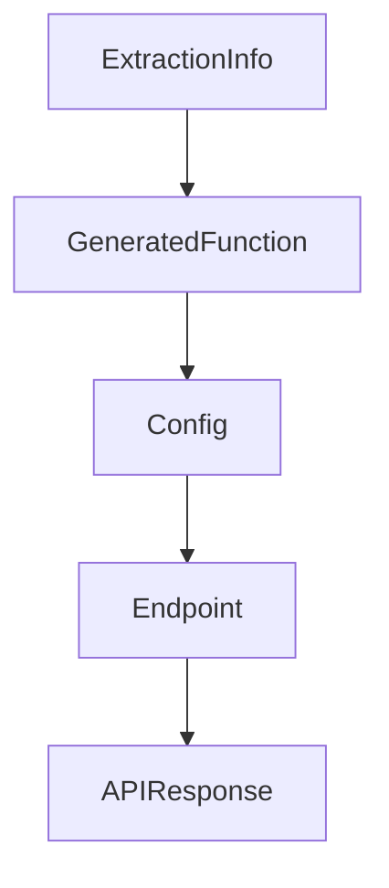

# Chapter 6: Extending BabyAGI: Custom Tools and Skills

Welcome to **Chapter 6: Extending BabyAGI: Custom Tools and Skills**. In this part of **BabyAGI Tutorial: The Original Autonomous AI Task Agent Framework**, you will build an intuitive mental model first, then move into concrete implementation details and practical production tradeoffs.

This chapter covers how to extend BabyAGI beyond pure LLM reasoning by adding web search, file I/O, code execution, and domain-specific tool integrations into the execution agent's capability set.

## Learning Goals

- understand how the execution agent can be extended to call external tools
- implement a web search tool integration using SerpAPI or Tavily
- add file read/write capabilities to enable persistent artifacts
- design a tool routing layer that selects the right tool for each task

## Fast Start Checklist

1. identify where the execution agent's output is currently produced (pure LLM text)
2. add a SerpAPI or Tavily web search function that can be called from the execution agent
3. modify the execution agent to detect when a task requires web search vs pure reasoning
4. run a 5-cycle test with an objective that explicitly requires current web information
5. verify that search results are stored in the vector store alongside LLM-generated results

## Source References

- [BabyAGI Main Script](https://github.com/yoheinakajima/babyagi/blob/main/babyagi.py)
- [BabyAGI README Extensions Section](https://github.com/yoheinakajima/babyagi#readme)
- [SerpAPI Documentation](https://serpapi.com/search-api)
- [Tavily Search API](https://tavily.com/docs)

## Summary

You now know how to extend BabyAGI with external tools and skills, enabling the execution agent to go beyond pure LLM reasoning and interact with the web, file systems, and domain-specific APIs.

Next: [Chapter 7: BabyAGI Evolution: 2o and Functionz Framework](07-babyagi-evolution-2o-and-functionz-framework.md)

## Source Code Walkthrough

### `babyagi/functionz/packs/drafts/generate_function.py`

The `ExtractionInfo` class in [`babyagi/functionz/packs/drafts/generate_function.py`](https://github.com/yoheinakajima/babyagi/blob/HEAD/babyagi/functionz/packs/drafts/generate_function.py) handles a key part of this chapter's functionality:

```py
        selected_urls: List[str] = Field(default_factory=list)

    # Updated ExtractionInfo model with 'requires_more_info'
    class ExtractionInfo(BaseModel):
        relevant_info: str
        additional_urls: List[str] = Field(default_factory=list)
        requires_more_info: bool

    # System prompt
    system_prompt = """
    You are an AI designed to help developers write Python functions using the functionz framework. Every function you generate must adhere to the following rules:

    Function Registration: All functions must be registered with the functionz framework using the @babyagi.register_function() decorator. Each function can include metadata, dependencies, imports, and key dependencies.

    Basic Function Registration Example:

    def function_name(param1, param2):
        # function logic here
        return result

    Metadata and Dependencies: When writing functions, you may include optional metadata (such as descriptions) and dependencies. Dependencies can be other functions or secrets (API keys, etc.).

    Import Handling: Manage imports by specifying them in the decorator as dictionaries with 'name' and 'lib' keys. Include these imports within the function body.

    Secret Management: When using API keys or authentication secrets, reference the stored key with globals()['key_name'].

    Error Handling: Functions should handle errors gracefully, catching exceptions if necessary.

    General Guidelines: Use simple, clean, and readable code. Follow the structure and syntax of the functionz framework. Ensure proper function documentation via metadata.
    """

    # Function to check if a URL is valid
```

This class is important because it defines how BabyAGI Tutorial: The Original Autonomous AI Task Agent Framework implements the patterns covered in this chapter.

### `babyagi/functionz/packs/drafts/generate_function.py`

The `GeneratedFunction` class in [`babyagi/functionz/packs/drafts/generate_function.py`](https://github.com/yoheinakajima/babyagi/blob/HEAD/babyagi/functionz/packs/drafts/generate_function.py) handles a key part of this chapter's functionality:

```py

    # Define Pydantic model
    class GeneratedFunction(BaseModel):
        name: str
        code: str
        metadata: Optional[Dict[str, Any]] = Field(default_factory=dict)
        imports: Optional[List[Dict[str, str]]] = Field(default_factory=list)
        dependencies: List[str] = Field(default_factory=list)
        key_dependencies: List[str] = Field(default_factory=list)
        triggers: List[str] = Field(default_factory=list)

        class Config:
            extra = "forbid"

    # System prompt
    system_prompt = """
    You are an AI designed to help developers write Python functions using the functionz framework. Every function you generate must adhere to the following rules:

    Function Registration: All functions must be registered with the functionz framework using the @babyagi.register_function() decorator. Each function can include metadata, dependencies, imports, and key dependencies.

    Basic Function Registration Example:

    def function_name(param1, param2):
        # function logic here
        return result

    Metadata and Dependencies: When writing functions, you may include optional metadata (such as descriptions) and dependencies. Dependencies can be other functions or secrets (API keys, etc.).

    Import Handling: Manage imports by specifying them in the decorator as dictionaries with 'name' and 'lib' keys. Include these imports within the function body.

    Secret Management: When using API keys or authentication secrets, reference the stored key with globals()['key_name'].

```

This class is important because it defines how BabyAGI Tutorial: The Original Autonomous AI Task Agent Framework implements the patterns covered in this chapter.

### `babyagi/functionz/packs/drafts/generate_function.py`

The `Config` class in [`babyagi/functionz/packs/drafts/generate_function.py`](https://github.com/yoheinakajima/babyagi/blob/HEAD/babyagi/functionz/packs/drafts/generate_function.py) handles a key part of this chapter's functionality:

```py
        triggers: List[str] = Field(default_factory=list)

        class Config:
            extra = "forbid"

    # System prompt
    system_prompt = """
    You are an AI designed to help developers write Python functions using the functionz framework. Every function you generate must adhere to the following rules:

    Function Registration: All functions must be registered with the functionz framework using the @babyagi.register_function() decorator. Each function can include metadata, dependencies, imports, and key dependencies.

    Basic Function Registration Example:

    def function_name(param1, param2):
        # function logic here
        return result

    Metadata and Dependencies: When writing functions, you may include optional metadata (such as descriptions) and dependencies. Dependencies can be other functions or secrets (API keys, etc.).

    Import Handling: Manage imports by specifying them in the decorator as dictionaries with 'name' and 'lib' keys. Include these imports within the function body.

    Secret Management: When using API keys or authentication secrets, reference the stored key with globals()['key_name'].

    Error Handling: Functions should handle errors gracefully, catching exceptions if necessary.

    General Guidelines: Use simple, clean, and readable code. Follow the structure and syntax of the functionz framework. Ensure proper function documentation via metadata.
    """

    # Function to chunk text
    def chunk_text(text: str, chunk_size: int = 100000, overlap: int = 10000) -> List[str]:
        chunks = []
        start = 0
```

This class is important because it defines how BabyAGI Tutorial: The Original Autonomous AI Task Agent Framework implements the patterns covered in this chapter.

### `babyagi/functionz/packs/drafts/generate_function.py`

The `Endpoint` class in [`babyagi/functionz/packs/drafts/generate_function.py`](https://github.com/yoheinakajima/babyagi/blob/HEAD/babyagi/functionz/packs/drafts/generate_function.py) handles a key part of this chapter's functionality:

```py

    # Define Pydantic models
    class Endpoint(BaseModel):
        method: Optional[str]
        url: str
        description: Optional[str] = None

    class APIDetails(BaseModel):
        api_name: str = Field(alias="name")  # Use alias to map 'name' to 'api_name'
        purpose: str
        endpoints: Optional[List[Union[Endpoint, str]]] = Field(default_factory=list)

        @validator("endpoints", pre=True, each_item=True)
        def convert_to_endpoint(cls, v):
            """Convert string URLs into Endpoint objects if necessary."""
            if isinstance(v, str):
                return Endpoint(url=v)  # Create an Endpoint object from a URL string
            return v

    class APIResponse(BaseModel):
        name: str
        purpose: str
        endpoints: List[Endpoint]

    # System prompt
    system_prompt = """
    [Your existing system prompt here]
    """

    prompt_for_apis = f"""You are an assistant analyzing function requirements.

    The user has provided the following function description: {description}.
```

This class is important because it defines how BabyAGI Tutorial: The Original Autonomous AI Task Agent Framework implements the patterns covered in this chapter.


## How These Components Connect


