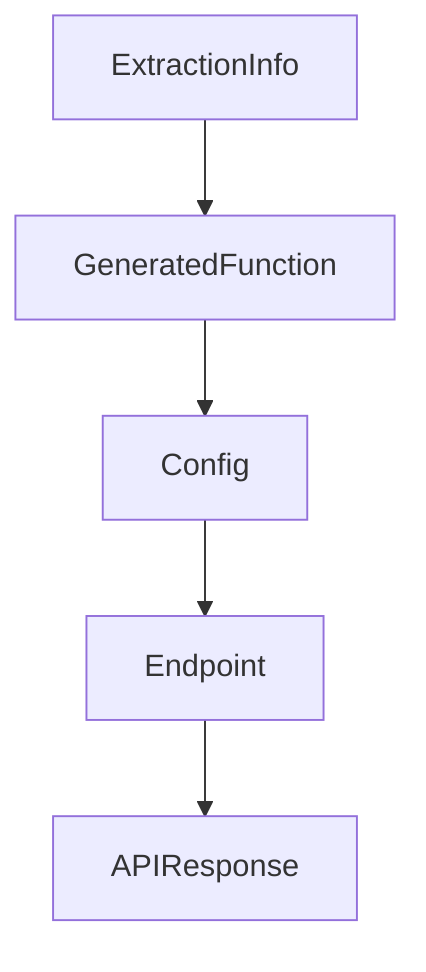

# Chapter 7: BabyAGI Evolution: 2o and Functionz Framework

Welcome to **Chapter 7: BabyAGI Evolution: 2o and Functionz Framework**. In this part of **BabyAGI Tutorial: The Original Autonomous AI Task Agent Framework**, you will build an intuitive mental model first, then move into concrete implementation details and practical production tradeoffs.

This chapter traces how BabyAGI evolved from the original single-file script into BabyAGI 2o (a self-building agent) and BabyAGI 3 / Functionz (a natural-language configurable agent framework), and what each evolutionary step means for practitioners.

## Learning Goals

- understand what BabyAGI 2o adds over the original: self-building skill acquisition
- understand what BabyAGI 3 / Functionz adds: natural language configuration and persistent function libraries
- identify which version to use for different use cases
- trace the conceptual lineage from the original three-agent loop to the modern BabyAGI variants

## Fast Start Checklist

1. read the `babyagi-2o` directory in the repository and identify what is new vs the original
2. read the `babyagi3` or `functionz` directory and identify the configuration model
3. run BabyAGI 2o on a simple objective and observe how it builds its skill library
4. understand the `functionz` framework's approach to persistent function storage
5. identify which evolutionary step is relevant to your use case

## Source References

- [BabyAGI 2o Directory](https://github.com/yoheinakajima/babyagi/tree/main/babyagi-2o)
- [BabyAGI 3 / Functionz Directory](https://github.com/yoheinakajima/babyagi/tree/main/babyagi3)
- [Functionz Repository](https://github.com/yoheinakajima/functionz)
- [BabyAGI README](https://github.com/yoheinakajima/babyagi/blob/main/README.md)

## Summary

You now understand the evolutionary arc from BabyAGI's original three-agent loop to self-building agents (2o) and natural-language configurable frameworks (BabyAGI 3), and can make an informed choice about which variant fits your needs.

Next: [Chapter 8: Production Patterns and Research Adaptations](08-production-patterns-and-research-adaptations.md)

## Depth Expansion Playbook

## Source Code Walkthrough

### `babyagi/functionz/packs/drafts/generate_function.py`

The `ExtractionInfo` class in [`babyagi/functionz/packs/drafts/generate_function.py`](https://github.com/yoheinakajima/babyagi/blob/HEAD/babyagi/functionz/packs/drafts/generate_function.py) handles a key part of this chapter's functionality:

```py
        selected_urls: List[str] = Field(default_factory=list)

    # Updated ExtractionInfo model with 'requires_more_info'
    class ExtractionInfo(BaseModel):
        relevant_info: str
        additional_urls: List[str] = Field(default_factory=list)
        requires_more_info: bool

    # System prompt
    system_prompt = """
    You are an AI designed to help developers write Python functions using the functionz framework. Every function you generate must adhere to the following rules:

    Function Registration: All functions must be registered with the functionz framework using the @babyagi.register_function() decorator. Each function can include metadata, dependencies, imports, and key dependencies.

    Basic Function Registration Example:

    def function_name(param1, param2):
        # function logic here
        return result

    Metadata and Dependencies: When writing functions, you may include optional metadata (such as descriptions) and dependencies. Dependencies can be other functions or secrets (API keys, etc.).

    Import Handling: Manage imports by specifying them in the decorator as dictionaries with 'name' and 'lib' keys. Include these imports within the function body.

    Secret Management: When using API keys or authentication secrets, reference the stored key with globals()['key_name'].

    Error Handling: Functions should handle errors gracefully, catching exceptions if necessary.

    General Guidelines: Use simple, clean, and readable code. Follow the structure and syntax of the functionz framework. Ensure proper function documentation via metadata.
    """

    # Function to check if a URL is valid
```

This class is important because it defines how BabyAGI Tutorial: The Original Autonomous AI Task Agent Framework implements the patterns covered in this chapter.

### `babyagi/functionz/packs/drafts/generate_function.py`

The `GeneratedFunction` class in [`babyagi/functionz/packs/drafts/generate_function.py`](https://github.com/yoheinakajima/babyagi/blob/HEAD/babyagi/functionz/packs/drafts/generate_function.py) handles a key part of this chapter's functionality:

```py

    # Define Pydantic model
    class GeneratedFunction(BaseModel):
        name: str
        code: str
        metadata: Optional[Dict[str, Any]] = Field(default_factory=dict)
        imports: Optional[List[Dict[str, str]]] = Field(default_factory=list)
        dependencies: List[str] = Field(default_factory=list)
        key_dependencies: List[str] = Field(default_factory=list)
        triggers: List[str] = Field(default_factory=list)

        class Config:
            extra = "forbid"

    # System prompt
    system_prompt = """
    You are an AI designed to help developers write Python functions using the functionz framework. Every function you generate must adhere to the following rules:

    Function Registration: All functions must be registered with the functionz framework using the @babyagi.register_function() decorator. Each function can include metadata, dependencies, imports, and key dependencies.

    Basic Function Registration Example:

    def function_name(param1, param2):
        # function logic here
        return result

    Metadata and Dependencies: When writing functions, you may include optional metadata (such as descriptions) and dependencies. Dependencies can be other functions or secrets (API keys, etc.).

    Import Handling: Manage imports by specifying them in the decorator as dictionaries with 'name' and 'lib' keys. Include these imports within the function body.

    Secret Management: When using API keys or authentication secrets, reference the stored key with globals()['key_name'].

```

This class is important because it defines how BabyAGI Tutorial: The Original Autonomous AI Task Agent Framework implements the patterns covered in this chapter.

### `babyagi/functionz/packs/drafts/generate_function.py`

The `Config` class in [`babyagi/functionz/packs/drafts/generate_function.py`](https://github.com/yoheinakajima/babyagi/blob/HEAD/babyagi/functionz/packs/drafts/generate_function.py) handles a key part of this chapter's functionality:

```py
        triggers: List[str] = Field(default_factory=list)

        class Config:
            extra = "forbid"

    # System prompt
    system_prompt = """
    You are an AI designed to help developers write Python functions using the functionz framework. Every function you generate must adhere to the following rules:

    Function Registration: All functions must be registered with the functionz framework using the @babyagi.register_function() decorator. Each function can include metadata, dependencies, imports, and key dependencies.

    Basic Function Registration Example:

    def function_name(param1, param2):
        # function logic here
        return result

    Metadata and Dependencies: When writing functions, you may include optional metadata (such as descriptions) and dependencies. Dependencies can be other functions or secrets (API keys, etc.).

    Import Handling: Manage imports by specifying them in the decorator as dictionaries with 'name' and 'lib' keys. Include these imports within the function body.

    Secret Management: When using API keys or authentication secrets, reference the stored key with globals()['key_name'].

    Error Handling: Functions should handle errors gracefully, catching exceptions if necessary.

    General Guidelines: Use simple, clean, and readable code. Follow the structure and syntax of the functionz framework. Ensure proper function documentation via metadata.
    """

    # Function to chunk text
    def chunk_text(text: str, chunk_size: int = 100000, overlap: int = 10000) -> List[str]:
        chunks = []
        start = 0
```

This class is important because it defines how BabyAGI Tutorial: The Original Autonomous AI Task Agent Framework implements the patterns covered in this chapter.

### `babyagi/functionz/packs/drafts/generate_function.py`

The `Endpoint` class in [`babyagi/functionz/packs/drafts/generate_function.py`](https://github.com/yoheinakajima/babyagi/blob/HEAD/babyagi/functionz/packs/drafts/generate_function.py) handles a key part of this chapter's functionality:

```py

    # Define Pydantic models
    class Endpoint(BaseModel):
        method: Optional[str]
        url: str
        description: Optional[str] = None

    class APIDetails(BaseModel):
        api_name: str = Field(alias="name")  # Use alias to map 'name' to 'api_name'
        purpose: str
        endpoints: Optional[List[Union[Endpoint, str]]] = Field(default_factory=list)

        @validator("endpoints", pre=True, each_item=True)
        def convert_to_endpoint(cls, v):
            """Convert string URLs into Endpoint objects if necessary."""
            if isinstance(v, str):
                return Endpoint(url=v)  # Create an Endpoint object from a URL string
            return v

    class APIResponse(BaseModel):
        name: str
        purpose: str
        endpoints: List[Endpoint]

    # System prompt
    system_prompt = """
    [Your existing system prompt here]
    """

    prompt_for_apis = f"""You are an assistant analyzing function requirements.

    The user has provided the following function description: {description}.
```

This class is important because it defines how BabyAGI Tutorial: The Original Autonomous AI Task Agent Framework implements the patterns covered in this chapter.


## How These Components Connect


