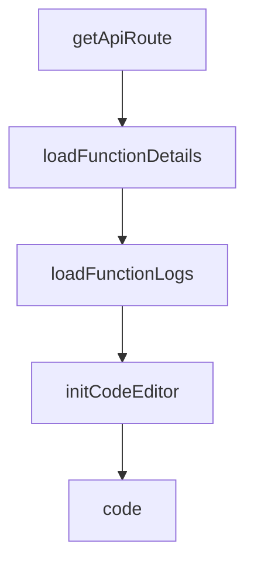

# Chapter 7: BabyAGI Evolution: 2o and Functionz Framework

Welcome to **Chapter 7: BabyAGI Evolution: 2o and Functionz Framework**. In this part of **BabyAGI Tutorial: The Original Autonomous AI Task Agent Framework**, you will build an intuitive mental model first, then move into concrete implementation details and practical production tradeoffs.

This chapter traces how BabyAGI evolved from the original single-file script into BabyAGI 2o (a self-building agent) and BabyAGI 3 / Functionz (a natural-language configurable agent framework), and what each evolutionary step means for practitioners.

## Learning Goals

- understand what BabyAGI 2o adds over the original: self-building skill acquisition
- understand what BabyAGI 3 / Functionz adds: natural language configuration and persistent function libraries
- identify which version to use for different use cases
- trace the conceptual lineage from the original three-agent loop to the modern BabyAGI variants

## Fast Start Checklist

1. read the `babyagi-2o` directory in the repository and identify what is new vs the original
2. read the `babyagi3` or `functionz` directory and identify the configuration model
3. run BabyAGI 2o on a simple objective and observe how it builds its skill library
4. understand the `functionz` framework's approach to persistent function storage
5. identify which evolutionary step is relevant to your use case

## Source References

- [BabyAGI 2o Directory](https://github.com/yoheinakajima/babyagi/tree/main/babyagi-2o)
- [BabyAGI 3 / Functionz Directory](https://github.com/yoheinakajima/babyagi/tree/main/babyagi3)
- [Functionz Repository](https://github.com/yoheinakajima/functionz)
- [BabyAGI README](https://github.com/yoheinakajima/babyagi/blob/main/README.md)

## Summary

You now understand the evolutionary arc from BabyAGI's original three-agent loop to self-building agents (2o) and natural-language configurable frameworks (BabyAGI 3), and can make an informed choice about which variant fits your needs.

Next: [Chapter 8: Production Patterns and Research Adaptations](08-production-patterns-and-research-adaptations.md)

## Source Code Walkthrough

### `babyagi/dashboard/static/js/function_details.js`

The `getApiRoute` function in [`babyagi/dashboard/static/js/function_details.js`](https://github.com/yoheinakajima/babyagi/blob/HEAD/babyagi/dashboard/static/js/function_details.js) handles a key part of this chapter's functionality:

```js

// Helper function to get the API route
function getApiRoute(routeName, ...args) {
    if (typeof apiRoutes[routeName] === 'function') {
        return apiRoutes[routeName](...args);
    } else {
        return apiRoutes[routeName];
    }
}

window.getApiRoute = getApiRoute;

let functionData;
let codeEditor;

// Expose necessary functions to the global scope
window.loadFunctionDetails = loadFunctionDetails;
window.loadFunctionLogs = loadFunctionLogs;
window.initCodeEditor = initCodeEditor;
window.displayFunctionDetails = displayFunctionDetails;
window.createExecutionForm = createExecutionForm;
window.updateFunction = updateFunction;
window.executeFunction = executeFunction;
window.toggleVersionHistory = toggleVersionHistory;
window.loadFunctionVersions = loadFunctionVersions;
window.activateVersion = activateVersion;

function loadFunctionDetails() {
    fetch(getApiRoute('getFunction'))
        .then(response => {
            if (!response.ok) {
                throw new Error(`HTTP error! status: ${response.status}`);
```

This function is important because it defines how BabyAGI Tutorial: The Original Autonomous AI Task Agent Framework implements the patterns covered in this chapter.

### `babyagi/dashboard/static/js/function_details.js`

The `loadFunctionDetails` function in [`babyagi/dashboard/static/js/function_details.js`](https://github.com/yoheinakajima/babyagi/blob/HEAD/babyagi/dashboard/static/js/function_details.js) handles a key part of this chapter's functionality:

```js

// Expose necessary functions to the global scope
window.loadFunctionDetails = loadFunctionDetails;
window.loadFunctionLogs = loadFunctionLogs;
window.initCodeEditor = initCodeEditor;
window.displayFunctionDetails = displayFunctionDetails;
window.createExecutionForm = createExecutionForm;
window.updateFunction = updateFunction;
window.executeFunction = executeFunction;
window.toggleVersionHistory = toggleVersionHistory;
window.loadFunctionVersions = loadFunctionVersions;
window.activateVersion = activateVersion;

function loadFunctionDetails() {
    fetch(getApiRoute('getFunction'))
        .then(response => {
            if (!response.ok) {
                throw new Error(`HTTP error! status: ${response.status}`);
            }
            return response.json();
        })
        .then(data => {
            functionData = data;
            console.log("functionData",functionData)
            displayFunctionDetails();
            createExecutionForm();
            initCodeEditor();
        })
        .catch(error => {
            console.error('Error:', error);
            document.getElementById('functionDetails').innerHTML = `<p>Error loading function details: ${error.message}</p>`;
        });
```

This function is important because it defines how BabyAGI Tutorial: The Original Autonomous AI Task Agent Framework implements the patterns covered in this chapter.

### `babyagi/dashboard/static/js/function_details.js`

The `loadFunctionLogs` function in [`babyagi/dashboard/static/js/function_details.js`](https://github.com/yoheinakajima/babyagi/blob/HEAD/babyagi/dashboard/static/js/function_details.js) handles a key part of this chapter's functionality:

```js
// Expose necessary functions to the global scope
window.loadFunctionDetails = loadFunctionDetails;
window.loadFunctionLogs = loadFunctionLogs;
window.initCodeEditor = initCodeEditor;
window.displayFunctionDetails = displayFunctionDetails;
window.createExecutionForm = createExecutionForm;
window.updateFunction = updateFunction;
window.executeFunction = executeFunction;
window.toggleVersionHistory = toggleVersionHistory;
window.loadFunctionVersions = loadFunctionVersions;
window.activateVersion = activateVersion;

function loadFunctionDetails() {
    fetch(getApiRoute('getFunction'))
        .then(response => {
            if (!response.ok) {
                throw new Error(`HTTP error! status: ${response.status}`);
            }
            return response.json();
        })
        .then(data => {
            functionData = data;
            console.log("functionData",functionData)
            displayFunctionDetails();
            createExecutionForm();
            initCodeEditor();
        })
        .catch(error => {
            console.error('Error:', error);
            document.getElementById('functionDetails').innerHTML = `<p>Error loading function details: ${error.message}</p>`;
        });
}
```

This function is important because it defines how BabyAGI Tutorial: The Original Autonomous AI Task Agent Framework implements the patterns covered in this chapter.

### `babyagi/dashboard/static/js/function_details.js`

The `initCodeEditor` function in [`babyagi/dashboard/static/js/function_details.js`](https://github.com/yoheinakajima/babyagi/blob/HEAD/babyagi/dashboard/static/js/function_details.js) handles a key part of this chapter's functionality:

```js
window.loadFunctionDetails = loadFunctionDetails;
window.loadFunctionLogs = loadFunctionLogs;
window.initCodeEditor = initCodeEditor;
window.displayFunctionDetails = displayFunctionDetails;
window.createExecutionForm = createExecutionForm;
window.updateFunction = updateFunction;
window.executeFunction = executeFunction;
window.toggleVersionHistory = toggleVersionHistory;
window.loadFunctionVersions = loadFunctionVersions;
window.activateVersion = activateVersion;

function loadFunctionDetails() {
    fetch(getApiRoute('getFunction'))
        .then(response => {
            if (!response.ok) {
                throw new Error(`HTTP error! status: ${response.status}`);
            }
            return response.json();
        })
        .then(data => {
            functionData = data;
            console.log("functionData",functionData)
            displayFunctionDetails();
            createExecutionForm();
            initCodeEditor();
        })
        .catch(error => {
            console.error('Error:', error);
            document.getElementById('functionDetails').innerHTML = `<p>Error loading function details: ${error.message}</p>`;
        });
}

```

This function is important because it defines how BabyAGI Tutorial: The Original Autonomous AI Task Agent Framework implements the patterns covered in this chapter.


## How These Components Connect


