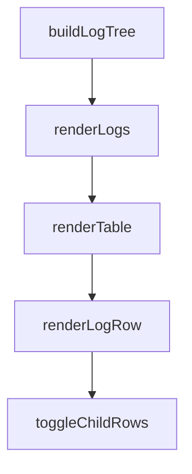

# Chapter 8: Production Patterns and Research Adaptations

Welcome to **Chapter 8: Production Patterns and Research Adaptations**. In this part of **BabyAGI Tutorial: The Original Autonomous AI Task Agent Framework**, you will build an intuitive mental model first, then move into concrete implementation details and practical production tradeoffs.

This chapter covers how to run BabyAGI reliably in production environments and how to adapt it for research experiments, including cost control, observability, safety controls, and reproducibility practices.

## Learning Goals

- design a production-grade BabyAGI deployment with cost controls and observability
- implement safety controls that prevent runaway autonomous loops in shared environments
- apply research-grade reproducibility practices for experiments using BabyAGI
- understand how BabyAGI has been used as a research reference and how to adapt it for your own research

## Fast Start Checklist

1. add `MAX_ITERATIONS` and `MAX_COST_USD` controls to the main loop
2. implement structured JSON logging for all agent calls
3. add a Slack or webhook notification on loop completion or failure
4. document the objective, model, and configuration for reproducibility
5. run a 10-cycle test with all controls active and verify the run summary

## Source References

- [BabyAGI Repository](https://github.com/yoheinakajima/babyagi)
- [BabyAGI README](https://github.com/yoheinakajima/babyagi/blob/main/README.md)
- [BabyAGI Inspired Projects](https://github.com/yoheinakajima/babyagi/blob/main/docs/inspired-projects.md)

## Summary

You now have the patterns needed to run BabyAGI safely in production environments and to adapt it for research experiments with full reproducibility, cost control, and observability.

## Source Code Walkthrough

### `babyagi/dashboard/static/js/log_dashboard.js`

The `buildLogTree` function in [`babyagi/dashboard/static/js/log_dashboard.js`](https://github.com/yoheinakajima/babyagi/blob/HEAD/babyagi/dashboard/static/js/log_dashboard.js) handles a key part of this chapter's functionality:

```js

        // Build the tree structure
        rootLogs = buildLogTree(filteredLogs);

        renderLogs();
    } catch (error) {
        console.error('Error populating filters:', error);
        alert('Failed to load logs for filters. Please try again later.');
    }
}

// Build log tree based on parent_log_id
function buildLogTree(logs) {
    const logsById = {};
    const rootLogs = [];

    // Initialize logsById mapping and add children array to each log
    logs.forEach(log => {
        log.children = [];
        logsById[log.id] = log;
    });

    // Build the tree
    logs.forEach(log => {
        if (log.parent_log_id !== null) {
            const parentLog = logsById[log.parent_log_id];
            if (parentLog) {
                parentLog.children.push(log);
            } else {
                // Parent log not found, treat as root
                rootLogs.push(log);
            }
```

This function is important because it defines how BabyAGI Tutorial: The Original Autonomous AI Task Agent Framework implements the patterns covered in this chapter.

### `babyagi/dashboard/static/js/log_dashboard.js`

The `renderLogs` function in [`babyagi/dashboard/static/js/log_dashboard.js`](https://github.com/yoheinakajima/babyagi/blob/HEAD/babyagi/dashboard/static/js/log_dashboard.js) handles a key part of this chapter's functionality:

```js
        rootLogs = buildLogTree(filteredLogs);

        renderLogs();
    } catch (error) {
        console.error('Error populating filters:', error);
        alert('Failed to load logs for filters. Please try again later.');
    }
}

// Build log tree based on parent_log_id
function buildLogTree(logs) {
    const logsById = {};
    const rootLogs = [];

    // Initialize logsById mapping and add children array to each log
    logs.forEach(log => {
        log.children = [];
        logsById[log.id] = log;
    });

    // Build the tree
    logs.forEach(log => {
        if (log.parent_log_id !== null) {
            const parentLog = logsById[log.parent_log_id];
            if (parentLog) {
                parentLog.children.push(log);
            } else {
                // Parent log not found, treat as root
                rootLogs.push(log);
            }
        } else {
            rootLogs.push(log);
```

This function is important because it defines how BabyAGI Tutorial: The Original Autonomous AI Task Agent Framework implements the patterns covered in this chapter.

### `babyagi/dashboard/static/js/log_dashboard.js`

The `renderTable` function in [`babyagi/dashboard/static/js/log_dashboard.js`](https://github.com/yoheinakajima/babyagi/blob/HEAD/babyagi/dashboard/static/js/log_dashboard.js) handles a key part of this chapter's functionality:

```js
// Render logs in table and grid formats
function renderLogs() {
    renderTable();
    renderGrid();
}

// Render Logs Table (Desktop View)
function renderTable() {
    const tableBody = document.querySelector('#logTable tbody');
    tableBody.innerHTML = '';

    rootLogs.forEach(log => {
        renderLogRow(tableBody, log, 0);
    });
}

// Recursive function to render each log row and its children
function renderLogRow(tableBody, log, depth, parentRowId) {
    const row = document.createElement('tr');
    const rowId = 'log-' + log.id;
    row.id = rowId;

    // If it's a child row, add a class to indicate it's a child
    if (parentRowId) {
        row.classList.add('child-of-log-' + parentRowId);
        row.style.display = 'none'; // Hide child rows by default
    }

    // Check if log has children
    const hasChildren = log.children && log.children.length > 0;

    // Create expand/collapse icon
```

This function is important because it defines how BabyAGI Tutorial: The Original Autonomous AI Task Agent Framework implements the patterns covered in this chapter.

### `babyagi/dashboard/static/js/log_dashboard.js`

The `renderLogRow` function in [`babyagi/dashboard/static/js/log_dashboard.js`](https://github.com/yoheinakajima/babyagi/blob/HEAD/babyagi/dashboard/static/js/log_dashboard.js) handles a key part of this chapter's functionality:

```js

    rootLogs.forEach(log => {
        renderLogRow(tableBody, log, 0);
    });
}

// Recursive function to render each log row and its children
function renderLogRow(tableBody, log, depth, parentRowId) {
    const row = document.createElement('tr');
    const rowId = 'log-' + log.id;
    row.id = rowId;

    // If it's a child row, add a class to indicate it's a child
    if (parentRowId) {
        row.classList.add('child-of-log-' + parentRowId);
        row.style.display = 'none'; // Hide child rows by default
    }

    // Check if log has children
    const hasChildren = log.children && log.children.length > 0;

    // Create expand/collapse icon
    let toggleIcon = '';
    if (hasChildren) {
        toggleIcon = `<span class="toggle-icon" data-log-id="${log.id}" style="cursor:pointer;">[+]</span> `;
    }

    row.innerHTML = `
        <td><a href="${dashboardRoute}/log/${log.id}" class="function-link">${log.id}</a></td>
        <td><a href="${dashboardRoute}/function/${encodeURIComponent(log.function_name)}" class="function-link">${log.function_name}</a></td>
        <td style="padding-left:${depth * 20}px">${toggleIcon}${log.message}</td>
        <td>${new Date(log.timestamp).toLocaleString()}</td>
```

This function is important because it defines how BabyAGI Tutorial: The Original Autonomous AI Task Agent Framework implements the patterns covered in this chapter.


## How These Components Connect


