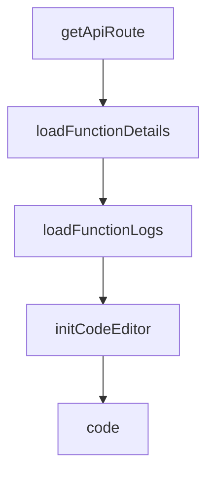

# Chapter 8: Production Patterns and Research Adaptations

Welcome to **Chapter 8: Production Patterns and Research Adaptations**. In this part of **BabyAGI Tutorial: The Original Autonomous AI Task Agent Framework**, you will build an intuitive mental model first, then move into concrete implementation details and practical production tradeoffs.

This chapter covers how to run BabyAGI reliably in production environments and how to adapt it for research experiments, including cost control, observability, safety controls, and reproducibility practices.

## Learning Goals

- design a production-grade BabyAGI deployment with cost controls and observability
- implement safety controls that prevent runaway autonomous loops in shared environments
- apply research-grade reproducibility practices for experiments using BabyAGI
- understand how BabyAGI has been used as a research reference and how to adapt it for your own research

## Fast Start Checklist

1. add `MAX_ITERATIONS` and `MAX_COST_USD` controls to the main loop
2. implement structured JSON logging for all agent calls
3. add a Slack or webhook notification on loop completion or failure
4. document the objective, model, and configuration for reproducibility
5. run a 10-cycle test with all controls active and verify the run summary

## Source References

- [BabyAGI Repository](https://github.com/yoheinakajima/babyagi)
- [BabyAGI README](https://github.com/yoheinakajima/babyagi/blob/main/README.md)
- [BabyAGI Inspired Projects](https://github.com/yoheinakajima/babyagi/blob/main/docs/inspired-projects.md)

## Summary

You now have the patterns needed to run BabyAGI safely in production environments and to adapt it for research experiments with full reproducibility, cost control, and observability.

## Depth Expansion Playbook

## Source Code Walkthrough

### `babyagi/dashboard/static/js/function_details.js`

The `getApiRoute` function in [`babyagi/dashboard/static/js/function_details.js`](https://github.com/yoheinakajima/babyagi/blob/HEAD/babyagi/dashboard/static/js/function_details.js) handles a key part of this chapter's functionality:

```js

// Helper function to get the API route
function getApiRoute(routeName, ...args) {
    if (typeof apiRoutes[routeName] === 'function') {
        return apiRoutes[routeName](...args);
    } else {
        return apiRoutes[routeName];
    }
}

window.getApiRoute = getApiRoute;

let functionData;
let codeEditor;

// Expose necessary functions to the global scope
window.loadFunctionDetails = loadFunctionDetails;
window.loadFunctionLogs = loadFunctionLogs;
window.initCodeEditor = initCodeEditor;
window.displayFunctionDetails = displayFunctionDetails;
window.createExecutionForm = createExecutionForm;
window.updateFunction = updateFunction;
window.executeFunction = executeFunction;
window.toggleVersionHistory = toggleVersionHistory;
window.loadFunctionVersions = loadFunctionVersions;
window.activateVersion = activateVersion;

function loadFunctionDetails() {
    fetch(getApiRoute('getFunction'))
        .then(response => {
            if (!response.ok) {
                throw new Error(`HTTP error! status: ${response.status}`);
```

This function is important because it defines how BabyAGI Tutorial: The Original Autonomous AI Task Agent Framework implements the patterns covered in this chapter.

### `babyagi/dashboard/static/js/function_details.js`

The `loadFunctionDetails` function in [`babyagi/dashboard/static/js/function_details.js`](https://github.com/yoheinakajima/babyagi/blob/HEAD/babyagi/dashboard/static/js/function_details.js) handles a key part of this chapter's functionality:

```js

// Expose necessary functions to the global scope
window.loadFunctionDetails = loadFunctionDetails;
window.loadFunctionLogs = loadFunctionLogs;
window.initCodeEditor = initCodeEditor;
window.displayFunctionDetails = displayFunctionDetails;
window.createExecutionForm = createExecutionForm;
window.updateFunction = updateFunction;
window.executeFunction = executeFunction;
window.toggleVersionHistory = toggleVersionHistory;
window.loadFunctionVersions = loadFunctionVersions;
window.activateVersion = activateVersion;

function loadFunctionDetails() {
    fetch(getApiRoute('getFunction'))
        .then(response => {
            if (!response.ok) {
                throw new Error(`HTTP error! status: ${response.status}`);
            }
            return response.json();
        })
        .then(data => {
            functionData = data;
            console.log("functionData",functionData)
            displayFunctionDetails();
            createExecutionForm();
            initCodeEditor();
        })
        .catch(error => {
            console.error('Error:', error);
            document.getElementById('functionDetails').innerHTML = `<p>Error loading function details: ${error.message}</p>`;
        });
```

This function is important because it defines how BabyAGI Tutorial: The Original Autonomous AI Task Agent Framework implements the patterns covered in this chapter.

### `babyagi/dashboard/static/js/function_details.js`

The `loadFunctionLogs` function in [`babyagi/dashboard/static/js/function_details.js`](https://github.com/yoheinakajima/babyagi/blob/HEAD/babyagi/dashboard/static/js/function_details.js) handles a key part of this chapter's functionality:

```js
// Expose necessary functions to the global scope
window.loadFunctionDetails = loadFunctionDetails;
window.loadFunctionLogs = loadFunctionLogs;
window.initCodeEditor = initCodeEditor;
window.displayFunctionDetails = displayFunctionDetails;
window.createExecutionForm = createExecutionForm;
window.updateFunction = updateFunction;
window.executeFunction = executeFunction;
window.toggleVersionHistory = toggleVersionHistory;
window.loadFunctionVersions = loadFunctionVersions;
window.activateVersion = activateVersion;

function loadFunctionDetails() {
    fetch(getApiRoute('getFunction'))
        .then(response => {
            if (!response.ok) {
                throw new Error(`HTTP error! status: ${response.status}`);
            }
            return response.json();
        })
        .then(data => {
            functionData = data;
            console.log("functionData",functionData)
            displayFunctionDetails();
            createExecutionForm();
            initCodeEditor();
        })
        .catch(error => {
            console.error('Error:', error);
            document.getElementById('functionDetails').innerHTML = `<p>Error loading function details: ${error.message}</p>`;
        });
}
```

This function is important because it defines how BabyAGI Tutorial: The Original Autonomous AI Task Agent Framework implements the patterns covered in this chapter.

### `babyagi/dashboard/static/js/function_details.js`

The `initCodeEditor` function in [`babyagi/dashboard/static/js/function_details.js`](https://github.com/yoheinakajima/babyagi/blob/HEAD/babyagi/dashboard/static/js/function_details.js) handles a key part of this chapter's functionality:

```js
window.loadFunctionDetails = loadFunctionDetails;
window.loadFunctionLogs = loadFunctionLogs;
window.initCodeEditor = initCodeEditor;
window.displayFunctionDetails = displayFunctionDetails;
window.createExecutionForm = createExecutionForm;
window.updateFunction = updateFunction;
window.executeFunction = executeFunction;
window.toggleVersionHistory = toggleVersionHistory;
window.loadFunctionVersions = loadFunctionVersions;
window.activateVersion = activateVersion;

function loadFunctionDetails() {
    fetch(getApiRoute('getFunction'))
        .then(response => {
            if (!response.ok) {
                throw new Error(`HTTP error! status: ${response.status}`);
            }
            return response.json();
        })
        .then(data => {
            functionData = data;
            console.log("functionData",functionData)
            displayFunctionDetails();
            createExecutionForm();
            initCodeEditor();
        })
        .catch(error => {
            console.error('Error:', error);
            document.getElementById('functionDetails').innerHTML = `<p>Error loading function details: ${error.message}</p>`;
        });
}

```

This function is important because it defines how BabyAGI Tutorial: The Original Autonomous AI Task Agent Framework implements the patterns covered in this chapter.


## How These Components Connect


