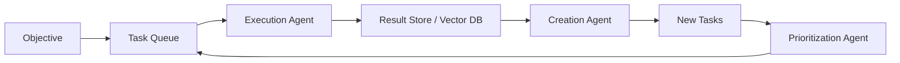

# BabyAGI Tutorial: The Original Autonomous AI Task Agent Framework

> Learn how to use `yoheinakajima/babyagi` for autonomous task generation, execution, and prioritization—the foundational agent loop that started the autonomous AI agent wave.

## Why This Track Matters

BabyAGI, released in March 2023 by Yohei Nakajima, is the original viral autonomous AI agent that introduced the three-agent loop pattern—task execution, task creation, and task prioritization—that underpins nearly every modern agentic framework. Understanding BabyAGI is understanding the DNA of autonomous AI systems: how agents decompose goals into tasks, maintain memory through vector stores, and continuously self-direct without human prompting between steps.

This track focuses on:

- understanding the three-agent loop at the core of autonomous task execution
- configuring and running BabyAGI with different LLM backends and vector stores
- extending BabyAGI with custom skills and tool integrations
- tracing the evolutionary arc from the original script to BabyAGI 2o and BabyAGI 3

## Current Snapshot (auto-updated)

- repository: [`yoheinakajima/babyagi`](https://github.com/yoheinakajima/babyagi)
- stars: about **18k**
- original release: **March 2023**
- author: Yohei Nakajima
- license: MIT
- recent activity: ongoing evolution via babyagi-2o and babyagi3 branches
- project positioning: foundational reference implementation for autonomous task-based AI agents

## Mental Model

## Chapter Guide

| Chapter | Key Question | Outcome |
|:--------|:-------------|:--------|
| [01 - Getting Started](01-getting-started.md) | How do I run BabyAGI on a first objective? | Working baseline |
| [02 - Core Architecture: Task Queue and Agent Loop](02-core-architecture-task-queue-and-agent-loop.md) | How does the three-agent loop actually work? | Architecture clarity |
| [03 - LLM Backend Integration and Configuration](03-llm-backend-integration-and-configuration.md) | How do I configure OpenAI, Anthropic, or local models? | Provider flexibility |
| [04 - Task Creation and Prioritization Engine](04-task-creation-and-prioritization-engine.md) | How are tasks generated, ranked, and managed? | Task loop mastery |
| [05 - Memory Systems and Vector Store Integration](05-memory-systems-and-vector-store-integration.md) | How does BabyAGI use Pinecone, Chroma, and Qdrant? | Memory architecture |
| [06 - Extending BabyAGI: Custom Tools and Skills](06-extending-babyagi-custom-tools-and-skills.md) | How do I add custom skills and tool integrations? | Extension patterns |
| [07 - BabyAGI Evolution: 2o and Functionz Framework](07-babyagi-evolution-2o-and-functionz-framework.md) | How has BabyAGI evolved to 2o and BabyAGI 3? | Evolutionary context |
| [08 - Production Patterns and Research Adaptations](08-production-patterns-and-research-adaptations.md) | How do teams run BabyAGI in production and research? | Operational readiness |

## What You Will Learn

- how the three-agent loop creates, executes, and prioritizes tasks autonomously
- how to configure vector memory backends for persistent context across task cycles
- how to extend BabyAGI with custom tools and domain-specific skills
- how to adapt BabyAGI patterns for production systems and research experiments

## Source References

- [BabyAGI Repository](https://github.com/yoheinakajima/babyagi)
- [BabyAGI README](https://github.com/yoheinakajima/babyagi/blob/main/README.md)
- [Original Twitter Announcement](https://twitter.com/yoheinakajima/status/1640934493489070080)
- [BabyAGI Paper / Design Doc](https://github.com/yoheinakajima/babyagi/blob/main/docs/inspired-projects.md)
- [BabyAGI 2o (babyagi-2o)](https://github.com/yoheinakajima/babyagi/tree/main/babyagi-2o)
- [BabyAGI 3 (babyagi3)](https://github.com/yoheinakajima/babyagi/tree/main/babyagi3)

## Related Tutorials

- [AutoGPT Tutorial](../autogen-tutorial/)
- [SuperAGI Tutorial](../superagi-tutorial/)
- [LangChain Tutorial](../langchain-tutorial/)
- [LangGraph Tutorial](../langgraph-tutorial/)
- [CrewAI Tutorial](../crewai-tutorial/)

---

Start with [Chapter 1: Getting Started](01-getting-started.md).

## Navigation & Backlinks

- [Start Here: Chapter 1: Getting Started](01-getting-started.md)
- [Back to Main Catalog](../../README.md#-tutorial-catalog)
- [Browse A-Z Tutorial Directory](../../discoverability/tutorial-directory.md)
- [Search by Intent](../../discoverability/query-hub.md)
- [Explore Category Hubs](../../README.md#category-hubs)

## Full Chapter Map

1. [Chapter 1: Getting Started](01-getting-started.md)
2. [Chapter 2: Core Architecture: Task Queue and Agent Loop](02-core-architecture-task-queue-and-agent-loop.md)
3. [Chapter 3: LLM Backend Integration and Configuration](03-llm-backend-integration-and-configuration.md)
4. [Chapter 4: Task Creation and Prioritization Engine](04-task-creation-and-prioritization-engine.md)
5. [Chapter 5: Memory Systems and Vector Store Integration](05-memory-systems-and-vector-store-integration.md)
6. [Chapter 6: Extending BabyAGI: Custom Tools and Skills](06-extending-babyagi-custom-tools-and-skills.md)
7. [Chapter 7: BabyAGI Evolution: 2o and Functionz Framework](07-babyagi-evolution-2o-and-functionz-framework.md)
8. [Chapter 8: Production Patterns and Research Adaptations](08-production-patterns-and-research-adaptations.md)

*Generated by [AI Codebase Knowledge Builder](https://github.com/The-Pocket/Tutorial-Codebase-Knowledge)*
