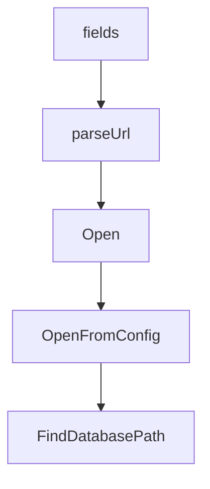

# Chapter 1: Getting Started

Welcome to **Chapter 1: Getting Started**. In this part of **Beads Tutorial: Git-Backed Task Graph Memory for Coding Agents**, you will build an intuitive mental model first, then move into concrete implementation details and practical production tradeoffs.


This chapter gets Beads installed and initialized in a real project.

## Learning Goals

- install `bd` via script/package manager
- initialize a project task graph with `bd init`
- verify ready/create/show command loop
- add minimal AGENTS.md guidance for agent usage

## Source References

- [Beads README Quick Start](https://github.com/steveyegge/beads/blob/main/README.md)
- [Beads Installation Guide](https://github.com/steveyegge/beads/blob/main/docs/INSTALLING.md)

## Summary

You now have a working Beads baseline for structured task tracking.

Next: [Chapter 2: Architecture and Data Model](02-architecture-and-data-model.md)

## Source Code Walkthrough

### `.golangci.yml`

The `fields` interface in [`.golangci.yml`](https://github.com/steveyegge/beads/blob/HEAD/.golangci.yml) handles a key part of this chapter's functionality:

```yml
          - gosec
        text: "G115"
      # G117: Exported struct fields matching secret patterns are intentional API fields
      - path: 'internal/compact/compactor\.go|internal/jira/client\.go|internal/linear/types\.go|internal/storage/versioned\.go'
        linters:
          - gosec
        text: "G117"
      # G304: Safe file reads from config paths
      - path: 'internal/config/config\.go'
        linters:
          - gosec
        text: "G304"
      # G306: Config file permissions 0644 are acceptable
      - path: 'internal/config/config\.go'
        linters:
          - gosec
        text: "G306"
      # G703: Path traversal via taint — paths are from config or internal construction
      - linters:
          - gosec
        text: "G703"
      # G704: SSRF via taint in API clients with user-configured URLs
      - path: 'cmd/bd/doctor/(claude|version)\.go|internal/gitlab/client\.go|internal/jira/client\.go|internal/linear/client\.go'
        linters:
          - gosec
        text: "G704"
      # G705: XSS via taint in CLI template rendering (no browser context)
      - path: 'cmd/bd/compact\.go'
        linters:
          - gosec
        text: "G705"
      # errcheck: fmt.Fprintf errors are noise in CLI help text generation
```

This interface is important because it defines how Beads Tutorial: Git-Backed Task Graph Memory for Coding Agents implements the patterns covered in this chapter.

### `website/docusaurus.config.ts`

The `parseUrl` function in [`website/docusaurus.config.ts`](https://github.com/steveyegge/beads/blob/HEAD/website/docusaurus.config.ts) handles a key part of this chapter's functionality:

```ts

// Parse SITE_URL into origin (url) and pathname (baseUrl)
function parseUrl(fullUrl: string): { origin: string; baseUrl: string } {
  try {
    const parsed = new URL(fullUrl);
    const baseUrl = parsed.pathname === '/' ? `/${projectName}/` :
                    parsed.pathname.endsWith('/') ? parsed.pathname : `${parsed.pathname}/`;
    return { origin: parsed.origin, baseUrl };
  } catch {
    return { origin: `https://${orgName}.github.io`, baseUrl: `/${projectName}/` };
  }
}

const { origin: siteUrl, baseUrl } = parseUrl(siteUrlEnv);

const config: Config = {
  title: 'Beads Documentation',
  tagline: 'Dolt-powered issue tracker for AI-supervised coding workflows',
  favicon: 'img/favicon.svg',

  // Enable Mermaid diagrams in markdown
  markdown: {
    mermaid: true,
  },
  themes: ['@docusaurus/theme-mermaid'],

  // future: {
  //   v4: true,
  // },

  // GitHub Pages deployment (environment-configurable)
  url: siteUrl,
```

This function is important because it defines how Beads Tutorial: Git-Backed Task Graph Memory for Coding Agents implements the patterns covered in this chapter.

### `beads.go`

The `Open` function in [`beads.go`](https://github.com/steveyegge/beads/blob/HEAD/beads.go) handles a key part of this chapter's functionality:

```go
)

// Open opens a Dolt-backed beads database at the given path.
// This always opens in embedded mode. Use OpenFromConfig to respect
// server mode settings from metadata.json.
func Open(ctx context.Context, dbPath string) (Storage, error) {
	return dolt.New(ctx, &dolt.Config{Path: dbPath, CreateIfMissing: true})
}

// OpenFromConfig opens a beads database using configuration from metadata.json.
// Unlike Open, this respects Dolt server mode settings and database name
// configuration, connecting to the Dolt SQL server when dolt_mode is "server".
// beadsDir is the path to the .beads directory.
func OpenFromConfig(ctx context.Context, beadsDir string) (Storage, error) {
	return dolt.NewFromConfigWithOptions(ctx, beadsDir, &dolt.Config{CreateIfMissing: true})
}

// FindDatabasePath finds the beads database in the current directory tree
func FindDatabasePath() string {
	return beads.FindDatabasePath()
}

// FindBeadsDir finds the .beads/ directory in the current directory tree.
// Returns empty string if not found.
func FindBeadsDir() string {
	return beads.FindBeadsDir()
}

// DatabaseInfo contains information about a beads database
type DatabaseInfo = beads.DatabaseInfo

// FindAllDatabases finds all beads databases in the system
```

This function is important because it defines how Beads Tutorial: Git-Backed Task Graph Memory for Coding Agents implements the patterns covered in this chapter.

### `beads.go`

The `OpenFromConfig` function in [`beads.go`](https://github.com/steveyegge/beads/blob/HEAD/beads.go) handles a key part of this chapter's functionality:

```go

// Open opens a Dolt-backed beads database at the given path.
// This always opens in embedded mode. Use OpenFromConfig to respect
// server mode settings from metadata.json.
func Open(ctx context.Context, dbPath string) (Storage, error) {
	return dolt.New(ctx, &dolt.Config{Path: dbPath, CreateIfMissing: true})
}

// OpenFromConfig opens a beads database using configuration from metadata.json.
// Unlike Open, this respects Dolt server mode settings and database name
// configuration, connecting to the Dolt SQL server when dolt_mode is "server".
// beadsDir is the path to the .beads directory.
func OpenFromConfig(ctx context.Context, beadsDir string) (Storage, error) {
	return dolt.NewFromConfigWithOptions(ctx, beadsDir, &dolt.Config{CreateIfMissing: true})
}

// FindDatabasePath finds the beads database in the current directory tree
func FindDatabasePath() string {
	return beads.FindDatabasePath()
}

// FindBeadsDir finds the .beads/ directory in the current directory tree.
// Returns empty string if not found.
func FindBeadsDir() string {
	return beads.FindBeadsDir()
}

// DatabaseInfo contains information about a beads database
type DatabaseInfo = beads.DatabaseInfo

// FindAllDatabases finds all beads databases in the system
func FindAllDatabases() []DatabaseInfo {
```

This function is important because it defines how Beads Tutorial: Git-Backed Task Graph Memory for Coding Agents implements the patterns covered in this chapter.


## How These Components Connect


