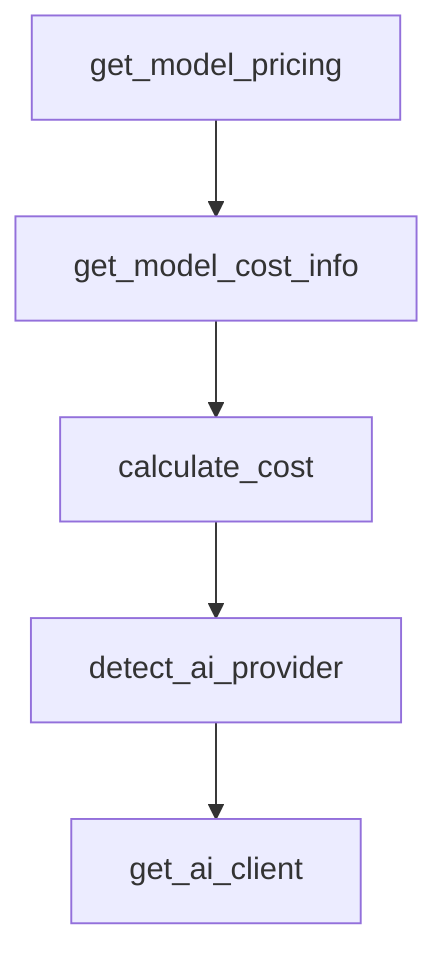

# Chapter 2: Architecture and Data Model

Welcome to **Chapter 2: Architecture and Data Model**. In this part of **Beads Tutorial: Git-Backed Task Graph Memory for Coding Agents**, you will build an intuitive mental model first, then move into concrete implementation details and practical production tradeoffs.


This chapter explains Beads internals for durable agent memory.

## Learning Goals

- understand git-backed graph tracking model
- interpret hash-based IDs and issue relationships
- map status, assignee, and audit semantics
- reason about portability and merge behavior

## Model Highlights

- graph issues with typed relationships
- hash IDs to avoid merge collisions
- structured output for machine-driven workflows

## Source References

- [Beads README Features](https://github.com/steveyegge/beads/blob/main/README.md)
- [Beads Agent Instructions](https://github.com/steveyegge/beads/blob/main/AGENT_INSTRUCTIONS.md)

## Summary

You now understand how Beads persists and structures long-horizon task state.

Next: [Chapter 3: Core Workflow Commands](03-core-workflow-commands.md)

## Source Code Walkthrough

### `scripts/generate-newsletter.py`

The `get_model_pricing` function in [`scripts/generate-newsletter.py`](https://github.com/steveyegge/beads/blob/HEAD/scripts/generate-newsletter.py) handles a key part of this chapter's functionality:

```py


def get_model_pricing(model: str) -> tuple[float, float]:
    """Get pricing for a model (input_cost, output_cost per 1M tokens).
    
    Returns tuple of (input_price_per_1m, output_price_per_1m).
    Prices in dollars per million tokens.
    """
    model_lower = model.lower()
    
    # Anthropic models
    if 'opus-4-1' in model_lower or 'opus-4.1' in model_lower:
        return (15.0, 45.0)
    elif 'opus' in model_lower:
        return (15.0, 45.0)
    elif 'sonnet-4-5' in model_lower:
        return (3.0, 15.0)
    elif 'sonnet' in model_lower:
        return (3.0, 15.0)
    elif 'haiku-4-5' in model_lower:
        return (0.80, 4.0)
    elif 'haiku' in model_lower:
        return (0.80, 4.0)
    
    # OpenAI models
    elif 'gpt-4o' in model_lower:
        return (5.0, 15.0)
    elif 'gpt-4-turbo' in model_lower:
        return (10.0, 30.0)
    elif 'gpt-4' in model_lower:
        return (30.0, 60.0)
    elif 'gpt-3.5' in model_lower:
```

This function is important because it defines how Beads Tutorial: Git-Backed Task Graph Memory for Coding Agents implements the patterns covered in this chapter.

### `scripts/generate-newsletter.py`

The `get_model_cost_info` function in [`scripts/generate-newsletter.py`](https://github.com/steveyegge/beads/blob/HEAD/scripts/generate-newsletter.py) handles a key part of this chapter's functionality:

```py


def get_model_cost_info(model: str) -> str:
    """Get cost information for a model.
    
    Returns a string with relative cost tier (cheap, moderate, expensive) and approximate cost.
    """
    model_lower = model.lower()
    input_price, output_price = get_model_pricing(model)
    
    if input_price == 0:
        return f"{model} (cost unknown)"
    
    # Anthropic models
    if 'opus-4-1' in model_lower or 'opus-4.1' in model_lower:
        return f"claude-opus-4-1 (${input_price}/${output_price} per 1M input/output tokens)"
    elif 'opus' in model_lower:
        return f"claude-opus (${input_price}/${output_price} per 1M input/output tokens)"
    elif 'sonnet-4-5' in model_lower:
        return f"claude-sonnet-4-5 (${input_price}/${output_price} per 1M input/output tokens)"
    elif 'sonnet' in model_lower:
        return f"claude-sonnet (${input_price}/${output_price} per 1M input/output tokens)"
    elif 'haiku-4-5' in model_lower:
        return f"claude-haiku-4-5 (${input_price}/${output_price} per 1M input/output tokens)"
    elif 'haiku' in model_lower:
        return f"claude-haiku (${input_price}/${output_price} per 1M input/output tokens)"
    
    # OpenAI models
    elif 'gpt-4o' in model_lower:
        return f"gpt-4o (${input_price}/${output_price} per 1M input/output tokens)"
    elif 'gpt-4-turbo' in model_lower:
        return f"gpt-4-turbo (${input_price}/${output_price} per 1M input/output tokens)"
```

This function is important because it defines how Beads Tutorial: Git-Backed Task Graph Memory for Coding Agents implements the patterns covered in this chapter.

### `scripts/generate-newsletter.py`

The `calculate_cost` function in [`scripts/generate-newsletter.py`](https://github.com/steveyegge/beads/blob/HEAD/scripts/generate-newsletter.py) handles a key part of this chapter's functionality:

```py


def calculate_cost(model: str, input_tokens: int, output_tokens: int) -> float:
    """Calculate the actual cost of a generation.
    
    Returns cost in dollars.
    """
    input_price, output_price = get_model_pricing(model)
    input_cost = (input_tokens / 1_000_000) * input_price
    output_cost = (output_tokens / 1_000_000) * output_price
    return input_cost + output_cost


def detect_ai_provider(model: str) -> str:
    """Detect AI provider from model name."""
    model_lower = model.lower()
    if 'claude' in model_lower:
        return 'anthropic'
    elif 'gpt' in model_lower or 'openai' in model_lower:
        return 'openai'
    elif 'o1' in model_lower or 'o3' in model_lower:
        return 'openai'  # OpenAI reasoning models
    else:
        return 'anthropic'  # Default


def get_ai_client(provider: str):
    """Get AI client based on provider."""
    if provider == 'anthropic':
        api_key = os.environ.get('ANTHROPIC_API_KEY')
        if not api_key:
            raise ValueError("ANTHROPIC_API_KEY environment variable not set")
```

This function is important because it defines how Beads Tutorial: Git-Backed Task Graph Memory for Coding Agents implements the patterns covered in this chapter.

### `scripts/generate-newsletter.py`

The `detect_ai_provider` function in [`scripts/generate-newsletter.py`](https://github.com/steveyegge/beads/blob/HEAD/scripts/generate-newsletter.py) handles a key part of this chapter's functionality:

```py


def detect_ai_provider(model: str) -> str:
    """Detect AI provider from model name."""
    model_lower = model.lower()
    if 'claude' in model_lower:
        return 'anthropic'
    elif 'gpt' in model_lower or 'openai' in model_lower:
        return 'openai'
    elif 'o1' in model_lower or 'o3' in model_lower:
        return 'openai'  # OpenAI reasoning models
    else:
        return 'anthropic'  # Default


def get_ai_client(provider: str):
    """Get AI client based on provider."""
    if provider == 'anthropic':
        api_key = os.environ.get('ANTHROPIC_API_KEY')
        if not api_key:
            raise ValueError("ANTHROPIC_API_KEY environment variable not set")
        client = Anthropic(api_key=api_key)
        return client
    elif provider == 'openai':
        api_key = os.environ.get('OPENAI_API_KEY')
        if not api_key:
            raise ValueError("OPENAI_API_KEY environment variable not set")
        client = OpenAI(api_key=api_key)
        return client
    else:
        raise ValueError(f"Unknown provider: {provider}")

```

This function is important because it defines how Beads Tutorial: Git-Backed Task Graph Memory for Coding Agents implements the patterns covered in this chapter.


## How These Components Connect


