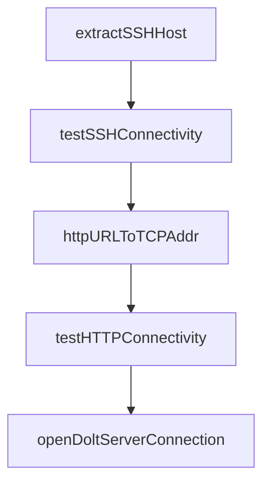

# Chapter 3: Core Workflow Commands

Welcome to **Chapter 3: Core Workflow Commands**. In this part of **Beads Tutorial: Git-Backed Task Graph Memory for Coding Agents**, you will build an intuitive mental model first, then move into concrete implementation details and practical production tradeoffs.


This chapter covers daily command patterns for execution flow.

## Learning Goals

- run `ready`, `create`, `update`, and `show` loops
- claim and progress tasks safely
- keep issue state synchronized with real work
- reduce accidental task duplication

## Command Rhythm

- use `bd ready` for next actionable tasks
- use `bd update --claim` for ownership handoff
- use `bd show` to inspect full context and history

## Source References

- [Beads README Essential Commands](https://github.com/steveyegge/beads/blob/main/README.md)
- [Beads Troubleshooting](https://github.com/steveyegge/beads/blob/main/docs/TROUBLESHOOTING.md)

## Summary

You now have a repeatable command workflow for day-to-day Beads operation.

Next: [Chapter 4: Dependency Graph and Hierarchy Patterns](04-dependency-graph-and-hierarchy-patterns.md)

## Depth Expansion Playbook

## Source Code Walkthrough

### `cmd/bd/dolt.go`

The `extractSSHHost` function in [`cmd/bd/dolt.go`](https://github.com/steveyegge/beads/blob/HEAD/cmd/bd/dolt.go) handles a key part of this chapter's functionality:

```go
		if doltutil.IsSSHURL(r.URL) {
			// Test SSH connectivity by parsing host from URL
			sshHost := extractSSHHost(r.URL)
			if sshHost != "" {
				fmt.Printf("  %s (%s)... ", r.Name, r.URL)
				if testSSHConnectivity(sshHost) {
					fmt.Printf("%s\n", ui.RenderPass("✓ reachable"))
				} else {
					fmt.Printf("%s\n", ui.RenderWarn("✗ unreachable"))
				}
			}
		} else if strings.HasPrefix(r.URL, "https://") || strings.HasPrefix(r.URL, "http://") {
			fmt.Printf("  %s (%s)... ", r.Name, r.URL)
			if testHTTPConnectivity(r.URL) {
				fmt.Printf("%s\n", ui.RenderPass("✓ reachable"))
			} else {
				fmt.Printf("%s\n", ui.RenderWarn("✗ unreachable"))
			}
		} else {
			fmt.Printf("  %s (%s)... skipped (no connectivity test for this scheme)\n", r.Name, r.URL)
		}
	}
}

// serverDialTimeout controls the TCP dial timeout for server connection tests.
// Tests may reduce this to avoid slow unreachable-host hangs in CI.
var serverDialTimeout = 3 * time.Second

func testServerConnection(host string, port int) bool {
	addr := net.JoinHostPort(host, strconv.Itoa(port))

	conn, err := net.DialTimeout("tcp", addr, serverDialTimeout)
```

This function is important because it defines how Beads Tutorial: Git-Backed Task Graph Memory for Coding Agents implements the patterns covered in this chapter.

### `cmd/bd/dolt.go`

The `testSSHConnectivity` function in [`cmd/bd/dolt.go`](https://github.com/steveyegge/beads/blob/HEAD/cmd/bd/dolt.go) handles a key part of this chapter's functionality:

```go
			if sshHost != "" {
				fmt.Printf("  %s (%s)... ", r.Name, r.URL)
				if testSSHConnectivity(sshHost) {
					fmt.Printf("%s\n", ui.RenderPass("✓ reachable"))
				} else {
					fmt.Printf("%s\n", ui.RenderWarn("✗ unreachable"))
				}
			}
		} else if strings.HasPrefix(r.URL, "https://") || strings.HasPrefix(r.URL, "http://") {
			fmt.Printf("  %s (%s)... ", r.Name, r.URL)
			if testHTTPConnectivity(r.URL) {
				fmt.Printf("%s\n", ui.RenderPass("✓ reachable"))
			} else {
				fmt.Printf("%s\n", ui.RenderWarn("✗ unreachable"))
			}
		} else {
			fmt.Printf("  %s (%s)... skipped (no connectivity test for this scheme)\n", r.Name, r.URL)
		}
	}
}

// serverDialTimeout controls the TCP dial timeout for server connection tests.
// Tests may reduce this to avoid slow unreachable-host hangs in CI.
var serverDialTimeout = 3 * time.Second

func testServerConnection(host string, port int) bool {
	addr := net.JoinHostPort(host, strconv.Itoa(port))

	conn, err := net.DialTimeout("tcp", addr, serverDialTimeout)
	if err != nil {
		return false
	}
```

This function is important because it defines how Beads Tutorial: Git-Backed Task Graph Memory for Coding Agents implements the patterns covered in this chapter.

### `cmd/bd/dolt.go`

The `httpURLToTCPAddr` function in [`cmd/bd/dolt.go`](https://github.com/steveyegge/beads/blob/HEAD/cmd/bd/dolt.go) handles a key part of this chapter's functionality:

```go
}

// httpURLToTCPAddr extracts a TCP dial address (host:port) from an HTTP(S) URL.
// Handles IPv6 addresses correctly (e.g., https://[::1]:8080/path).
func httpURLToTCPAddr(url string) string {
	host := url
	host = strings.TrimPrefix(host, "https://")
	host = strings.TrimPrefix(host, "http://")
	if idx := strings.Index(host, "/"); idx >= 0 {
		host = host[:idx]
	}
	defaultPort := "443"
	if strings.HasPrefix(url, "http://") {
		defaultPort = "80"
	}
	// Use net.SplitHostPort to correctly handle IPv6 addresses (which
	// contain colons that would otherwise be confused with host:port).
	if h, p, err := net.SplitHostPort(host); err == nil {
		return net.JoinHostPort(h, p)
	}
	// No port in host string. Strip IPv6 brackets if present so
	// JoinHostPort can re-add them correctly.
	h := strings.TrimPrefix(host, "[")
	h = strings.TrimSuffix(h, "]")
	return net.JoinHostPort(h, defaultPort)
}

// testHTTPConnectivity tests if an HTTP(S) URL is reachable via TCP.
func testHTTPConnectivity(url string) bool {
	addr := httpURLToTCPAddr(url)
	conn, err := net.DialTimeout("tcp", addr, 5*time.Second)
	if err != nil {
```

This function is important because it defines how Beads Tutorial: Git-Backed Task Graph Memory for Coding Agents implements the patterns covered in this chapter.

### `cmd/bd/dolt.go`

The `testHTTPConnectivity` function in [`cmd/bd/dolt.go`](https://github.com/steveyegge/beads/blob/HEAD/cmd/bd/dolt.go) handles a key part of this chapter's functionality:

```go
		} else if strings.HasPrefix(r.URL, "https://") || strings.HasPrefix(r.URL, "http://") {
			fmt.Printf("  %s (%s)... ", r.Name, r.URL)
			if testHTTPConnectivity(r.URL) {
				fmt.Printf("%s\n", ui.RenderPass("✓ reachable"))
			} else {
				fmt.Printf("%s\n", ui.RenderWarn("✗ unreachable"))
			}
		} else {
			fmt.Printf("  %s (%s)... skipped (no connectivity test for this scheme)\n", r.Name, r.URL)
		}
	}
}

// serverDialTimeout controls the TCP dial timeout for server connection tests.
// Tests may reduce this to avoid slow unreachable-host hangs in CI.
var serverDialTimeout = 3 * time.Second

func testServerConnection(host string, port int) bool {
	addr := net.JoinHostPort(host, strconv.Itoa(port))

	conn, err := net.DialTimeout("tcp", addr, serverDialTimeout)
	if err != nil {
		return false
	}
	_ = conn.Close() // Best effort cleanup
	return true
}

// extractSSHHost extracts the hostname from an SSH URL for connectivity testing.
func extractSSHHost(url string) string {
	// git+ssh://git@github.com/org/repo.git → github.com
	// ssh://git@github.com/org/repo.git → github.com
```

This function is important because it defines how Beads Tutorial: Git-Backed Task Graph Memory for Coding Agents implements the patterns covered in this chapter.


## How These Components Connect


