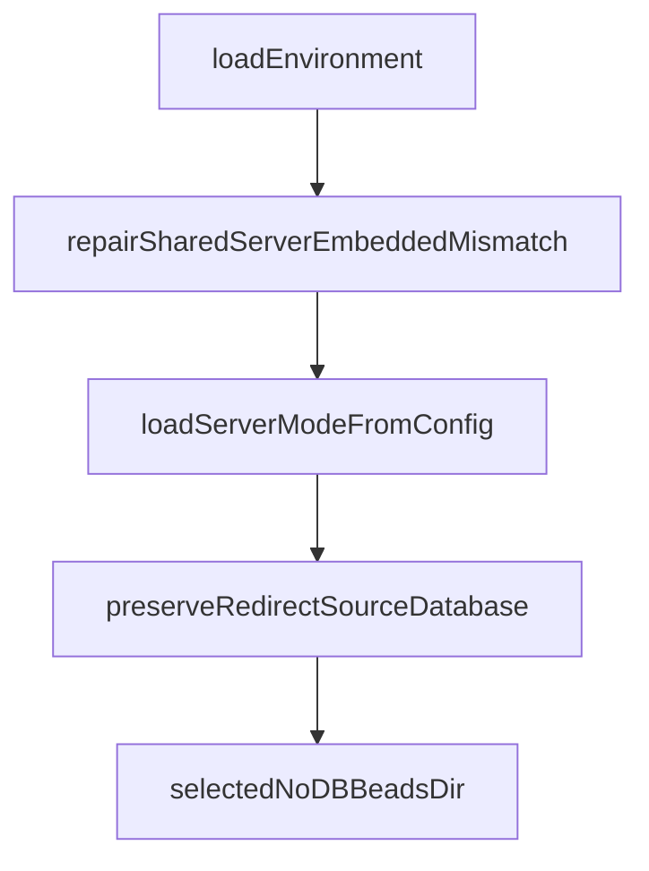

# Chapter 3: Core Workflow Commands

Welcome to **Chapter 3: Core Workflow Commands**. In this part of **Beads Tutorial: Git-Backed Task Graph Memory for Coding Agents**, you will build an intuitive mental model first, then move into concrete implementation details and practical production tradeoffs.


This chapter covers daily command patterns for execution flow.

## Learning Goals

- run `ready`, `create`, `update`, and `show` loops
- claim and progress tasks safely
- keep issue state synchronized with real work
- reduce accidental task duplication

## Command Rhythm

- use `bd ready` for next actionable tasks
- use `bd update --claim` for ownership handoff
- use `bd show` to inspect full context and history

## Source References

- [Beads README Essential Commands](https://github.com/steveyegge/beads/blob/main/README.md)
- [Beads Troubleshooting](https://github.com/steveyegge/beads/blob/main/docs/TROUBLESHOOTING.md)

## Summary

You now have a repeatable command workflow for day-to-day Beads operation.

Next: [Chapter 4: Dependency Graph and Hierarchy Patterns](04-dependency-graph-and-hierarchy-patterns.md)

## Source Code Walkthrough

### `cmd/bd/main.go`

The `loadEnvironment` function in [`cmd/bd/main.go`](https://github.com/steveyegge/beads/blob/HEAD/cmd/bd/main.go) handles a key part of this chapter's functionality:

```go
}

// loadEnvironment runs the lightweight, always-needed environment setup that
// must happen before the noDbCommands early return. This ensures commands like
// "bd doctor --server" pick up per-project Dolt credentials from .beads/.env.
//
// This function intentionally does NOT do any store initialization, auto-migrate,
// or telemetry setup — those belong in the store-init phase that runs after the
// noDbCommands check.
func loadEnvironment() {
	// FindBeadsDir is lightweight (filesystem walk, no git subprocesses)
	// and resolves BEADS_DIR, redirects, and worktree paths.
	if beadsDir := beads.FindBeadsDir(); beadsDir != "" {
		loadBeadsEnvFile(beadsDir)
		// Non-fatal warning if .beads/ directory has overly permissive access.
		config.CheckBeadsDirPermissions(beadsDir)
	}
}

// repairSharedServerEmbeddedMismatch detects and auto-repairs the case where
// shared-server mode is active but metadata.json still pins dolt_mode=embedded.
// This prevents the silent fallback into embedded mode that hides server-backed
// issue state after upgrades (GH#2949).
func repairSharedServerEmbeddedMismatch(beadsDir string, cfg *configfile.Config) {
	if cfg == nil {
		return
	}
	if strings.ToLower(strings.TrimSpace(cfg.DoltMode)) != configfile.DoltModeEmbedded {
		return
	}
	if !doltserver.IsSharedServerMode() {
		return
```

This function is important because it defines how Beads Tutorial: Git-Backed Task Graph Memory for Coding Agents implements the patterns covered in this chapter.

### `cmd/bd/main.go`

The `repairSharedServerEmbeddedMismatch` function in [`cmd/bd/main.go`](https://github.com/steveyegge/beads/blob/HEAD/cmd/bd/main.go) handles a key part of this chapter's functionality:

```go
}

// repairSharedServerEmbeddedMismatch detects and auto-repairs the case where
// shared-server mode is active but metadata.json still pins dolt_mode=embedded.
// This prevents the silent fallback into embedded mode that hides server-backed
// issue state after upgrades (GH#2949).
func repairSharedServerEmbeddedMismatch(beadsDir string, cfg *configfile.Config) {
	if cfg == nil {
		return
	}
	if strings.ToLower(strings.TrimSpace(cfg.DoltMode)) != configfile.DoltModeEmbedded {
		return
	}
	if !doltserver.IsSharedServerMode() {
		return
	}
	fmt.Fprintln(os.Stderr, "Notice: shared-server is enabled but metadata.json had dolt_mode=embedded.")
	cfg.DoltMode = configfile.DoltModeServer
	if err := cfg.Save(beadsDir); err != nil {
		fmt.Fprintf(os.Stderr, "Warning: failed to auto-repair metadata.json: %v\n", err)
		fmt.Fprintln(os.Stderr, "Fix manually: set dolt_mode to \"server\" in .beads/metadata.json")
	} else {
		fmt.Fprintln(os.Stderr, "Auto-repaired: dolt_mode updated to \"server\" in metadata.json.")
	}
}

// loadServerModeFromConfig loads the storage mode (embedded vs server) from
// metadata.json so that isEmbeddedMode() returns the correct value. Called
// for commands that skip full DB init but still need to know the mode.
func loadServerModeFromConfig() {
	beadsDir := beads.FindBeadsDir()
	if beadsDir == "" {
```

This function is important because it defines how Beads Tutorial: Git-Backed Task Graph Memory for Coding Agents implements the patterns covered in this chapter.

### `cmd/bd/main.go`

The `loadServerModeFromConfig` function in [`cmd/bd/main.go`](https://github.com/steveyegge/beads/blob/HEAD/cmd/bd/main.go) handles a key part of this chapter's functionality:

```go
}

// loadServerModeFromConfig loads the storage mode (embedded vs server) from
// metadata.json so that isEmbeddedMode() returns the correct value. Called
// for commands that skip full DB init but still need to know the mode.
func loadServerModeFromConfig() {
	beadsDir := beads.FindBeadsDir()
	if beadsDir == "" {
		return
	}
	cfg, err := configfile.Load(beadsDir)
	if err != nil || cfg == nil {
		return
	}
	repairSharedServerEmbeddedMismatch(beadsDir, cfg)
	sm := cfg.IsDoltServerMode()
	// GH#2946: shared-server override for stale metadata.json (no-db commands)
	if !sm && doltserver.IsSharedServerMode() {
		sm = true
	}
	serverMode = sm
	if cmdCtx != nil {
		cmdCtx.ServerMode = sm
	}
}

func preserveRedirectSourceDatabase(beadsDir string) {
	if beadsDir == "" || os.Getenv("BEADS_DOLT_SERVER_DATABASE") != "" {
		return
	}

	rInfo := beads.ResolveRedirect(beadsDir)
```

This function is important because it defines how Beads Tutorial: Git-Backed Task Graph Memory for Coding Agents implements the patterns covered in this chapter.

### `cmd/bd/main.go`

The `preserveRedirectSourceDatabase` function in [`cmd/bd/main.go`](https://github.com/steveyegge/beads/blob/HEAD/cmd/bd/main.go) handles a key part of this chapter's functionality:

```go
}

func preserveRedirectSourceDatabase(beadsDir string) {
	if beadsDir == "" || os.Getenv("BEADS_DOLT_SERVER_DATABASE") != "" {
		return
	}

	rInfo := beads.ResolveRedirect(beadsDir)
	if rInfo.WasRedirected && rInfo.SourceDatabase != "" {
		_ = os.Setenv("BEADS_DOLT_SERVER_DATABASE", rInfo.SourceDatabase)
		if os.Getenv("BD_DEBUG_ROUTING") != "" {
			fmt.Fprintf(os.Stderr, "[routing] Preserved source dolt_database %q across redirect\n", rInfo.SourceDatabase)
		}
	}
}

func selectedNoDBBeadsDir() string {
	selectedDBPath := ""
	if rootCmd.PersistentFlags().Changed("db") && dbPath != "" {
		selectedDBPath = dbPath
	} else if envDB := os.Getenv("BEADS_DB"); envDB != "" {
		selectedDBPath = envDB
	} else if envDB := os.Getenv("BD_DB"); envDB != "" {
		selectedDBPath = envDB
	} else {
		selectedDBPath = dbPath
	}
	if selectedDBPath != "" {
		if selectedBeadsDir := resolveCommandBeadsDir(selectedDBPath); selectedBeadsDir != "" {
			return selectedBeadsDir
		}
	}
```

This function is important because it defines how Beads Tutorial: Git-Backed Task Graph Memory for Coding Agents implements the patterns covered in this chapter.


## How These Components Connect


