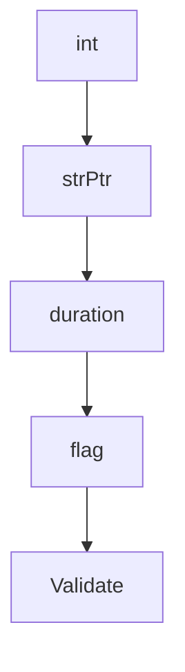

# Chapter 4: Dependency Graph and Hierarchy Patterns

Welcome to **Chapter 4: Dependency Graph and Hierarchy Patterns**. In this part of **Beads Tutorial: Git-Backed Task Graph Memory for Coding Agents**, you will build an intuitive mental model first, then move into concrete implementation details and practical production tradeoffs.


This chapter focuses on modeling blocker relationships and hierarchical plans.

## Learning Goals

- represent parent/child and blocking relationships correctly
- use hierarchy IDs for epic decomposition
- avoid cyclic dependencies in planning graphs
- improve ready-task signal quality

## Pattern Guidance

- reserve hierarchy for delivery decomposition
- use relation links for cross-cutting context
- keep dependencies minimal and explicit

## Source References

- [Beads README Hierarchy & Workflow](https://github.com/steveyegge/beads/blob/main/README.md)
- [Beads FAQ](https://github.com/steveyegge/beads/blob/main/docs/FAQ.md)

## Summary

You now can model complex plans as clean, navigable Beads graphs.

Next: [Chapter 5: Agent Integration and AGENTS.md Patterns](05-agent-integration-and-agents-md-patterns.md)

## Depth Expansion Playbook

## Source Code Walkthrough

### `internal/types/types.go`

The `int` function in [`internal/types/types.go`](https://github.com/steveyegge/beads/blob/HEAD/internal/types/types.go) handles a key part of this chapter's functionality:

```go

// Issue represents a trackable work item.
// Fields are organized into logical groups for maintainability.
type Issue struct {
	// ===== Core Identification =====
	ID          string `json:"id"`
	ContentHash string `json:"-"` // Internal: SHA256 of canonical content

	// ===== Issue Content =====
	Title              string `json:"title"`
	Description        string `json:"description,omitempty"`
	Design             string `json:"design,omitempty"`
	AcceptanceCriteria string `json:"acceptance_criteria,omitempty"`
	Notes              string `json:"notes,omitempty"`
	SpecID             string `json:"spec_id,omitempty"`

	// ===== Status & Workflow =====
	Status    Status    `json:"status,omitempty"`
	Priority  int       `json:"priority"` // No omitempty: 0 is valid (P0/critical)
	IssueType IssueType `json:"issue_type,omitempty"`

	// ===== Assignment =====
	Assignee         string `json:"assignee,omitempty"`
	Owner            string `json:"owner,omitempty"` // Human owner for CV attribution (git author email)
	EstimatedMinutes *int   `json:"estimated_minutes,omitempty"`

	// ===== Timestamps =====
	CreatedAt       time.Time  `json:"created_at"`
	CreatedBy       string     `json:"created_by,omitempty"` // Who created this issue (GH#748)
	UpdatedAt       time.Time  `json:"updated_at"`
	ClosedAt        *time.Time `json:"closed_at,omitempty"`
	CloseReason     string     `json:"close_reason,omitempty"`      // Reason provided when closing
```

This function is important because it defines how Beads Tutorial: Git-Backed Task Graph Memory for Coding Agents implements the patterns covered in this chapter.

### `internal/types/types.go`

The `strPtr` function in [`internal/types/types.go`](https://github.com/steveyegge/beads/blob/HEAD/internal/types/types.go) handles a key part of this chapter's functionality:

```go

	// Optional fields
	w.strPtr(i.ExternalRef)
	w.str(i.SourceSystem)
	w.flag(i.Pinned, "pinned")
	w.str(string(i.Metadata)) // Include metadata in content hash
	w.flag(i.IsTemplate, "template")

	// Bonded molecules
	for _, br := range i.BondedFrom {
		w.str(br.SourceID)
		w.str(br.BondType)
		w.str(br.BondPoint)
	}

	// Gate fields for async coordination
	w.str(i.AwaitType)
	w.str(i.AwaitID)
	w.duration(i.Timeout)
	for _, waiter := range i.Waiters {
		w.str(waiter)
	}

	// Molecule type
	w.str(string(i.MolType))

	// Work type
	w.str(string(i.WorkType))

	// Event fields
	w.str(i.EventKind)
	w.str(i.Actor)
```

This function is important because it defines how Beads Tutorial: Git-Backed Task Graph Memory for Coding Agents implements the patterns covered in this chapter.

### `internal/types/types.go`

The `duration` function in [`internal/types/types.go`](https://github.com/steveyegge/beads/blob/HEAD/internal/types/types.go) handles a key part of this chapter's functionality:

```go
	w.str(i.AwaitType)
	w.str(i.AwaitID)
	w.duration(i.Timeout)
	for _, waiter := range i.Waiters {
		w.str(waiter)
	}

	// Molecule type
	w.str(string(i.MolType))

	// Work type
	w.str(string(i.WorkType))

	// Event fields
	w.str(i.EventKind)
	w.str(i.Actor)
	w.str(i.Target)
	w.str(i.Payload)

	return fmt.Sprintf("%x", h.Sum(nil))
}

// hashFieldWriter provides helper methods for writing fields to a hash.
// Each method writes the value followed by a null separator for consistency.
type hashFieldWriter struct {
	h hash.Hash
}

func (w hashFieldWriter) str(s string) {
	w.h.Write([]byte(s))
	w.h.Write([]byte{0})
}
```

This function is important because it defines how Beads Tutorial: Git-Backed Task Graph Memory for Coding Agents implements the patterns covered in this chapter.

### `internal/types/types.go`

The `flag` function in [`internal/types/types.go`](https://github.com/steveyegge/beads/blob/HEAD/internal/types/types.go) handles a key part of this chapter's functionality:

```go
	w.strPtr(i.ExternalRef)
	w.str(i.SourceSystem)
	w.flag(i.Pinned, "pinned")
	w.str(string(i.Metadata)) // Include metadata in content hash
	w.flag(i.IsTemplate, "template")

	// Bonded molecules
	for _, br := range i.BondedFrom {
		w.str(br.SourceID)
		w.str(br.BondType)
		w.str(br.BondPoint)
	}

	// Gate fields for async coordination
	w.str(i.AwaitType)
	w.str(i.AwaitID)
	w.duration(i.Timeout)
	for _, waiter := range i.Waiters {
		w.str(waiter)
	}

	// Molecule type
	w.str(string(i.MolType))

	// Work type
	w.str(string(i.WorkType))

	// Event fields
	w.str(i.EventKind)
	w.str(i.Actor)
	w.str(i.Target)
	w.str(i.Payload)
```

This function is important because it defines how Beads Tutorial: Git-Backed Task Graph Memory for Coding Agents implements the patterns covered in this chapter.


## How These Components Connect


